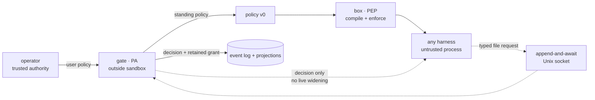

# pagu — context and design

pagu is a security wrapper for coding-agent harnesses. It separates policy
enforcement from policy administration:

- the **box** is the Policy Enforcement Point (PEP): compile and enforce a
  launch-time sandbox;
- the **gate** is the Policy Administrator (PA): adjudicate requests, persist
  scoped decisions, and retain evidence.

The architecture pivot is authoritative in
[ADR-0004](docs/decisions/0004-pivot-to-sandbox-plus-gate.md); the schema and
interface boundary are authoritative in
[ADR-0005](docs/decisions/0005-grant-schema-and-gate-boundary.md). This file
explains the durable model. Forward work belongs in [ROADMAP.md](ROADMAP.md).

## Why the split exists

A useful harness changes quickly and holds rich application behavior. An OS
sandbox should be small, predictable, and indifferent to which harness it
contains. Approval is a third concern: it needs operator authority and durable
state, but it must not live inside the process asking for more access.

The split follows the NIST PE/PA/PEP model and capability-system precedents
summarized in
[the composition analysis](box/docs/notes/composition-split-analysis.md):

| Plane                 | pagu component                              | Responsibility                                    | Must not do                                 |
| --------------------- | ------------------------------------------- | ------------------------------------------------- | ------------------------------------------- |
| Policy decision       | operator or optional external control plane | author standing authority                         | enforce a process                           |
| Policy administration | gate                                        | adjudicate misses, derive grants, retain evidence | enter the sandbox                           |
| Policy enforcement    | box                                         | lower policy into OS controls and launch          | decide whether a request deserves authority |

This separation keeps routine launches local and fail-secure. The gate is an
exception path, not a per-action dependency.

## System boundary

The box and gate share a schema family, not a process:

- the box receives a complete standing policy at launch;
- the gate receives typed requests through an optional mounted socket;
- decisions return to the caller, but approved mounts are not applied to the
  running sandbox in the current release;
- Slice 5 will make relaunch/resume the only widening application path.

## Trust model

| Input or component                      | Trust                    | Treatment                                                            |
| --------------------------------------- | ------------------------ | -------------------------------------------------------------------- |
| User policy selected by the operator    | trusted authority        | may grant within schema v0                                           |
| Project policy supplied by a repository | untrusted                | may only attenuate user authority; widening is ignored with warnings |
| Harness and everything it reads         | untrusted                | may request; cannot resolve or edit gate state                       |
| Gate process and its state directory    | trusted core             | single writer for requests, decisions, and grants                    |
| Box compiler and OS sandbox             | trusted enforcement core | exact lowering is the security boundary                              |
| Human-readable explanation              | evidence, not authority  | derived from the same compiled result used to launch                 |

Host processes running as the same user are outside the sandbox threat model.
The gate socket is mode `0600` to exclude other users; possession of the
bind-mounted path is the local request capability.

## Policy and grant model

Schema v0 is defined and strictly decoded in
[`src/policy/schema.ts`](src/policy/schema.ts). A non-empty policy is complete;
unknown fields are errors. `{}` denotes bottom authority.

The standing policy controls:

- home visibility (`rw` or a temporary filesystem);
- explicit read-write and read-only mounts;
- path denies;
- network namespace sharing;
- copied environment names;
- read-only auto-escalation and refusal scopes.

A grant is gate-derived policy data with `parent` and `expires` derivation
fields. It is not a hand-authored second policy language. Current once/session
grant projections are decoded again on gate restart.

### Narrow-only composition

[`src/policy/load.ts`](src/policy/load.ts) folds an authoritative user policy
with an optional project policy. The project layer can:

- change `home` from read-write to temporary, never the reverse;
- choose read-write children of user read-write roots;
- choose read-only children of user read-write or read-only roots;
- turn network off, never on;
- retain only environment names and auto rules already authorized by the user;
- add denies and refusals.

Nested paths require canonical containment. Invalid, widening, or symlink-
escaping candidates are dropped and surfaced as warnings. This is attenuation,
not a merge of peers.

### Deny wins

The schema always adds the built-in SSH and GPG denies. A refusal must be
covered by a filesystem deny. During Linux lowering, allows are emitted before
denies so later deny mounts overlay earlier access.

## Enforcement model

[`src/policy/compile.ts`](src/policy/compile.ts) is a pure lowering from a
validated policy plus explicit host facts to bubblewrap arguments and a scrubbed
environment.

Security-relevant properties:

- the environment starts empty and only named values are copied;
- schema-policy launches do not inherit the legacy Nix-daemon bind;
- missing allow paths grant nothing;
- missing deny paths become empty mounts, preserving the deny if a writable
  parent later creates the path;
- network remains isolated unless `net` is true;
- the optional request socket and its environment name exist only when `--gate`
  is supplied;
- `--explain` is a projection of the exact compiled result and omits secret
  values.

[`src/policy/cli.ts`](src/policy/cli.ts) is the thin process adapter used by the
Nix-built `pagu-box` launcher. Linux schema-policy compilation is implemented.
The macOS schema compiler fails with a typed unsupported-platform error; the
legacy seatbelt profiles remain separate compatibility behavior.

## Escalation loop

The request schema in [`src/request/schema.ts`](src/request/schema.ts) permits
one exact `fs.ro` suggestion with a human-readable need and justification.
Unknown fields, wildcards, traversal, quotes, and control characters fail.

The Unix channel in [`src/request/channel.ts`](src/request/channel.ts) is
deliberately not general RPC:

1. one connection carries one request frame;
2. the gate returns that connection's decision;
3. the connection closes;
4. no resolution frame exists.

Frames and concurrent clients are bounded, incomplete frames time out, active
listeners cannot be replaced, and the socket is private to the user.

[`src/request/adjudicate.ts`](src/request/adjudicate.ts) applies tiers in this
order:

1. refusal match → deny without prompting;
2. lexical and canonical containment within an auto rule → exact session grant;
3. otherwise → the gate's Approver port.

Canonicalization before auto-approval closes symlink aliases at decision time.
The enforcement-time recheck required for relaunch is intentionally deferred
with relaunch itself.

## Gate state and evidence

[`src/request/gate.ts`](src/request/gate.ts) serializes all mutations. Its
append-only log is the retained source of request, decision, and grant events.
The queue and session-grants JSON files are gate-owned projections:

| Artifact              | Meaning                                                            |
| --------------------- | ------------------------------------------------------------------ |
| `events.md`           | retained request, decision, and policy-grant evidence              |
| `queue.json`          | the operator request currently awaiting the Approver               |
| `session-grants.json` | once/session grants that survive a gate restart                    |
| user policy           | standing authority; changed only by an explicit `persist` decision |

The CLI adapter in [`src/gate/cli.ts`](src/gate/cli.ts) renders the Approver as
a TTY prompt. A future herdr surface is another adapter over the same port, not
a second adjudicator.

## Fail-secure behavior

- No gate mount means no request capability and no new escalation path.
- An absent or malformed policy fails before launch; `{}` compiles to bottom.
- Gate unavailability cannot widen an already-running box.
- Refuse and auto tiers do not depend on an operator prompt.
- A malformed request creates no event or grant.
- Project policy widening fails closed to the user policy ceiling.
- Unsupported schema enforcement fails loud rather than falling back to a weaker
  mode.

Fail-secure does not mean highly available. A harness can delay its own request
path; bounded connections and timeouts cap that resource use. The standing box
continues enforcing independently.

## Evidence standard

Claims about enforcement bind to executable evidence:

- policy schema, attenuation, canonical paths, and explain equivalence:
  [`src/policy/policy.test.ts`](src/policy/policy.test.ts);
- request protocol, tiers, persistence, socket boundary, and real bubblewrap
  falsifier: [`src/request/request.test.ts`](src/request/request.test.ts);
- event wire compatibility: [`src/events.test.ts`](src/events.test.ts);
- public SDK floor: [`src/mod.test.ts`](src/mod.test.ts).

The complete invariant catalog and enforcement tiers live in
[docs/INVARIANTS.md](docs/INVARIANTS.md).
