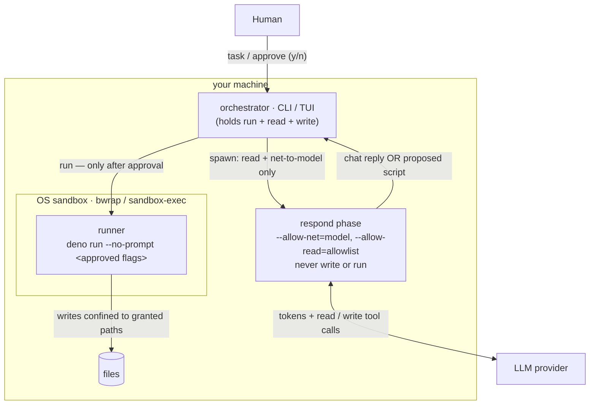
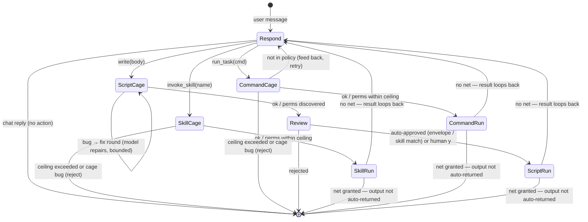
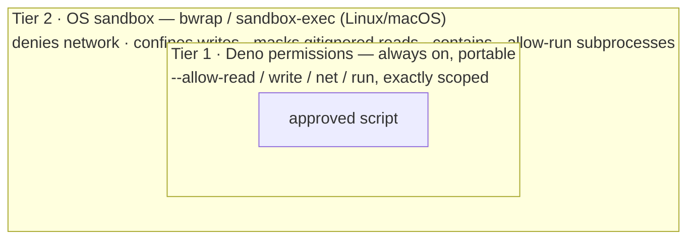

# pagu — context & design

> Status: the v1 loop is implemented and in daily use. Command: `pagu`. Named
> for _Paguroidea_, the hermit-crab superfamily — soft and untrusted inside (the
> LLM), operating only through a hard, borrowed, disposable shell (the sandboxed
> runner).
>
> **This is the source of truth for project design** — rationale, threat model,
> and the system/security model. Durable design context goes here, not scattered
> across docs. The **forward plan, idea backlog, and milestones** live in
> **`ROADMAP.md`** (organized by concern). **`README.md`** is usage;
> **`AGENTS.md`** is how-we-work; **`docs/CONCEPTS.md`** is the mental-models
> reference; **`docs/INVARIANTS.md`** is the canonical catalog of load-bearing
> claims with their enforcement tier — and the **single home of the numbered
> invariants (`#1`–`#5`)** this file cites throughout.

**Map** (sections below): _What & why_ — One-liner · Why it exists ·
Goals/non-goals. _The model_ — Core principle · System map · Phase FSM · State
model. _Security_ — Approval model · Output gating · Security tiers · Threat
model. _Project_ — Tech & UX · Build & packaging · **Roadmap** (a pointer; the
plan + backlog + milestones live in `ROADMAP.md`).

## One-liner

A local, cross-platform agent you use like a terminal — but the model **can
never execute anything**. It reads context and _authors_ scripts into an
auditable conversation log; a human approves; a separate sandboxed runner
executes. Capability-phased, event-sourced, BYO model.

## Why it exists

Existing computer-use/coding agents make `execute` a tool the model can call
(behind an approval prompt). pagu removes that capability entirely: security
comes from the **absence** of the tool plus a mandatory human gate, not from
gating a dangerous tool the agent holds. The result is an agent whose entire
blast radius is statically enumerable.

The intended payoff: **safely give an agent access to personal homelabs and
critical infrastructure** — operate on _real working servers_, not a disposable
remote sandbox. The market splits into _sandbox-the-execution_ (throwaway envs)
and _SRE agents on real infra_ (RBAC/governance-gated agents that still _hold_
execute). pagu's wedge is **structural, not policy**: it contains a
_compromised_ model, not just a cooperative one. The demo-worthy proof is the
**golden scenario** (`examples/golden-scenario/`) — a prompt-injected pagu,
running unattended, that provably cannot leak secrets or escape, with
in-envelope damage bounded and restorable.

## Goals / non-goals

**Goals**

- Quick to install on any computer/laptop/appliance. Connect a model provider,
  use immediately.
- Maximal power for user _and_ agent — with **no compromise of security for
  utility** (security is the invariant; utility is maximized within it).
- Fully auditable: every observation, proposed script, and result is a durable,
  diffable event.
- Small trusted core — readable in one sitting.

**Non-goals (deferred)**

- GUI/computer-use (mouse/screen) — CLI + TUI first, expand only if needed.
- Uniform OS-level sandboxing across every platform (see Security tiers — Linux
  and macOS are done; Windows is open).

(Several original non-goals have since shipped: conversation **forking**
(`/fork`), and a **multi-provider** layer — OpenAI Chat Completions covers
Ollama/OpenRouter/OpenAI/etc., with native Anthropic alongside.)

## Core principle: the model has no _real-effect_ execute capability

The agent's tools are **read** (allowlisted inspect), **write** (arbitrary
script proposals — requires human approval), **invoke_skill** (pre-authored
skill scripts — auto-approved within declared ceiling), and **run_task** (named
project tasks from the command policy — auto-approved within inferred/declared
ceiling). There is no `bash`/exec tool. **Real-effect execution** — running a
script with real-path writes, network, or broader permissions — happens only in
a separate process triggered by **human approval** or a pre-vetted envelope.

### The capability ladder

| tool           | what it does                                                             | approval path                                    |
| -------------- | ------------------------------------------------------------------------ | ------------------------------------------------ |
| `read`         | inspect files/dirs                                                       | no side effects — always allowed                 |
| `write`        | author arbitrary scripts                                                 | **human gate** (y/n at every proposal)           |
| `invoke_skill` | run a pre-authored skill script verbatim                                 | auto-approved (verbatim match + ceiling)         |
| `run_task`     | run a named project task from policy                                     | auto-approved (policy match + ceiling)           |
| `run_command`  | run a vetted read-only command (search/inspect) with validated free args | auto-approved (grammar match, read-only ceiling) |

`invoke_skill`, `run_task`, and `run_command` expand the agent's effective
capability without widening the blast radius: the orchestrator verifies the
script body matches verbatim what was pre-approved, the cage validates
permissions within the declared or inferred ceiling, and `run_command`'s args
are validated against a per-command **grammar** (the safe argv sublanguage) and
run with a fixed read-only ceiling (no write/net). `run_task` and `run_command`
are two presentations over one command-policy spine (`recognize` subsumes
`matchesPolicy`; exact match = the degenerate zero-free-arg grammar).

Refinement (the cage): the agent _may_ run its proposed script in a **disposable
cage** to self-test and self-correct before you see it. The cage grants
`--allow-read=<allowlist>` + `--allow-write=<scratch>` only — **no network, no
real-path writes** — so autonomous execution cannot exfiltrate or damage
anything. The cage classifies each run:

- **runtime/type error** → feed back to the agent; it fixes and retries
  (bounded), so you review a _working_ script, not a buggy one;
- **permission denial** → not a bug — the script asked for a real permission the
  cage withholds; this _is_ the permission-discovery mechanism (see below),
  surfaced to you at approval;
- **clean exit** → present as-is.

So the boundary is precise: autonomous execution is confined to a no-net,
no-real-write rehearsal; real-effect execution stays human-gated.

## System map

Who holds which capability. The agent process (`respond`) only ever has read +
net-to-the-model; **write and run live only in the human-gated runner**, itself
wrapped by the OS sandbox where available.



## Phase FSM (chat-or-act)

The loop is a small state machine. **Each turn is a separate, short-lived
process launched with exactly that turn's permissions** — so the runtime
sandbox, not just our code, enforces the boundary. Turns are stateless: each
folds the conversation log and appends new events.

The original Observe and Author phases are now a **single `respond` phase**: the
model converses normally and only switches into "act" mode — authoring a script
with the `write` tool — when finishing the task genuinely needs an effect. It
reads with the `read` tool inside the same phase. So a plain question costs one
read-capable turn and no script at all.

| Phase                | process permissions                                 | tools                                       | advances when                        |
| -------------------- | --------------------------------------------------- | ------------------------------------------- | ------------------------------------ |
| **Respond**          | read = allowlist; net = provider only               | `read`, `write`, `invoke_skill`, `run_task` | model replies (chat) or emits action |
| **Cage** (self-test) | read = allowlist; write = scratch; **no net**       | — (runner)                                  | proposal runs clean / needs-perms    |
| **Review**           | _(no agent process)_                                | —                                           | **human** y/n (or auto-approve rule) |
| **Run**              | runner: scoped perms, in OS sandbox where available | — (runner)                                  | script exits → result re-enters loop |

The agent process only ever holds read + net-to-model; it never holds write or
run. After a run, the result re-enters the log and the loop continues (the model
wraps up or proposes the next step), bounded by a turn limit.

Two operational bounds make a long-lived/unattended run safe: a **per-run
wall-clock ceiling** (`RUN_TIMEOUT_MS`, default 120s — both cage and runner kill
a wedged script and surface a `timed out` result, so a hang can't pin the
process), and an **atomic log write** (`persist` writes a sibling temp then
renames over the canonical file — a crash never leaves the event store
half-written; the synchronous write is also load-bearing for `submitDecision`'s
double-submit safety). Both are partial answers to #16's "scheduled agents"
needs; an aggregate budget/iteration ceiling is still open.

Both Cage and Run execute the script with **cwd = the repo (repo mode) else the
launch directory** (`ctx.cwd`; for `run_task`/`invoke_skill`, the project root —
those are project tasks), never the throwaway script scratch — so a relative
path (`answer.txt`) resolves where the user is, and the cage observes the script
under the _same_ cwd the run will use. This is load-bearing: it's why a
relative-path write is _discovered_ by the cage (denied there exactly as at run)
rather than silently absorbed by the scratch. **The same dir is the base that
discovered perms are absolutized against** (`cageCwd` in `src/capability/`) —
run cwd, cage cwd, and absolutize base are one source, so they cannot diverge (a
divergence in non-repo / ACP-workspace mode was a real bug). cwd sets only
relative-path resolution; every effect is still bounded by the granted perms.

The three action paths diverge at the Respond→Cage transition:

| Tool called    | Cage purpose              | Auto-approve rule                        | Fix loop?                                     |
| -------------- | ------------------------- | ---------------------------------------- | --------------------------------------------- |
| `write`        | Discover needed perms     | Envelope / skill-match / human y/n       | Yes (MAX_FIX=3) — model repairs buggy scripts |
| `invoke_skill` | Validate within ceiling   | Ceiling match — auto only, no human gate | No — pre-authored, bug = reject               |
| `run_task`     | Discover / verify ceiling | Ceiling match — auto only, no human gate | No — generated body, bug = reject             |



**On phases as a folder:** `phases/` (the respond subprocess infrastructure) and
`runner/` (the cage + run execution engine) are both named after phases in the
FSM, but they don't co-change — the respond phase subprocess and the runner are
independent mechanisms. The coupling test: if you add a new tool, you change
`phases/respond.ts` (add dispatch) and the relevant capability module
(`skills/`, `tasks/`, `write/`) — you don't change `runner/`. The FSM is the
mental model; the folder structure reflects coupling.

## State model: the conversation log _is_ the event store

There is one canonical artifact: an append-only, git-backed conversation log.
Observations, proposed scripts, approvals, and run results are first-class turns
woven into it (CQRS event stream). Desktop state is the projection (fold) over
those events. Git history gives audit + (later) forking = branching the log.

### Format: Markdown + structured fenced blocks

Human-diffable prose with typed, parseable fenced blocks. **Tilde** fences
(`~~~pagu:<kind>`), not backtick, so a script body containing ``` survives the
round-trip:

- `~~~pagu:message` — a conversational turn (user task or assistant prose).
- `~~~pagu:observation` — what a read returned. `source` records **the command
  that ran** (`read <path>` / `ls <path>`) for a full action audit, not just its
  output.
- `~~~pagu:script` — a proposed script (lang + body).
- `~~~pagu:decision` — human approve/reject + rationale.
- `~~~pagu:result` — runner output + exit status + the exact perms it ran with.

One file, readable by a human, parseable by the harness, clean git diffs. A
session also carries a small YAML **frontmatter** header (display `name`,
`created`); the entries below stay the source of truth
(`src/config/sessions.ts`).

### Open: the markdown _container_ assumes a single co-located reader

The log is already a typed event store — the entries are the canonical CQRS
stream, the markdown is the _container_. That container quietly assumes one
writer (the runner) and one reader (a co-located CLI/TUI that re-folds the whole
file). That assumption holds today and should not be disturbed for the
co-located case — it is exactly what gives the cheap "read the file"
auditability the threat model leans on. What it does _not_ provide is what a
**non-co-located client** (ACP remote, a management surface, an alerting
webhook) needs:

- an **offset / event id** so a reconnecting client can ask for "everything
  after N" instead of re-reading the file (the entire sync story for remote
  clients — append-only + single-writer means no CRDT and no consensus _for the
  log itself_; ordering has one authority per session);
- a **tail/subscribe** affordance instead of poll-and-reparse;
- the events as a **stream**, not only a file.

The framing to hold: do **not** demote the markdown — it stays a first-class
projection (the human-readable, git-diffable one). The open question is whether
the _same typed events_ also get an addressable, streamable representation
(append-addressed JSONL, or SQLite for indexed cross-session queries) that the
markdown is rendered _from_. If so, several things fall out for free, the same
way content-addressed caching falls out elsewhere: offset-based resumption _is_
the remote sync protocol; the observability stream (costs, advisor flags,
approvals, hook firings) is just a **filtered projection of the one log**, not a
parallel pipeline; cross-session / cross-host queries become expressible at all.

The cost, stated honestly: a structured store shifts auditability from "read the
file" to "trust the projection," and the moment a second client reads the events
the **event schema becomes public API** — it needs the same floor-test
versioning discipline as `src/mod.ts` (a CI test that fails on a
backwards-incompatible change). Where CRDTs _do_ earn a place is the
coordination edge _around_ the logs (a client aggregating many hosts;
multi-client edits to session metadata / tags / standing approvals) — kept to
types whose current value is statable in one line (OR-set, LWW-register), never
the conversation log itself, which stays single-writer authoritative. (Whether
this is worth doing is gated on the remote-client work actually landing — see
the subscribable event stream item in `ROADMAP.md`.)

## Approval model

> **Implemented:** a simple **y/n** per-script gate is the default — the human
> sees the proposed script and the exact permissions it will run with (surfaced
> by the cage's discovery), and approves or rejects. The runner enforces exactly
> those permissions; its enforcement is the actual security boundary.

- **Per-script explicit by default** (y/n; the perms list is always shown).
- **Auto-approve within an envelope.** A proposal runs without a prompt only
  when its **discovered permission set ⊆ a pre-vetted envelope**, verified by
  the cage (Deno's own denials), never by trusting the agent's description — so
  auto-approve can never silently widen the real capability surface. **Repo
  mode** is the shipped instance: grant read+write to the current git repo and
  auto-approve scripts confined to it (git is the undo buffer, the runner has no
  net, `.gitignore`'d paths are write-denied). Remembered per repo.
- **Modes** = named bundles of such envelopes — generalizing repo mode (e.g. a
  `scratch-readonly` mode) — remain open.

## Output gating falls out of the runner's permissions

Whether a script's output auto-returns into the agent's context is a function of
how the runner ran it:

- Runner had **no network** (`--deny-net` / no `--allow-net`) → output could not
  have phoned home; auto-return is contained. Script review covers local exfil
  (e.g. "logs out `$SECRET`").
- Runner was **granted network** → output passes a human glance before
  re-entering context.

This is the one deliberately relaxed point: the audit of the _script_ (catching
env-var logging etc.) is what makes the output channel safe, so we don't
double-gate output for net-less runs.

## Security tiers (portability makes this layered)

1. **Portable floor — Deno permissions.** Cross-platform read/write/net/ run
   scoping, identical on Linux/macOS/Windows. This is always present. Also
   applied to the **harness's own phase processes** (a buggy harness in Author
   phase still cannot read the disk).
2. **OS isolation — platform-specific hardening (implemented for Linux/macOS).**
   The runner wraps each `deno run` in **bubblewrap** (Linux, when `bwrap` is on
   PATH) or **sandbox-exec** (macOS). v1 hardens the escape vectors that matter:
   it **denies network** (unless granted), **confines writes** to the granted
   paths + scratch, and **masks concealed paths** from the runner's filesystem
   view (read confinement — bwrap binds `/dev/null`/empty-tmpfs over them,
   sandbox-exec denies reads). The concealment set is multi-source —
   `.gitignore` (the VCS source), the config `hide` globs, and an on-by-default
   secret-glob list (`.env`/`*.pem`/…) — with a `reveal` opt-out
   (`src/permissions/concealment.ts`). Crucially this contains a subprocess
   spawned via `--allow-run` — which Deno does _not_ permission-bound — at the
   kernel level. It wraps both the cage self-test (unreviewed code) and the
   approved run. Auto-detected; falls back to tier 1 with a note when
   unavailable (`src/runner/sandbox.ts`). Windows (AppContainer/Job Objects) is
   open.

   _Scope of v1:_ reads of granted, non-concealed content stay broad at the OS
   layer (Deno bounds the script's own reads); concealed paths (gitignore +
   config `hide` + default secrets) are masked. Arbitrary per-path read
   confinement (Landlock) is a roadmap item; at tier 1 only (no OS sandbox —
   e.g. Windows or `--no-sandbox`) the masking is absent and the read gap
   persists.
3. **Optional outer VM tier (sub-project B) — `pagu vm`.** A coarse wall around
   the _whole_ pagu process (not per-script): `detectVM` runs pagu in a guest
   (rootless **Podman** first cut; degrades to `none` → runs directly, no
   regression). Only cwd is mounted, concealed paths are masked at the **mount
   layer** (tier-2 can't nest in a rootless container, so this replaces bwrap's
   read-masking in-guest), and the guest is on an isolated netns. Opt-in
   (`pagu vm <task>`), so it doesn't affect normal runs. The Firecracker microVM
   tier + model-host-only egress confinement are deferred (`src/vm/`,
   `src/frontends/vm.ts`, `vm/Containerfile`).

Honest ceiling: with only tier 1, a Deno/V8 escape would breach isolation; tier
2 closes the write/network escape (incl. via subprocesses) and masks concealed
paths (gitignore + config + default secrets) from reads where the OS supports
it.



The script sits inside both walls; on a platform without tier 2 it still has the
portable tier-1 floor around it (no regression).

## Threat model (load-bearing parts)

- **Boundary = no-exec-capability + mandatory per-proposal human review.**
- **Reads are untrusted input** — the prompt-injection / exfiltration surface.
  Adversarial content in read material can steer what the agent _proposes_; the
  human review of every proposal is the backstop (Dual-LLM / quarantine
  posture). The per-turn gate bounds the read → propose → run → read
  amplification.
  - **The context axis is a trust gradient** (model owned by `docs/CONCEPTS.md`
    → The context axis is a trust gradient). The structural invariant —
    _untrusted context may inform, never instruct_ — is the context-axis sibling
    of deny-wins. Its security _consequence_ lives here: an
    `~~~pagu:observation` entry is accumulated-untrusted and must never be
    treated as an authored instruction at prompt-assembly. The log's typed entry
    kinds already carry the label; the discipline is that prompt assembly
    preserve it (fence untrusted spans), never flatten observation into
    instruction.
  - **Relation to CaMeL / dual-LLM (prior art, same diagnosis, different
    cure).** The diagnosis — mixing trust levels in one token stream is the root
    flaw — is shared with Willison's Dual-LLM pattern and DeepMind's **CaMeL**
    ("Defeating Prompt Injections by Design", 2025), which labels every value
    with a capability and **taint-tracks** whether untrusted data reaches a
    dangerous sink, blocking the tool call if so. pagu's cure is **structural,
    not dataflow**: there is no sink to reach, because the agent holds no
    execute capability — untrusted context can at most cause a _proposal_, which
    hits the cage + envelope + human gate. CaMeL keeps full autonomy and pays
    with a conservative taint policy (≈⅔ task completion on AgentDojo, since any
    untrusted-derived argument is rejected); pagu trades some autonomy (novel
    actions need approval) for total containment that does not depend on
    tracking taint correctly. The two sit at different points on the
    autonomy/containment frontier; pagu's wedge (contain a _compromised_ model,
    not merely a cooperative one) is the sharper end. This is the same lineage
    as the LangSec framing (`docs/CONCEPTS.md` → The command grammar): a
    boundary _described_ in prose is not a boundary; a boundary that is
    structural (an absent capability, a recognised grammar, a typed envelope) is
    _enforced_.
  - **The residual recogniser (honest seam).** The LangSec ideal is _complete_
    recognisability. pagu has one irreducible non-decidable recogniser left: the
    human reading a `write` script at the gate. We have not eliminated it — we
    have moved it _off the hot path_ (novelty only; `invoke_skill`/`run_task`/
    `run_command` are decidable and auto-approve) and surrounded it with
    decidable structure (cage-discovered perms, envelope diff, advisor flags).
    The irreducible "should I authorise this novel script?" decision is where a
    sufficiently clever injected proposal could still get a tired human to say
    yes; approval fatigue (below) is the empirical form of this risk. pagu
    _minimises and structures_ the weird-machine surface; it does not claim to
    have zero.
  - **Approval fatigue is a named risk.** Too many prompts habituate "yes"; this
    is the failure mode the auto-approve envelope (decidable, deny-by-default)
    exists to keep _rare_, so the human's attention is spent only on genuine
    novelty. Any future change that increases gate frequency trades against
    this.
- **Runner perms cap an approved-but-buggy script**; **harness phase perms cap a
  buggy/compromised harness**.
- **Advisory reviewer** (`src/write/advisor.ts`) is a pre-screening _control
  action_ that enriches human information at review — not a second approver and
  not in the critical path. It fails open; the human gate remains the sole
  security boundary. Structured `[advisory]` flags are presented alongside the
  review aid output to assist the human reviewer, not to make approval decisions
  autonomously.
- When approved scripts need egress, a credential-injecting proxy (e.g. Claw
  Patrol) can mediate so the script never sees raw secrets.

## Tech & UX

- **Runtime:** Deno (TypeScript). Cross-platform, runs TS directly,
  `deno compile` → single binary, permission model is the security floor.
- **Core in plain TypeScript — no Effect (evaluated, declined 2026-05).** A
  throwaway spike confirmed Effect v4-beta (`effect@4.0.0-beta.71` plus
  `@effect/ai-anthropic`/`-openai@4.0.0-beta.71`) _does_ run under Deno: the
  runtime, `effect/unstable/ai`, and `Tool`/`Toolkit`/handlers all compose and
  type-check. Declined anyway on measured cost — the AI layer is
  `effect/unstable/ai` (an explicitly _unstable_ API on a _beta_ runtime, with
  docs still v3-shaped); the `effect` package unpacks to ~48 MB over a wide
  transitive graph; and importing the AI modules adds ~120 ms to a cold process,
  which matters because pagu spawns a **fresh process per turn**. All of that
  works _against_ the value prop (small TCB, auditable in one sitting, minimal
  supply chain), and Effect's strength (in-process structured concurrency)
  doesn't touch pagu's real security seam (separate processes plus Deno
  permissions). **Direction:** build our own minimal abstractions in Effect's
  _footsteps_ — typed errors, composable layers, explicit effects at the seams —
  without the runtime. Revisit only if `effect/ai` stabilizes out of `unstable/`
  _and_ orchestration pain justifies it; even then, keep it out of the
  security-critical core.
- **`@cliffy/keypress` + `@cliffy/command` (adopted 2026-05).** Terminal key
  parsing (SS3 arrows, modifiers) is fiddly, edge-case-heavy, and
  non-differentiating, so we borrow the focused, stable `@cliffy/keypress` (1.x,
  small @std-based dep) for it — the opposite profile to the rejected Effect
  (small/stable/focused, earns its weight, like our `@std/*` use). We do **not**
  use `@cliffy/prompt`'s Select/Checkbox despite the overlap: they call
  `exit(130)` on Ctrl-C, which would kill the whole REPL. Driving keypress at
  the event level lets Ctrl-C/Esc cancel just the picker; the pure selection
  model (`reduce`/`frame`) stays ours and stays tested. Likewise `parseArgs`
  uses `@cliffy/command` for the CLI surface: typed flags, generated
  `--help`/usage, and shell completions as the flag set grows. Flags still map
  onto the same `RunOpts`/`ConfigLayer` split (reversible), and an unknown
  `--flag` falls into the free-text task — matching the prior hand-rolled
  behavior and harmless under the no-exec invariant.
- **Provider:** a hand-rolled **OpenAI Chat Completions** client is the default
  wire format (covers Ollama — the local default — plus OpenRouter, OpenAI,
  Groq, LM Studio, vLLM…), with a native **Anthropic** Messages client
  alongside, selected by a per-preset `format`. BYO key via named env vars;
  config never holds secrets. (Anthropic subscription OAuth is barred — API key
  only.) Both wire formats **stream** (OpenAI + Anthropic SSE); `max_tokens` is
  configurable (`--max-tokens`/config, Anthropic requires it, default 4096). The
  hand-rolled clients are audited against the canonical docs
  (`platform.claude.com`), not the SDK (invariant #5 — minimal TCB).
  - **Prompt caching (Anthropic, always-on):** the native client sends `system`
    as a structured text block with a single `cache_control: {type:"ephemeral"}`
    breakpoint. Tools precede system in the prompt prefix, so this one
    breakpoint caches the whole stable `tools + system` prefix (the AGENTS.md
    instructions + tool defs re-sent verbatim each turn) → later turns read it
    at ~0.1× input cost. GA (no beta header); a no-op below the model's min
    cacheable size. _Always-on by design_ — pagu's main mode is multi-turn agent
    loops where the fixed prefix dominates; the only downside is a tiny one-shot
    write overhead. _Deferred:_ a second breakpoint to cache the growing
    **message** prefix (needs care with turn-coalescing + the 4-breakpoint
    budget). _Real cache-hit + stream verification awaits Anthropic credits (the
    configured account is empty); the request shape is pinned by tests against
    the canonical event/caching docs._
  - **Token usage / cost (SHIPPED):** `ChatResponse.usage`
    (`{input,output,cacheRead?,cacheCreation?}`) extracted from all four paths
    (OpenAI buffered/stream via `stream_options.include_usage`; Anthropic
    buffered + stream via `message_start` input/cache + `message_delta` output).
    Threaded phase→orchestrator: the respond phase sums a turn's `chat()` calls
    into `writeOutput(entries, usage)`; `spawnPhase` returns `{entries, usage}`;
    `injectRespond` calls `ctx.recordUsage` (side-effect — the Responder stays
    `Entry[]`, so the cage fix-loop caller is unchanged + its rounds are
    counted); `buildContext` holds the cumulative `sessionUsage` +
    `ctx.usageTotal()`. The TUI HUD shows `↑in ↓out (cached R)`. **The hook the
    #16 token/cost ceiling needed** (usage is now out of `chat()`). Also handles
    in-stream `error` (529) events as a clean throw. Verified end-to-end against
    real Ollama tokens (`↑1.5k ↓48` in the HUD — credit-free; Anthropic cache
    fields populate identically once credited). **The #16 token ceiling now
    consumes this** (`Budget.maxTotalTokens` — see ROADMAP #16 slice 2).
    _Deferred:_ surfacing `stop_reason=="max_tokens"` truncation; a per-call
    cost (price × tokens) readout, which needs a per-model price table pagu does
    not carry (the token count is the provider-agnostic ceiling).
- **Harness:** our own minimal loop + phase FSM, written from scratch — inspired
  by Pi (loop shape, tool-call parsing), not forked. Smaller TCB is the point,
  and from-scratch bakes in the no-exec/phase model from line one. `pi-ai` kept
  as an optional fallback if multi-provider lands.
- **Runner shell-out:** generated scripts use **only Deno built-ins** (no
  imports — simplest to run offline and review); they call CLIs via
  `Deno.Command`, gated by `--allow-run=<specific binaries>` surfaced by the
  cage. (A `dax`-style helper could be allowed later if the no-import rule
  proves too restrictive.)
- **UX:** CLI-first ("terminal with an LLM"); TUI for the transcript + approval
  view; GUI only if a real need appears.

## Build & packaging

- Standalone git repo (dev checkout lives in a gitignored subfolder of the
  homelab repo; published separately, e.g. JSR `@.../pagu`).
- No build step (Deno runs TS); distribute via `deno install` / `deno compile`.

## Roadmap

The roadmap, idea backlog, decided-behavior reference, v1 milestone, and North
Star now live in **[`ROADMAP.md`](./ROADMAP.md)** — organized by concern
(harness & core · security & sandboxing · frontend interfaces · config &
management · vendor & ecosystem · quality/eval). Moved out of this file
(2026-05-30) to keep CONTEXT focused on durable design + threat model and to
make the roadmap independently navigable. This file remains the source of truth
for _design / rationale / threat model_; `ROADMAP.md` owns _what's next_.
