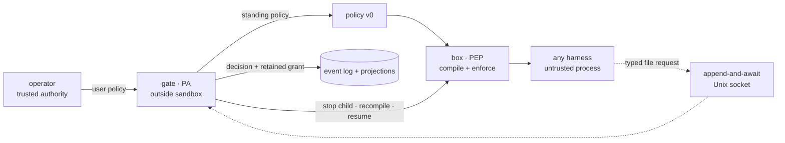

# pagu — context and design

pagu is a security wrapper for coding-agent harnesses. It separates policy
enforcement from policy administration:

- the **box** is the Policy Enforcement Point (PEP): compile and enforce a
  launch-time sandbox;
- the **gate** is the Policy Administrator (PA): adjudicate requests, persist
  scoped decisions, and retain evidence.

The architecture pivot is authoritative in
[ADR-0004](docs/decisions/0004-pivot-to-sandbox-plus-gate.md); the schema and
interface boundary are authoritative in
[ADR-0005](docs/decisions/0005-grant-schema-and-gate-boundary.md). This file
explains the durable model. Category profiles and the policy-growth telemetry
loop are authoritative in
[ADR-0006](docs/decisions/0006-profiles-growth-and-telemetry.md). Forward work
belongs in [ROADMAP.md](ROADMAP.md).

## Why the split exists

A useful harness changes quickly and holds rich application behavior. An OS
sandbox should be small, predictable, and indifferent to which harness it
contains. Approval is a third concern: it needs operator authority and durable
state, but it must not live inside the process asking for more access.

The split follows the NIST PE/PA/PEP model and capability-system precedents
summarized in
[the composition analysis](box/docs/notes/composition-split-analysis.md):

| Plane                 | pagu component                              | Responsibility                                    | Must not do                                 |
| --------------------- | ------------------------------------------- | ------------------------------------------------- | ------------------------------------------- |
| Policy decision       | operator or optional external control plane | author standing authority                         | enforce a process                           |
| Policy administration | gate                                        | adjudicate misses, derive grants, retain evidence | enter the sandbox                           |
| Policy enforcement    | box                                         | lower policy into OS controls and launch          | decide whether a request deserves authority |

This separation keeps routine launches local and fail-secure. The gate is an
exception path, not a per-action dependency.

## System boundary

The box and gate share a schema family, not a process:

- the box receives a complete standing policy at launch;
- the gate receives typed requests through an optional mounted socket;
- a decision never mutates the running mount namespace;
- the gate owns the boxed child, stops it after approval, and starts one new box
  from a complete derived policy;
- a resume adapter carries the same harness session across the new boundary.

## Trust model

| Input or component                      | Trust                    | Treatment                                                            |
| --------------------------------------- | ------------------------ | -------------------------------------------------------------------- |
| User policy selected by the operator    | trusted authority        | may grant within schema v0                                           |
| Project policy supplied by a repository | untrusted                | may only attenuate user authority; widening is ignored with warnings |
| Harness and everything it reads         | untrusted                | may request; cannot resolve or edit gate state                       |
| Gate process and its state directory    | trusted core             | single writer and owner of the boxed child lifecycle                 |
| Box compiler and OS sandbox             | trusted enforcement core | exact lowering is the security boundary                              |
| Human-readable explanation              | evidence, not authority  | derived from the same compiled result used to launch                 |

Host processes running as the same user are outside the sandbox threat model.
The gate socket is mode `0600` to exclude other users; possession of the
bind-mounted path is the local request capability.

## Policy and grant model

Schema v0 is defined and strictly decoded in
[`src/policy/schema.ts`](src/policy/schema.ts). A non-empty policy is complete;
unknown fields are errors. `{}` denotes bottom authority.

The standing policy controls:

- home visibility (`rw` or a temporary filesystem);
- explicit read-write and read-only mounts;
- path denies;
- network namespace sharing;
- copied environment names;
- read-only auto-escalation and refusal scopes.

A grant is gate-derived policy data with `parent` and `expires` derivation
fields. It is not a hand-authored second policy language. Stored grants also
carry the session, authoritative policy hash, decision-policy hash, original
path, canonical target, and application state.

### Narrow-only composition

[`src/policy/load.ts`](src/policy/load.ts) folds an authoritative user policy
with an optional project policy. The project layer can:

- change `home` from read-write to temporary, never the reverse;
- choose read-write children of user read-write roots;
- choose read-only children of user read-write or read-only roots;
- turn network off, never on;
- retain only environment names and auto rules already authorized by the user;
- add denies and refusals.

Nested paths require canonical containment. Invalid, widening, or symlink-
escaping candidates are dropped and surfaced as warnings. This is attenuation,
not a merge of peers.

### Deny wins

The schema always adds the built-in SSH and GPG denies. A refusal must be
covered by a filesystem deny. During Linux lowering, allows are emitted before
denies so later deny mounts overlay earlier access.

### Category profiles and overlays

The six policy-v0 artifacts in [`profiles/`](profiles/) are curated categories,
not inferred per-task policies: advisor, worker, proof, web, infra, and
orchestrator. Their axes are explicit policy data and checked together in CI.
Every category carries the full secret refusal floor and at least one narrow
read-only session-auto seed.

Named launch is sugar for selecting one immutable artifact. Persist-scoped
growth is stored as a sparse read-only grant overlay in private gate state and
re-composed with a freshly materialized copy of the latest base at each start;
it is not a forked profile snapshot. The private materialization also prevents
a source-checkout profile under writable `$PWD` from entering the sandbox. Fast
operational growth therefore cannot silently rewrite or freeze the curated
category. Promotion into a profile requires review and profile assertions. The
proof category keeps direct network isolated while the explicit
Nix-daemon mount mediates cache and substitution work. Infra alone exposes
journal paths. Orchestrator strips the Herdr control environment/socket surface;
schema v0 does not claim to enforce a general per-executable allowlist.

## Enforcement model

[`src/policy/compile.ts`](src/policy/compile.ts) is a pure lowering from a
validated policy plus explicit host facts to bubblewrap arguments and a scrubbed
environment.

Security-relevant properties:

- the environment starts empty and only named values are copied;
- schema-policy launches do not inherit the legacy Nix-daemon bind;
- missing allow paths grant nothing;
- missing deny paths become empty mounts, preserving the deny if a writable
  parent later creates the path;
- a missing deny below an overlapping read-only mount fails before launch,
  because the host could create it after the check and bubblewrap cannot safely
  install the destination mask below RO;
- network remains isolated unless `net` is true;
- the optional request socket and its environment name exist only when `--gate`
  is supplied;
- binding `/nix/var/nix/daemon-socket` adds `NIX_REMOTE=daemon` to the compiled
  environment and explanation; without the bind it is absent;
- `--explain` is a projection of the exact compiled result and omits secret
  values;
- gate-owned launches use `--evidence` to persist that spawned result's argv,
  environment names, command, and PID.

On Linux, `--observe-denials FILE` opts a schema-policy launch into the seccomp
user-notif supervisor in [`box/src/denial-spike.c`](box/src/denial-spike.c).
The same `CompiledPolicy` value drives bubblewrap argv and the expanded
exact-file/directory-subtree deny rules; the adapter rejects a log below any
compiled sandbox-writable root. The supervisor appends denial-evidence v1 JSONL
outside bubblewrap and is absent from the default launch path. User-notif runs
before the syscall, so this bounded observer classifies only lexically canonical
UTF-8 absolute `open`/`openat` paths covered by `fs.deny`; relative/non-UTF-8
paths, path races, other bubblewrap denials, and automatic requests remain out
of scope. See the
[design and verification note](box/docs/notes/seccomp-user-notif-spike.md).

[`src/policy/cli.ts`](src/policy/cli.ts) is the thin process adapter used by the
Nix-built `pagu-box` launcher. Linux schema-policy compilation is implemented.
The macOS schema compiler fails with a typed unsupported-platform error; the
legacy seatbelt profiles remain separate compatibility behavior.

## Escalation loop

The request schema in [`src/request/schema.ts`](src/request/schema.ts) permits
one exact `fs.ro` suggestion with a human-readable need and justification.
Unknown fields, wildcards, traversal, quotes, and control characters fail.

The Unix channel in [`src/request/channel.ts`](src/request/channel.ts) is
deliberately not general RPC:

1. one connection carries one request frame;
2. the gate returns that connection's decision;
3. the connection closes;
4. no resolution frame exists.

Frames and concurrent clients are bounded, incomplete frames time out, active
listeners cannot be replaced, and the socket is private to the user.

[`src/request/adjudicate.ts`](src/request/adjudicate.ts) applies tiers in this
order:

1. refusal match → deny without prompting;
2. lexical and canonical containment within an auto rule → exact session grant;
3. otherwise → the gate's Approver port.

Canonicalization before auto-approval closes symlink aliases at decision time.
[`src/request/gate.ts`](src/request/gate.ts) captures that canonical target and
resolves the original path again immediately before application. A changed
target fails before the old box is stopped. The applied policy contains the
canonical path, not the mutable alias.

[`src/gate/relaunch.ts`](src/gate/relaunch.ts) owns the active child. It
verifies the request gate is reachable, stops the narrower box, and starts
`pagu-box` with the complete derived policy. Immediately before each initial or
approved launch it adds only that harness's RW state: `~/.codex`, or
`~/.claude` plus `~/.claude.json`. This trusted launch overlay leaves the
standing/profile policy immutable, passes through the same boundary validation
and exact compiler/evidence path, and retains final secret denies. Session-store
inference selects exactly one of Codex or Claude; ambiguous and missing matches
fail loud, while an explicit harness skips discovery. Gate-session v1 retains
that selection. Codex uses UUID resume with its inner approval/sandbox posture
disabled because bubblewrap is the outer boundary; Claude uses
`claude --resume SESSION_ID`. Versioned box launch evidence v1 and the
`policy-launch` event bind compiled argv, cwd, and resume command together.
[`src/gate/resume.ts`](src/gate/resume.ts) is the harness command/state port;
[`src/gate/harness.ts`](src/gate/harness.ts) owns session-store discovery.

## Gate state and evidence

[`src/request/gate.ts`](src/request/gate.ts) serializes all mutations. Its
append-only log is the retained source of request, decision, and grant events.
The queue and session-grants JSON files are gate-owned projections:

| Artifact                      | Meaning                                                                                     |
| ----------------------------- | ------------------------------------------------------------------------------------------- |
| `events.md`                   | request, decision, grant, launch/failure, and once-spent evidence                           |
| `queue.json`                  | the operator request currently awaiting the Approver                                        |
| `resolution.json`             | host-only operator response; never mounted into the box                                     |
| `session-grants.json`         | bound pending/applied/spent once/session/persist projections                                |
| `launches/`                   | complete launch policies plus exact box-emitted evidence                                    |
| user policy / profile overlay | custom standing authority, or sparse named-profile `fs.ro` growth changed only by `persist` |

[`src/gate/operator.ts`](src/gate/operator.ts) supplies queue reads and a
resolve-only host file adapter. The CLI races that adapter with asynchronous TTY
input behind the same Approver port. A herdr pane renders the queue and invokes
`pagu resolve`; it receives no sandbox mount or alternative adjudicator.
[`src/gate/boundary.ts`](src/gate/boundary.ts) fails launch if the effective
policy can see gate state/the host socket pathname or write the user policy. The
default state lives below `XDG_RUNTIME_DIR`, never below the project mount.
Without that directory the operator supplies a private absolute directory;
ownership, final mode, symlinks, and replaceable ancestry are checked.

Every CLI-owned gate run appends a gate-session v1 entry with its harness,
profile, subject, session, and timestamp; v0 logs remain readable. Request,
decision, grant, and launch evidence also carries timestamps.
[`src/telemetry/`](src/telemetry/) folds those retained
events into a versioned in-memory view; the CLI's table and JSON are two
renderings of that same value. No telemetry database or flow dependency exists.

The current prune query can prove only that an old approved grant lacks launch
evidence. It cannot prove whether an enforced filesystem capability was used.
That stronger claim waits for the syscall-interception observation substrate
specified—but deliberately not implemented—by ADR-0006.

## Fail-secure behavior

- No gate mount means no request capability and no new escalation path.
- An absent or malformed policy fails before launch; `{}` compiles to bottom.
- Gate unavailability cannot widen an already-running box.
- The relaunch adapter checks gate reachability before stopping the narrower
  child and has no wider fallback.
- A symlink target or any existing policy root changed after decision, while the
  gate was down, or before enforcement after the prior sandbox stops cannot
  expose operator authority to the launcher.
- A provisional widened child is stopped if durable grant state or launch
  evidence cannot commit; there is no wider unrecorded fallback.
- A persist decision and grant are retained in one append before projection, so
  restart rebuilds missing state and completes an interrupted exact policy edit.
- A grant for another session or authoritative policy hash cannot apply.
- A once grant is durably spent before the irreversible spawn; crash recovery
  prefers lost utility over possible replay.
- Refuse and auto tiers do not depend on an operator prompt.
- A malformed request creates no request, decision, or grant event.
- Project policy widening fails closed to the user policy ceiling.
- Unsupported schema enforcement fails loud rather than falling back to a weaker
  mode.

Fail-secure does not mean highly available. Gate absence at the preflight keeps
the standing box; an error after it stops is fail-stop rather than an unsafe
wider fallback. On Linux the policy adapter also probes the gate PID from its
trusted outer process, stopping the sandbox after an owning-gate crash.

## Evidence standard

Claims about enforcement bind to executable evidence:

- policy schema, attenuation, canonical paths, and explain equivalence:
  [`src/policy/policy.test.ts`](src/policy/policy.test.ts);
- request protocol, tiers, persistence, socket boundary, and real bubblewrap
  falsifier: [`src/request/request.test.ts`](src/request/request.test.ts);
- relaunch, resume, TOCTOU, once, binding, operator, and fail-secure falsifiers:
  [`src/gate/gate.test.ts`](src/gate/gate.test.ts);
- event wire compatibility: [`src/events.test.ts`](src/events.test.ts);
- category profile and telemetry projections:
  [`src/policy/profiles.test.ts`](src/policy/profiles.test.ts) and
  [`src/telemetry/telemetry.test.ts`](src/telemetry/telemetry.test.ts);
- public SDK floor: [`src/mod.test.ts`](src/mod.test.ts).

The complete invariant catalog and enforcement tiers live in
[docs/INVARIANTS.md](docs/INVARIANTS.md).
