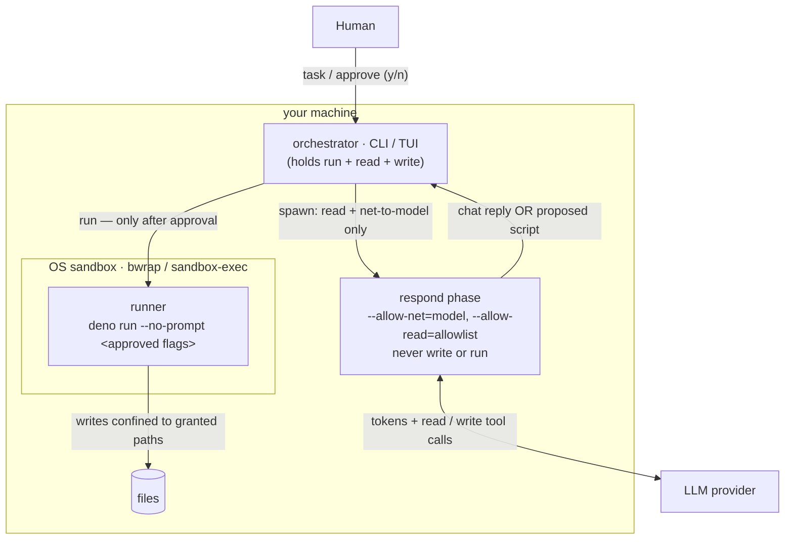
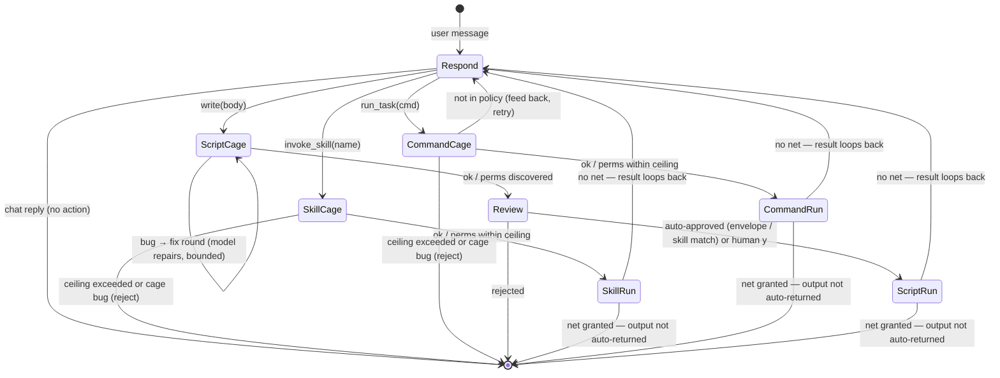
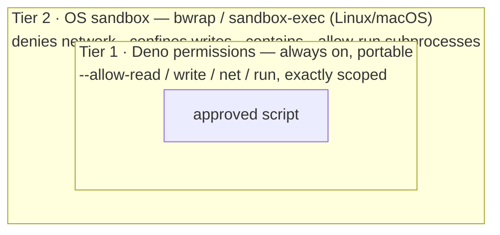

# pagu — context & design

> Status: the v1 loop is implemented and in daily use. Command: `pagu`. Named
> for _Paguroidea_, the hermit-crab superfamily — soft and untrusted inside (the
> LLM), operating only through a hard, borrowed, disposable shell (the sandboxed
> runner).
>
> **This is the single source of truth for the project** — rationale, threat
> model, design, roadmap, and the idea backlog. Durable project context goes
> here, not scattered across docs. **`README.md`** is usage; **`AGENTS.md`** is
> how-we-work; **`docs/CONCEPTS.md`** is the mental-models reference. The
> **Roadmap** at the bottom tracks shipped / open / backlog.

**Map** (sections below): _What & why_ — One-liner · Why it exists ·
Goals/non-goals. _The model_ — Core principle · System map · Phase FSM · State
model. _Security_ — Approval model · Output gating · Security tiers · Threat
model. _Project_ — Tech & UX · Build & packaging · **Roadmap** (Shipped · Roles
decided-behavior · Open · Idea backlog, with the **Next up** pointer).

## One-liner

A local, cross-platform agent you use like a terminal — but the model **can
never execute anything**. It reads context and _authors_ scripts into an
auditable conversation log; a human approves; a separate sandboxed runner
executes. Capability-phased, event-sourced, BYO model.

## Why it exists

Existing computer-use/coding agents make `execute` a tool the model can call
(behind an approval prompt). pagu removes that capability entirely: security
comes from the **absence** of the tool plus a mandatory human gate, not from
gating a dangerous tool the agent holds. The result is an agent whose entire
blast radius is statically enumerable.

## Goals / non-goals

**Goals**

- Quick to install on any computer/laptop/appliance. Connect a model provider,
  use immediately.
- Maximal power for user _and_ agent — with **no compromise of security for
  utility** (security is the invariant; utility is maximized within it).
- Fully auditable: every observation, proposed script, and result is a durable,
  diffable event.
- Small trusted core — readable in one sitting.

**Non-goals (deferred)**

- GUI/computer-use (mouse/screen) — CLI + TUI first, expand only if needed.
- Uniform OS-level sandboxing across every platform (see Security tiers — Linux
  and macOS are done; Windows is open).

(Several original non-goals have since shipped: conversation **forking**
(`/fork`), and a **multi-provider** layer — OpenAI Chat Completions covers
Ollama/OpenRouter/OpenAI/etc., with native Anthropic alongside.)

## Core principle: the model has no _real-effect_ execute capability

The agent's tools are **read** (allowlisted inspect), **write** (arbitrary
script proposals — requires human approval), **invoke_skill** (pre-authored
skill scripts — auto-approved within declared ceiling), and **run_task** (named
project tasks from the command policy — auto-approved within inferred/declared
ceiling). There is no `bash`/exec tool. **Real-effect execution** — running a
script with real-path writes, network, or broader permissions — happens only in
a separate process triggered by **human approval** or a pre-vetted envelope.

### The capability ladder

| tool           | what it does                             | approval path                            |
| -------------- | ---------------------------------------- | ---------------------------------------- |
| `read`         | inspect files/dirs                       | no side effects — always allowed         |
| `write`        | author arbitrary scripts                 | **human gate** (y/n at every proposal)   |
| `invoke_skill` | run a pre-authored skill script verbatim | auto-approved (verbatim match + ceiling) |
| `run_task`     | run a named project task from policy     | auto-approved (policy match + ceiling)   |

`invoke_skill` and `run_task` expand the agent's effective capability without
widening the blast radius: the orchestrator verifies the script body matches
verbatim what was pre-approved, and the cage still validates permissions within
the declared or inferred ceiling before executing.

Refinement (the cage): the agent _may_ run its proposed script in a **disposable
cage** to self-test and self-correct before you see it. The cage grants
`--allow-read=<allowlist>` + `--allow-write=<scratch>` only — **no network, no
real-path writes** — so autonomous execution cannot exfiltrate or damage
anything. The cage classifies each run:

- **runtime/type error** → feed back to the agent; it fixes and retries
  (bounded), so you review a _working_ script, not a buggy one;
- **permission denial** → not a bug — the script asked for a real permission the
  cage withholds; this _is_ the permission-discovery mechanism (see below),
  surfaced to you at approval;
- **clean exit** → present as-is.

So the boundary is precise: autonomous execution is confined to a no-net,
no-real-write rehearsal; real-effect execution stays human-gated.

## System map

Who holds which capability. The agent process (`respond`) only ever has read +
net-to-the-model; **write and run live only in the human-gated runner**, itself
wrapped by the OS sandbox where available.



## Phase FSM (chat-or-act)

The loop is a small state machine. **Each turn is a separate, short-lived
process launched with exactly that turn's permissions** — so the runtime
sandbox, not just our code, enforces the boundary. Turns are stateless: each
folds the conversation log and appends new events.

The original Observe and Author phases are now a **single `respond` phase**: the
model converses normally and only switches into "act" mode — authoring a script
with the `write` tool — when finishing the task genuinely needs an effect. It
reads with the `read` tool inside the same phase. So a plain question costs one
read-capable turn and no script at all.

| Phase                | process permissions                                 | tools                                       | advances when                        |
| -------------------- | --------------------------------------------------- | ------------------------------------------- | ------------------------------------ |
| **Respond**          | read = allowlist; net = provider only               | `read`, `write`, `invoke_skill`, `run_task` | model replies (chat) or emits action |
| **Cage** (self-test) | read = allowlist; write = scratch; **no net**       | — (runner)                                  | proposal runs clean / needs-perms    |
| **Review**           | _(no agent process)_                                | —                                           | **human** y/n (or auto-approve rule) |
| **Run**              | runner: scoped perms, in OS sandbox where available | — (runner)                                  | script exits → result re-enters loop |

The agent process only ever holds read + net-to-model; it never holds write or
run. After a run, the result re-enters the log and the loop continues (the model
wraps up or proposes the next step), bounded by a turn limit.

The three action paths diverge at the Respond→Cage transition:

| Tool called    | Cage purpose              | Auto-approve rule                        | Fix loop?                                     |
| -------------- | ------------------------- | ---------------------------------------- | --------------------------------------------- |
| `write`        | Discover needed perms     | Envelope / skill-match / human y/n       | Yes (MAX_FIX=3) — model repairs buggy scripts |
| `invoke_skill` | Validate within ceiling   | Ceiling match — auto only, no human gate | No — pre-authored, bug = reject               |
| `run_task`     | Discover / verify ceiling | Ceiling match — auto only, no human gate | No — generated body, bug = reject             |



**On phases as a folder:** `phases/` (the respond subprocess infrastructure) and
`runner/` (the cage + run execution engine) are both named after phases in the
FSM, but they don't co-change — the respond phase subprocess and the runner are
independent mechanisms. The coupling test: if you add a new tool, you change
`phases/respond.ts` (add dispatch) and the relevant capability module
(`skills/`, `tasks/`, `write/`) — you don't change `runner/`. The FSM is the
mental model; the folder structure reflects coupling.

## State model: the conversation log _is_ the event store

There is one canonical artifact: an append-only, git-backed conversation log.
Observations, proposed scripts, approvals, and run results are first-class turns
woven into it (CQRS event stream). Desktop state is the projection (fold) over
those events. Git history gives audit + (later) forking = branching the log.

### Format: Markdown + structured fenced blocks

Human-diffable prose with typed, parseable fenced blocks. **Tilde** fences
(`~~~pagu:<kind>`), not backtick, so a script body containing ``` survives the
round-trip:

- `~~~pagu:message` — a conversational turn (user task or assistant prose).
- `~~~pagu:observation` — what a read returned. `source` records **the command
  that ran** (`read <path>` / `ls <path>`) for a full action audit, not just its
  output.
- `~~~pagu:script` — a proposed script (lang + body).
- `~~~pagu:decision` — human approve/reject + rationale.
- `~~~pagu:result` — runner output + exit status + the exact perms it ran with.

One file, readable by a human, parseable by the harness, clean git diffs. A
session also carries a small YAML **frontmatter** header (display `name`,
`created`); the entries below stay the source of truth (`src/conversations.ts`).

## Approval model

> **Implemented:** a simple **y/n** per-script gate is the default — the human
> sees the proposed script and the exact permissions it will run with (surfaced
> by the cage's discovery), and approves or rejects. The runner enforces exactly
> those permissions; its enforcement is the actual security boundary.

- **Per-script explicit by default** (y/n; the perms list is always shown).
- **Auto-approve within an envelope.** A proposal runs without a prompt only
  when its **discovered permission set ⊆ a pre-vetted envelope**, verified by
  the cage (Deno's own denials), never by trusting the agent's description — so
  auto-approve can never silently widen the real capability surface. **Repo
  mode** is the shipped instance: grant read+write to the current git repo and
  auto-approve scripts confined to it (git is the undo buffer, the runner has no
  net, `.gitignore`'d paths are write-denied). Remembered per repo.
- **Modes** = named bundles of such envelopes — generalizing repo mode (e.g. a
  `scratch-readonly` mode) — remain open.

## Output gating falls out of the runner's permissions

Whether a script's output auto-returns into the agent's context is a function of
how the runner ran it:

- Runner had **no network** (`--deny-net` / no `--allow-net`) → output could not
  have phoned home; auto-return is contained. Script review covers local exfil
  (e.g. "logs out `$SECRET`").
- Runner was **granted network** → output passes a human glance before
  re-entering context.

This is the one deliberately relaxed point: the audit of the _script_ (catching
env-var logging etc.) is what makes the output channel safe, so we don't
double-gate output for net-less runs.

## Security tiers (portability makes this two-layer)

1. **Portable floor — Deno permissions.** Cross-platform read/write/net/ run
   scoping, identical on Linux/macOS/Windows. This is always present. Also
   applied to the **harness's own phase processes** (a buggy harness in Author
   phase still cannot read the disk).
2. **OS isolation — platform-specific hardening (implemented for Linux/macOS).**
   The runner wraps each `deno run` in **bubblewrap** (Linux, when `bwrap` is on
   PATH) or **sandbox-exec** (macOS). v1 hardens the two escape vectors that
   matter: it **denies network** (unless granted) and **confines writes** to the
   granted paths + scratch. Crucially this contains a subprocess spawned via
   `--allow-run` — which Deno does _not_ permission-bound — at the kernel level.
   It wraps both the cage self-test (unreviewed code) and the approved run.
   Auto-detected; falls back to tier 1 with a note when unavailable
   (`src/runner/sandbox.ts`). Windows (AppContainer/Job Objects) is open.

   _Scope of v1:_ **reads stay broad** at the OS layer (Deno still bounds the
   script's own reads). OS-layer read isolation + Landlock are roadmap items.

Honest ceiling: with only tier 1, a Deno/V8 escape would breach isolation; tier
2 closes the write/network escape (incl. via subprocesses) where the OS supports
it. Read confinement of subprocesses is the remaining tier-2 gap.



The script sits inside both walls; on a platform without tier 2 it still has the
portable tier-1 floor around it (no regression).

## Threat model (load-bearing parts)

- **Boundary = no-exec-capability + mandatory per-proposal human review.**
- **Reads are untrusted input** — the prompt-injection / exfiltration surface.
  Adversarial content in read material can steer what the agent _proposes_; the
  human review of every proposal is the backstop (Dual-LLM / quarantine
  posture). The per-turn gate bounds the read → propose → run → read
  amplification.
- **Runner perms cap an approved-but-buggy script**; **harness phase perms cap a
  buggy/compromised harness**.
- **Advisory reviewer** (`src/advisor.ts`) is a pre-screening _control action_
  that enriches human information at review — not a second approver and not in
  the critical path. It fails open; the human gate remains the sole security
  boundary. Structured `[advisory]` flags are presented alongside the review aid
  output to assist the human reviewer, not to make approval decisions
  autonomously.
- When approved scripts need egress, a credential-injecting proxy (e.g. Claw
  Patrol) can mediate so the script never sees raw secrets.

## Tech & UX

- **Runtime:** Deno (TypeScript). Cross-platform, runs TS directly,
  `deno compile` → single binary, permission model is the security floor.
- **Core in plain TypeScript — no Effect (evaluated, declined 2026-05).** A
  throwaway spike confirmed Effect v4-beta (`effect@4.0.0-beta.71` plus
  `@effect/ai-anthropic`/`-openai@4.0.0-beta.71`) _does_ run under Deno: the
  runtime, `effect/unstable/ai`, and `Tool`/`Toolkit`/handlers all compose and
  type-check. Declined anyway on measured cost — the AI layer is
  `effect/unstable/ai` (an explicitly _unstable_ API on a _beta_ runtime, with
  docs still v3-shaped); the `effect` package unpacks to ~48 MB over a wide
  transitive graph; and importing the AI modules adds ~120 ms to a cold process,
  which matters because pagu spawns a **fresh process per turn**. All of that
  works _against_ the value prop (small TCB, auditable in one sitting, minimal
  supply chain), and Effect's strength (in-process structured concurrency)
  doesn't touch pagu's real security seam (separate processes plus Deno
  permissions). **Direction:** build our own minimal abstractions in Effect's
  _footsteps_ — typed errors, composable layers, explicit effects at the seams —
  without the runtime. Revisit only if `effect/ai` stabilizes out of `unstable/`
  _and_ orchestration pain justifies it; even then, keep it out of the
  security-critical core.
- **`@cliffy/keypress` + `@cliffy/command` (adopted 2026-05).** Terminal key
  parsing (SS3 arrows, modifiers) is fiddly, edge-case-heavy, and
  non-differentiating, so we borrow the focused, stable `@cliffy/keypress` (1.x,
  small @std-based dep) for it — the opposite profile to the rejected Effect
  (small/stable/focused, earns its weight, like our `@std/*` use). We do **not**
  use `@cliffy/prompt`'s Select/Checkbox despite the overlap: they call
  `exit(130)` on Ctrl-C, which would kill the whole REPL. Driving keypress at
  the event level lets Ctrl-C/Esc cancel just the picker; the pure selection
  model (`reduce`/`frame`) stays ours and stays tested. Likewise `parseArgs`
  uses `@cliffy/command` for the CLI surface: typed flags, generated
  `--help`/usage, and shell completions as the flag set grows. Flags still map
  onto the same `RunOpts`/`ConfigLayer` split (reversible), and an unknown
  `--flag` falls into the free-text task — matching the prior hand-rolled
  behavior and harmless under the no-exec invariant.
- **Provider:** a hand-rolled **OpenAI Chat Completions** client is the default
  wire format (covers Ollama — the local default — plus OpenRouter, OpenAI,
  Groq, LM Studio, vLLM…), with a native **Anthropic** Messages client
  alongside, selected by a per-preset `format`. BYO key via named env vars;
  config never holds secrets. (Anthropic subscription OAuth is barred — API key
  only.)
- **Harness:** our own minimal loop + phase FSM, written from scratch — inspired
  by Pi (loop shape, tool-call parsing), not forked. Smaller TCB is the point,
  and from-scratch bakes in the no-exec/phase model from line one. `pi-ai` kept
  as an optional fallback if multi-provider lands.
- **Runner shell-out:** generated scripts use **only Deno built-ins** (no
  imports — simplest to run offline and review); they call CLIs via
  `Deno.Command`, gated by `--allow-run=<specific binaries>` surfaced by the
  cage. (A `dax`-style helper could be allowed later if the no-import rule
  proves too restrictive.)
- **UX:** CLI-first ("terminal with an LLM"); TUI for the transcript + approval
  view; GUI only if a real need appears.

## Build & packaging

- Standalone git repo (dev checkout lives in a gitignored subfolder of the
  homelab repo; published separately, e.g. JSR `@.../pagu`).
- No build step (Deno runs TS); distribute via `deno install` / `deno compile`.

## Roadmap

### Shipped since the original draft

- **The chat-or-act loop** — a single `respond` phase that converses and only
  authors a script when an effect is needed (replaced separate Observe/Author).
- **Permission discovery via the cage** — the self-test runs with no net and
  scratch-only writes, collecting the permissions Deno _denies_ as the requested
  set, surfaced at approval and fed to `within()`
  (`src/permissions/envelope.ts`) to gate auto-approve. Static AST analysis
  remains an optional precision refinement, not required.
- **Approval** — y/n per-script gate; **repo-mode** auto-approve within the
  git-repo envelope.
- **Conversation sessions** — per-project `.pagu/sessions/<id>.log.md` store
  with list / new / open / **fork** / rename (frontmatter `name`), `--continue`.
- **OS sandbox tier** — bubblewrap (Linux) + sandbox-exec (macOS): denies
  network and confines writes beneath the Deno floor (`src/runner/sandbox.ts`).
- **Providers** — OpenAI Chat Completions (default; Ollama/OpenRouter/OpenAI/…)
  - native Anthropic.
- **Frontends** — CLI one-shot + streaming TUI (spinner, slash commands with
  ghost-text autocomplete, context readout).
- **CLI ergonomics** — flags parsed by `@cliffy/command`: a generated
  `pagu --help`, and `pagu completions <bash|zsh|fish>` for shell completion.
- **Interactive pickers** — `/roles` (multi-select) and `/open` (single-select)
  open an arrow-key list (`src/select.ts`); the selection model is pure and
  unit-tested, key decoding is borrowed from `@cliffy/keypress`. Both keep a
  text fallback when stdin is not a TTY.
- **Config interop** — reads `CLAUDE.md` as a per-scope fallback when
  `AGENTS.md` is absent (prose only, never `.claude/` settings).
- **Roles** — composable config+instruction bundles: a markdown file whose YAML
  frontmatter folds as a `ConfigLayer` monoid and whose body appends as prose.
  `--role <name>` (repeatable) and the TUI `/roles` picker. See _Roles — decided
  behavior_ below.
- **Structured review aid** (`src/review.ts`) — pure module with four static
  analyses at the human approval gate: risk tier badge (read-only / local-write
  / EXTERNAL-NET), permission diff against envelope, LCS-based iteration diff
  when cage revised the script, and `--allow-run` target check. Replaces the
  flat script+perms dump.
- **Deno denial format pin** — two integration tests in `classify.test.ts` that
  run real Deno subprocesses and assert `classifyRun` returns `needs-perms` with
  the exact path. Fails at CI if Deno changes its denial message wording.
- **Advisory reviewer** (`src/advisor.ts`) — optional pre-approval add-on. Sends
  `{task, script, perms}` (not the full log) to a configurable model, returns
  structured flag strings labeled `[advisory]`. Fails open on any error. Enabled
  via `--advisor` flag, `advisor: true` in config, or TUI `/advisor` command
  (toggle/configure with preset + model; tab-completes). Separate
  `advisorProvider`/`advisorModel` config fields allow a different model from
  the proposer.
- **Illegal state elimination** — three redundant derived fields removed:
  `autoEnabled` (was `!!repo`), `autoReturn` (was `!grantsNet(ranWith)`), and
  scoped `Permission { flag: "all" }` (now a discriminated union; `all` is never
  scoped). `advisorEnabled` also removed — `advisorConfig` presence is the
  signal.
- **Skills system** (`src/skills.ts`, `src/tools/invoke-skill.ts`) — a skill is
  a directory `.pagu/skills/<name>/` containing `SKILL.md` (frontmatter +
  instructions, agentskills.io spec) and a `scripts/` subdirectory with
  pre-authored `.ts` files. Denotation: `(prose, ConfigLayer, files, scripts)` —
  extends roles by the same composition law. `invoke_skill` tool: agent names a
  skill script by enum-constrained name; the orchestrator resolves the verbatim
  body from `ctx.activeSkillScripts` (agent never copies content); cage
  validates and auto-approves within the declared permission ceiling.
- **Command policy / `run_task`** (`src/command-policy.ts`, `src/discovery.ts`,
  `src/tools/run-task.ts`) — `run_task` tool: agent passes an exact command
  string (enum-constrained to the allowed-tasks policy). Deny by default: only
  tasks listed in `allowed-tasks` config can run via `run_task`. Discovery scans
  `deno.json`, `package.json`, `Justfile` for available tasks at startup.
  **Type-inference model for permissions:** first cage run with minimal perms
  discovers what the command actually needs → stored in
  `.pagu/inferred-perms.json` (gitignored lockfile); second run cages against
  the stored ceiling. Explicit annotation = declared permissions; inferred type
  = cage-discovered permissions; strict mode = outside-repo (explicit required);
  type cache = `inferred-perms.json`.
- **ACP frontend** (`src/frontends/acp.ts`) — pagu runs as an Agent Client
  Protocol agent over stdio (`pagu --acp`), so editors (Zed via `agent_servers`)
  drive it. pagu is the _agent_, editor is the _client_, launched as a local
  subprocess. Port mapping: `session/prompt` → `runTask`; `session/update` ←
  `UI` (show/stream → `agent_message_chunk`); `session/request_permission` ←
  `Approver`; `session/new`/`session/load` ↔ session store. Uses
  `@agentclientprotocol/sdk` (`AgentSideConnection`, ndJSON over Deno-native web
  streams). **Declines the client's `terminal/*`/`fs/write` for execution** —
  the runner stays the only exec path (invariant #1); ACP carries conversation +
  approval UX only. Deferred: session/cancel (needs cancellable `runTask`),
  images/audio, MCP, remote transport.

### Roles — decided behavior (shipped; intended, surfaced — not bugs)

- **Fold order:** defaults → global `config.json` → selected roles (in `--role`
  order) → CLI flags (flags win last; roles are reusable middle layers). Prose:
  base AGENTS/CLAUDE (global then project), then each role's body, concatenated.
- **Merge law** (`mergeLayer`, a monoid): scalars last-write-wins; grants
  (`allow`/`write`) set-union (order-independent); deny-wins lattice when
  explicit denies arrive. See `docs/CONCEPTS.md`.
- **Scopes:** global `~/.config/pagu/roles/<name>.md` (any project), project
  `./.pagu/roles/<name>.md` (tracked/shared — `.gitignore` ignores only
  `.pagu/sessions/`). Same name in both: the project file **shadows** global.
- **Missing `--role <name>`:** **fail loud**, never silently ignored.
- **Runtime `/roles <names>`** **replaces** the active group and re-derives the
  whole effective config (provider, model, envelope/read-scope, prose). Most-
  recent action wins between `/roles` and `/provider`/`/model`; an unknown name
  leaves state unchanged. Repo mode is resolved once at startup, never
  re-prompted. Safe because auto-approve is gated by repo mode, not roles.

### Open

- **Verify the macOS `sandbox-exec` profile on a Mac** — implemented but not yet
  exercised on real hardware (developed/tested on Linux).
- **OS-layer read isolation + Landlock (Linux).** Tier 2 confines writes +
  network but leaves reads broad at the OS layer; per-path read binding / a
  Landlock backend would close subprocess read-confinement.
- **`.gitignore` read-protection.** `--deny-read=<child>` breaks `readDir` of
  the parent, so repo mode applies gitignore denies as **deny-write only**. A
  broad-read script can thus surface a secret's _contents_ to the (local) model
  — no internet exfil, the runner has no net. Fix: per-file read allowlisting,
  content redaction, or a narrower granted read set.
- **Windows OS isolation** (AppContainer / Job Objects).
- **Permission modes** — named envelope bundles generalizing repo mode.
- **A credential-injecting egress proxy** so net-granted scripts never see raw
  secrets.
- GUI / computer-use.

### Idea backlog (speculative / paradigm-level)

**Next up: #1, composable agent loops** — ACP shipped (2026-05-27); the capstone
is making the loop itself a composable value.

To knock out one at a time — not commitments. Designed through the compositional
lens (see `AGENTS.md` → Values: functional/compositional core, composition over
inheritance, category-theory/algebraic abstractions) and bound by the invariants
above (esp. #1: no agent exec path). It's a personal harness, so packing ideas
in is fair game — remove what doesn't earn its keep. (Shipped already: config
interop, roles, skills, command policy, ACP frontend — see the Shipped sections
above.)

1. **Composable agent loops — iterative review / multi-agent.** Treat `runTask`
   (or a smaller turn unit) as a **composable value** so loops combine: author →
   reviewer (iterative critique), fan-out/critique, etc. Multi-agent is _later_,
   but designing the loop as a composed procedure now (explicit in/out, no
   hidden actor state) keeps the door open — and that's the point where
   "independent actors" finally become appropriate. The capstone (ACP, its
   prerequisite frontend seam, is shipped).
2. **Composable extensibility — plugins / feature flags.** Further extension
   beyond skills/tasks without forking the core; new providers behind `chat()`,
   new frontends behind `UI`/`Approver`, new tools that still only _propose_.

Suggested order **1 → 2** (re-sequence freely as constraints surface).
