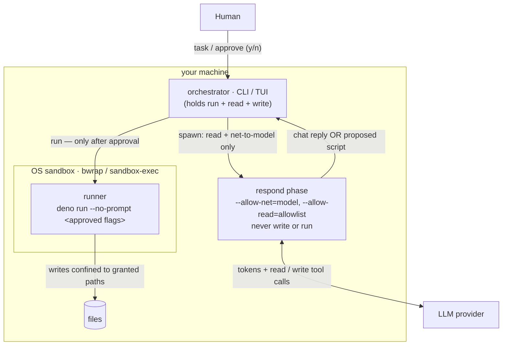
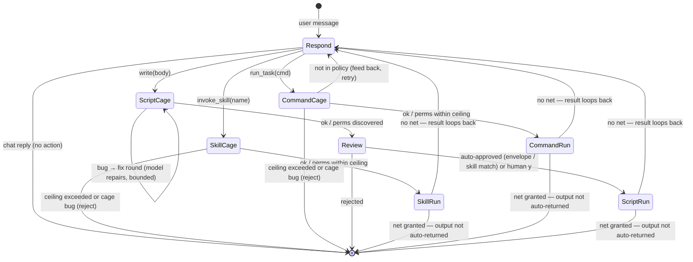
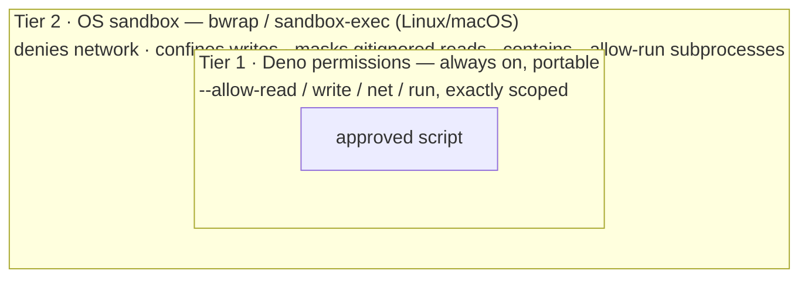

# pagu — context & design

> Status: the v1 loop is implemented and in daily use. Command: `pagu`. Named
> for _Paguroidea_, the hermit-crab superfamily — soft and untrusted inside (the
> LLM), operating only through a hard, borrowed, disposable shell (the sandboxed
> runner).
>
> **This is the single source of truth for the project** — rationale, threat
> model, design, roadmap, and the idea backlog. Durable project context goes
> here, not scattered across docs. **`README.md`** is usage; **`AGENTS.md`** is
> how-we-work; **`docs/CONCEPTS.md`** is the mental-models reference;
> **`docs/INVARIANTS.md`** is the canonical catalog of load-bearing claims with
> their enforcement tier — and the **single home of the numbered invariants
> (`#1`–`#5`)** this file cites throughout. The **Roadmap** at the bottom tracks
> shipped / open / backlog.

**Map** (sections below): _What & why_ — One-liner · Why it exists ·
Goals/non-goals. _The model_ — Core principle · System map · Phase FSM · State
model. _Security_ — Approval model · Output gating · Security tiers · Threat
model. _Project_ — Tech & UX · Build & packaging · **Roadmap** (Shipped · Roles
decided-behavior · Open · Idea backlog, with the **Next up** pointer).

## One-liner

A local, cross-platform agent you use like a terminal — but the model **can
never execute anything**. It reads context and _authors_ scripts into an
auditable conversation log; a human approves; a separate sandboxed runner
executes. Capability-phased, event-sourced, BYO model.

## Why it exists

Existing computer-use/coding agents make `execute` a tool the model can call
(behind an approval prompt). pagu removes that capability entirely: security
comes from the **absence** of the tool plus a mandatory human gate, not from
gating a dangerous tool the agent holds. The result is an agent whose entire
blast radius is statically enumerable.

The intended payoff: **safely give an agent access to personal homelabs and
critical infrastructure** — operate on _real working servers_, not a disposable
remote sandbox. The market splits into _sandbox-the-execution_ (throwaway envs)
and _SRE agents on real infra_ (RBAC/governance-gated agents that still _hold_
execute). pagu's wedge is **structural, not policy**: it contains a
_compromised_ model, not just a cooperative one. The demo-worthy proof is the
**golden scenario** (`examples/golden-scenario/`) — a prompt-injected pagu,
running unattended, that provably cannot leak secrets or escape, with
in-envelope damage bounded and restorable.

## Goals / non-goals

**Goals**

- Quick to install on any computer/laptop/appliance. Connect a model provider,
  use immediately.
- Maximal power for user _and_ agent — with **no compromise of security for
  utility** (security is the invariant; utility is maximized within it).
- Fully auditable: every observation, proposed script, and result is a durable,
  diffable event.
- Small trusted core — readable in one sitting.

**Non-goals (deferred)**

- GUI/computer-use (mouse/screen) — CLI + TUI first, expand only if needed.
- Uniform OS-level sandboxing across every platform (see Security tiers — Linux
  and macOS are done; Windows is open).

(Several original non-goals have since shipped: conversation **forking**
(`/fork`), and a **multi-provider** layer — OpenAI Chat Completions covers
Ollama/OpenRouter/OpenAI/etc., with native Anthropic alongside.)

## Core principle: the model has no _real-effect_ execute capability

The agent's tools are **read** (allowlisted inspect), **write** (arbitrary
script proposals — requires human approval), **invoke_skill** (pre-authored
skill scripts — auto-approved within declared ceiling), and **run_task** (named
project tasks from the command policy — auto-approved within inferred/declared
ceiling). There is no `bash`/exec tool. **Real-effect execution** — running a
script with real-path writes, network, or broader permissions — happens only in
a separate process triggered by **human approval** or a pre-vetted envelope.

### The capability ladder

| tool           | what it does                                                             | approval path                                    |
| -------------- | ------------------------------------------------------------------------ | ------------------------------------------------ |
| `read`         | inspect files/dirs                                                       | no side effects — always allowed                 |
| `write`        | author arbitrary scripts                                                 | **human gate** (y/n at every proposal)           |
| `invoke_skill` | run a pre-authored skill script verbatim                                 | auto-approved (verbatim match + ceiling)         |
| `run_task`     | run a named project task from policy                                     | auto-approved (policy match + ceiling)           |
| `run_command`  | run a vetted read-only command (search/inspect) with validated free args | auto-approved (grammar match, read-only ceiling) |

`invoke_skill`, `run_task`, and `run_command` expand the agent's effective
capability without widening the blast radius: the orchestrator verifies the
script body matches verbatim what was pre-approved, the cage validates
permissions within the declared or inferred ceiling, and `run_command`'s args
are validated against a per-command **grammar** (the safe argv sublanguage) and
run with a fixed read-only ceiling (no write/net). `run_task` and `run_command`
are two presentations over one command-policy spine (`recognize` subsumes
`matchesPolicy`; exact match = the degenerate zero-free-arg grammar).

Refinement (the cage): the agent _may_ run its proposed script in a **disposable
cage** to self-test and self-correct before you see it. The cage grants
`--allow-read=<allowlist>` + `--allow-write=<scratch>` only — **no network, no
real-path writes** — so autonomous execution cannot exfiltrate or damage
anything. The cage classifies each run:

- **runtime/type error** → feed back to the agent; it fixes and retries
  (bounded), so you review a _working_ script, not a buggy one;
- **permission denial** → not a bug — the script asked for a real permission the
  cage withholds; this _is_ the permission-discovery mechanism (see below),
  surfaced to you at approval;
- **clean exit** → present as-is.

So the boundary is precise: autonomous execution is confined to a no-net,
no-real-write rehearsal; real-effect execution stays human-gated.

## System map

Who holds which capability. The agent process (`respond`) only ever has read +
net-to-the-model; **write and run live only in the human-gated runner**, itself
wrapped by the OS sandbox where available.



## Phase FSM (chat-or-act)

The loop is a small state machine. **Each turn is a separate, short-lived
process launched with exactly that turn's permissions** — so the runtime
sandbox, not just our code, enforces the boundary. Turns are stateless: each
folds the conversation log and appends new events.

The original Observe and Author phases are now a **single `respond` phase**: the
model converses normally and only switches into "act" mode — authoring a script
with the `write` tool — when finishing the task genuinely needs an effect. It
reads with the `read` tool inside the same phase. So a plain question costs one
read-capable turn and no script at all.

| Phase                | process permissions                                 | tools                                       | advances when                        |
| -------------------- | --------------------------------------------------- | ------------------------------------------- | ------------------------------------ |
| **Respond**          | read = allowlist; net = provider only               | `read`, `write`, `invoke_skill`, `run_task` | model replies (chat) or emits action |
| **Cage** (self-test) | read = allowlist; write = scratch; **no net**       | — (runner)                                  | proposal runs clean / needs-perms    |
| **Review**           | _(no agent process)_                                | —                                           | **human** y/n (or auto-approve rule) |
| **Run**              | runner: scoped perms, in OS sandbox where available | — (runner)                                  | script exits → result re-enters loop |

The agent process only ever holds read + net-to-model; it never holds write or
run. After a run, the result re-enters the log and the loop continues (the model
wraps up or proposes the next step), bounded by a turn limit.

Two operational bounds make a long-lived/unattended run safe: a **per-run
wall-clock ceiling** (`RUN_TIMEOUT_MS`, default 120s — both cage and runner kill
a wedged script and surface a `timed out` result, so a hang can't pin the
process), and an **atomic log write** (`persist` writes a sibling temp then
renames over the canonical file — a crash never leaves the event store
half-written; the synchronous write is also load-bearing for `submitDecision`'s
double-submit safety). Both are partial answers to #16's "scheduled agents"
needs; an aggregate budget/iteration ceiling is still open.

Both Cage and Run execute the script with **cwd = the repo (repo mode) else the
launch directory** (`ctx.cwd`; for `run_task`/`invoke_skill`, the project root —
those are project tasks), never the throwaway script scratch — so a relative
path (`answer.txt`) resolves where the user is, and the cage observes the script
under the _same_ cwd the run will use. This is load-bearing: it's why a
relative-path write is _discovered_ by the cage (denied there exactly as at run)
rather than silently absorbed by the scratch. **The same dir is the base that
discovered perms are absolutized against** (`cageCwd` in `src/capability/`) —
run cwd, cage cwd, and absolutize base are one source, so they cannot diverge (a
divergence in non-repo / ACP-workspace mode was a real bug). cwd sets only
relative-path resolution; every effect is still bounded by the granted perms.

The three action paths diverge at the Respond→Cage transition:

| Tool called    | Cage purpose              | Auto-approve rule                        | Fix loop?                                     |
| -------------- | ------------------------- | ---------------------------------------- | --------------------------------------------- |
| `write`        | Discover needed perms     | Envelope / skill-match / human y/n       | Yes (MAX_FIX=3) — model repairs buggy scripts |
| `invoke_skill` | Validate within ceiling   | Ceiling match — auto only, no human gate | No — pre-authored, bug = reject               |
| `run_task`     | Discover / verify ceiling | Ceiling match — auto only, no human gate | No — generated body, bug = reject             |



**On phases as a folder:** `phases/` (the respond subprocess infrastructure) and
`runner/` (the cage + run execution engine) are both named after phases in the
FSM, but they don't co-change — the respond phase subprocess and the runner are
independent mechanisms. The coupling test: if you add a new tool, you change
`phases/respond.ts` (add dispatch) and the relevant capability module
(`skills/`, `tasks/`, `write/`) — you don't change `runner/`. The FSM is the
mental model; the folder structure reflects coupling.

## State model: the conversation log _is_ the event store

There is one canonical artifact: an append-only, git-backed conversation log.
Observations, proposed scripts, approvals, and run results are first-class turns
woven into it (CQRS event stream). Desktop state is the projection (fold) over
those events. Git history gives audit + (later) forking = branching the log.

### Format: Markdown + structured fenced blocks

Human-diffable prose with typed, parseable fenced blocks. **Tilde** fences
(`~~~pagu:<kind>`), not backtick, so a script body containing ``` survives the
round-trip:

- `~~~pagu:message` — a conversational turn (user task or assistant prose).
- `~~~pagu:observation` — what a read returned. `source` records **the command
  that ran** (`read <path>` / `ls <path>`) for a full action audit, not just its
  output.
- `~~~pagu:script` — a proposed script (lang + body).
- `~~~pagu:decision` — human approve/reject + rationale.
- `~~~pagu:result` — runner output + exit status + the exact perms it ran with.

One file, readable by a human, parseable by the harness, clean git diffs. A
session also carries a small YAML **frontmatter** header (display `name`,
`created`); the entries below stay the source of truth (`src/conversations.ts`).

### Open: the markdown _container_ assumes a single co-located reader

The log is already a typed event store — the entries are the canonical CQRS
stream, the markdown is the _container_. That container quietly assumes one
writer (the runner) and one reader (a co-located CLI/TUI that re-folds the whole
file). That assumption holds today and should not be disturbed for the
co-located case — it is exactly what gives the cheap "read the file"
auditability the threat model leans on. What it does _not_ provide is what a
**non-co-located client** (ACP remote, a management surface, an alerting
webhook) needs:

- an **offset / event id** so a reconnecting client can ask for "everything
  after N" instead of re-reading the file (the entire sync story for remote
  clients — append-only + single-writer means no CRDT and no consensus _for the
  log itself_; ordering has one authority per session);
- a **tail/subscribe** affordance instead of poll-and-reparse;
- the events as a **stream**, not only a file.

The framing to hold: do **not** demote the markdown — it stays a first-class
projection (the human-readable, git-diffable one). The open question is whether
the _same typed events_ also get an addressable, streamable representation
(append-addressed JSONL, or SQLite for indexed cross-session queries) that the
markdown is rendered _from_. If so, several things fall out for free, the same
way content-addressed caching falls out elsewhere: offset-based resumption _is_
the remote sync protocol; the observability stream (costs, advisor flags,
approvals, hook firings) is just a **filtered projection of the one log**, not a
parallel pipeline; cross-session / cross-host queries become expressible at all.

The cost, stated honestly: a structured store shifts auditability from "read the
file" to "trust the projection," and the moment a second client reads the events
the **event schema becomes public API** — it needs the same floor-test
versioning discipline as `src/mod.ts` (a CI test that fails on a
backwards-incompatible change). Where CRDTs _do_ earn a place is the
coordination edge _around_ the logs (a client aggregating many hosts;
multi-client edits to session metadata / tags / standing approvals) — kept to
types whose current value is statable in one line (OR-set, LWW-register), never
the conversation log itself, which stays single-writer authoritative. (Whether
this is worth doing is gated on the remote-client work actually landing — see
Roadmap → Idea backlog → the subscribable event stream.)

## Approval model

> **Implemented:** a simple **y/n** per-script gate is the default — the human
> sees the proposed script and the exact permissions it will run with (surfaced
> by the cage's discovery), and approves or rejects. The runner enforces exactly
> those permissions; its enforcement is the actual security boundary.

- **Per-script explicit by default** (y/n; the perms list is always shown).
- **Auto-approve within an envelope.** A proposal runs without a prompt only
  when its **discovered permission set ⊆ a pre-vetted envelope**, verified by
  the cage (Deno's own denials), never by trusting the agent's description — so
  auto-approve can never silently widen the real capability surface. **Repo
  mode** is the shipped instance: grant read+write to the current git repo and
  auto-approve scripts confined to it (git is the undo buffer, the runner has no
  net, `.gitignore`'d paths are write-denied). Remembered per repo.
- **Modes** = named bundles of such envelopes — generalizing repo mode (e.g. a
  `scratch-readonly` mode) — remain open.

## Output gating falls out of the runner's permissions

Whether a script's output auto-returns into the agent's context is a function of
how the runner ran it:

- Runner had **no network** (`--deny-net` / no `--allow-net`) → output could not
  have phoned home; auto-return is contained. Script review covers local exfil
  (e.g. "logs out `$SECRET`").
- Runner was **granted network** → output passes a human glance before
  re-entering context.

This is the one deliberately relaxed point: the audit of the _script_ (catching
env-var logging etc.) is what makes the output channel safe, so we don't
double-gate output for net-less runs.

## Security tiers (portability makes this layered)

1. **Portable floor — Deno permissions.** Cross-platform read/write/net/ run
   scoping, identical on Linux/macOS/Windows. This is always present. Also
   applied to the **harness's own phase processes** (a buggy harness in Author
   phase still cannot read the disk).
2. **OS isolation — platform-specific hardening (implemented for Linux/macOS).**
   The runner wraps each `deno run` in **bubblewrap** (Linux, when `bwrap` is on
   PATH) or **sandbox-exec** (macOS). v1 hardens the escape vectors that matter:
   it **denies network** (unless granted), **confines writes** to the granted
   paths + scratch, and **masks concealed paths** from the runner's filesystem
   view (read confinement — bwrap binds `/dev/null`/empty-tmpfs over them,
   sandbox-exec denies reads). The concealment set is multi-source —
   `.gitignore` (the VCS source), the config `hide` globs, and an on-by-default
   secret-glob list (`.env`/`*.pem`/…) — with a `reveal` opt-out
   (`src/permissions/concealment.ts`). Crucially this contains a subprocess
   spawned via `--allow-run` — which Deno does _not_ permission-bound — at the
   kernel level. It wraps both the cage self-test (unreviewed code) and the
   approved run. Auto-detected; falls back to tier 1 with a note when
   unavailable (`src/runner/sandbox.ts`). Windows (AppContainer/Job Objects) is
   open.

   _Scope of v1:_ reads of granted, non-concealed content stay broad at the OS
   layer (Deno bounds the script's own reads); concealed paths (gitignore +
   config `hide` + default secrets) are masked. Arbitrary per-path read
   confinement (Landlock) is a roadmap item; at tier 1 only (no OS sandbox —
   e.g. Windows or `--no-sandbox`) the masking is absent and the read gap
   persists.
3. **Optional outer VM tier (sub-project B) — `pagu vm`.** A coarse wall around
   the _whole_ pagu process (not per-script): `detectVM` runs pagu in a guest
   (rootless **Podman** first cut; degrades to `none` → runs directly, no
   regression). Only cwd is mounted, concealed paths are masked at the **mount
   layer** (tier-2 can't nest in a rootless container, so this replaces bwrap's
   read-masking in-guest), and the guest is on an isolated netns. Opt-in
   (`pagu vm <task>`), so it doesn't affect normal runs. The Firecracker microVM
   tier + model-host-only egress confinement are deferred (`src/vm/`,
   `src/frontends/vm.ts`, `vm/Containerfile`).

Honest ceiling: with only tier 1, a Deno/V8 escape would breach isolation; tier
2 closes the write/network escape (incl. via subprocesses) and masks concealed
paths (gitignore + config + default secrets) from reads where the OS supports
it.



The script sits inside both walls; on a platform without tier 2 it still has the
portable tier-1 floor around it (no regression).

## Threat model (load-bearing parts)

- **Boundary = no-exec-capability + mandatory per-proposal human review.**
- **Reads are untrusted input** — the prompt-injection / exfiltration surface.
  Adversarial content in read material can steer what the agent _proposes_; the
  human review of every proposal is the backstop (Dual-LLM / quarantine
  posture). The per-turn gate bounds the read → propose → run → read
  amplification.
  - **The context axis is a trust gradient** (model owned by `docs/CONCEPTS.md`
    → The context axis is a trust gradient). The structural invariant —
    _untrusted context may inform, never instruct_ — is the context-axis sibling
    of deny-wins. Its security _consequence_ lives here: an
    `~~~pagu:observation` entry is accumulated-untrusted and must never be
    treated as an authored instruction at prompt-assembly. The log's typed entry
    kinds already carry the label; the discipline is that prompt assembly
    preserve it (fence untrusted spans), never flatten observation into
    instruction.
  - **Relation to CaMeL / dual-LLM (prior art, same diagnosis, different
    cure).** The diagnosis — mixing trust levels in one token stream is the root
    flaw — is shared with Willison's Dual-LLM pattern and DeepMind's **CaMeL**
    ("Defeating Prompt Injections by Design", 2025), which labels every value
    with a capability and **taint-tracks** whether untrusted data reaches a
    dangerous sink, blocking the tool call if so. pagu's cure is **structural,
    not dataflow**: there is no sink to reach, because the agent holds no
    execute capability — untrusted context can at most cause a _proposal_, which
    hits the cage + envelope + human gate. CaMeL keeps full autonomy and pays
    with a conservative taint policy (≈⅔ task completion on AgentDojo, since any
    untrusted-derived argument is rejected); pagu trades some autonomy (novel
    actions need approval) for total containment that does not depend on
    tracking taint correctly. The two sit at different points on the
    autonomy/containment frontier; pagu's wedge (contain a _compromised_ model,
    not merely a cooperative one) is the sharper end. This is the same lineage
    as the LangSec framing (`docs/CONCEPTS.md` → The command grammar): a
    boundary _described_ in prose is not a boundary; a boundary that is
    structural (an absent capability, a recognised grammar, a typed envelope) is
    _enforced_.
  - **The residual recogniser (honest seam).** The LangSec ideal is _complete_
    recognisability. pagu has one irreducible non-decidable recogniser left: the
    human reading a `write` script at the gate. We have not eliminated it — we
    have moved it _off the hot path_ (novelty only; `invoke_skill`/`run_task`/
    `run_command` are decidable and auto-approve) and surrounded it with
    decidable structure (cage-discovered perms, envelope diff, advisor flags).
    The irreducible "should I authorise this novel script?" decision is where a
    sufficiently clever injected proposal could still get a tired human to say
    yes; approval fatigue (below) is the empirical form of this risk. pagu
    _minimises and structures_ the weird-machine surface; it does not claim to
    have zero.
  - **Approval fatigue is a named risk.** Too many prompts habituate "yes"; this
    is the failure mode the auto-approve envelope (decidable, deny-by-default)
    exists to keep _rare_, so the human's attention is spent only on genuine
    novelty. Any future change that increases gate frequency trades against
    this.
- **Runner perms cap an approved-but-buggy script**; **harness phase perms cap a
  buggy/compromised harness**.
- **Advisory reviewer** (`src/advisor.ts`) is a pre-screening _control action_
  that enriches human information at review — not a second approver and not in
  the critical path. It fails open; the human gate remains the sole security
  boundary. Structured `[advisory]` flags are presented alongside the review aid
  output to assist the human reviewer, not to make approval decisions
  autonomously.
- When approved scripts need egress, a credential-injecting proxy (e.g. Claw
  Patrol) can mediate so the script never sees raw secrets.

## Tech & UX

- **Runtime:** Deno (TypeScript). Cross-platform, runs TS directly,
  `deno compile` → single binary, permission model is the security floor.
- **Core in plain TypeScript — no Effect (evaluated, declined 2026-05).** A
  throwaway spike confirmed Effect v4-beta (`effect@4.0.0-beta.71` plus
  `@effect/ai-anthropic`/`-openai@4.0.0-beta.71`) _does_ run under Deno: the
  runtime, `effect/unstable/ai`, and `Tool`/`Toolkit`/handlers all compose and
  type-check. Declined anyway on measured cost — the AI layer is
  `effect/unstable/ai` (an explicitly _unstable_ API on a _beta_ runtime, with
  docs still v3-shaped); the `effect` package unpacks to ~48 MB over a wide
  transitive graph; and importing the AI modules adds ~120 ms to a cold process,
  which matters because pagu spawns a **fresh process per turn**. All of that
  works _against_ the value prop (small TCB, auditable in one sitting, minimal
  supply chain), and Effect's strength (in-process structured concurrency)
  doesn't touch pagu's real security seam (separate processes plus Deno
  permissions). **Direction:** build our own minimal abstractions in Effect's
  _footsteps_ — typed errors, composable layers, explicit effects at the seams —
  without the runtime. Revisit only if `effect/ai` stabilizes out of `unstable/`
  _and_ orchestration pain justifies it; even then, keep it out of the
  security-critical core.
- **`@cliffy/keypress` + `@cliffy/command` (adopted 2026-05).** Terminal key
  parsing (SS3 arrows, modifiers) is fiddly, edge-case-heavy, and
  non-differentiating, so we borrow the focused, stable `@cliffy/keypress` (1.x,
  small @std-based dep) for it — the opposite profile to the rejected Effect
  (small/stable/focused, earns its weight, like our `@std/*` use). We do **not**
  use `@cliffy/prompt`'s Select/Checkbox despite the overlap: they call
  `exit(130)` on Ctrl-C, which would kill the whole REPL. Driving keypress at
  the event level lets Ctrl-C/Esc cancel just the picker; the pure selection
  model (`reduce`/`frame`) stays ours and stays tested. Likewise `parseArgs`
  uses `@cliffy/command` for the CLI surface: typed flags, generated
  `--help`/usage, and shell completions as the flag set grows. Flags still map
  onto the same `RunOpts`/`ConfigLayer` split (reversible), and an unknown
  `--flag` falls into the free-text task — matching the prior hand-rolled
  behavior and harmless under the no-exec invariant.
- **Provider:** a hand-rolled **OpenAI Chat Completions** client is the default
  wire format (covers Ollama — the local default — plus OpenRouter, OpenAI,
  Groq, LM Studio, vLLM…), with a native **Anthropic** Messages client
  alongside, selected by a per-preset `format`. BYO key via named env vars;
  config never holds secrets. (Anthropic subscription OAuth is barred — API key
  only.)
- **Harness:** our own minimal loop + phase FSM, written from scratch — inspired
  by Pi (loop shape, tool-call parsing), not forked. Smaller TCB is the point,
  and from-scratch bakes in the no-exec/phase model from line one. `pi-ai` kept
  as an optional fallback if multi-provider lands.
- **Runner shell-out:** generated scripts use **only Deno built-ins** (no
  imports — simplest to run offline and review); they call CLIs via
  `Deno.Command`, gated by `--allow-run=<specific binaries>` surfaced by the
  cage. (A `dax`-style helper could be allowed later if the no-import rule
  proves too restrictive.)
- **UX:** CLI-first ("terminal with an LLM"); TUI for the transcript + approval
  view; GUI only if a real need appears.

## Build & packaging

- Standalone git repo (dev checkout lives in a gitignored subfolder of the
  homelab repo; published separately, e.g. JSR `@.../pagu`).
- No build step (Deno runs TS); distribute via `deno install` / `deno compile`.

## Roadmap

### Shipped since the original draft

- **The chat-or-act loop** — a single `respond` phase that converses and only
  authors a script when an effect is needed (replaced separate Observe/Author).
- **Permission discovery via the cage** — the self-test runs with no net and
  scratch-only writes, collecting the permissions Deno _denies_ as the requested
  set, surfaced at approval and fed to `within()`
  (`src/permissions/envelope.ts`) to gate auto-approve. Static AST analysis
  remains an optional precision refinement, not required.
- **Approval** — y/n per-script gate; **repo-mode** auto-approve within the
  git-repo envelope.
- **Conversation sessions** — per-project `.pagu/sessions/<id>.log.md` store
  with list / new / open / **fork** / rename (frontmatter `name`), `--continue`.
- **OS sandbox tier** — bubblewrap (Linux) + sandbox-exec (macOS): denies
  network and confines writes beneath the Deno floor (`src/runner/sandbox.ts`).
- **Providers** — OpenAI Chat Completions (default; Ollama/OpenRouter/OpenAI/…)
  - native Anthropic.
- **Frontends** — CLI one-shot + streaming TUI (spinner, slash commands with
  ghost-text autocomplete, context readout).
- **CLI ergonomics** — flags parsed by `@cliffy/command`: a generated
  `pagu --help`, and `pagu completions <bash|zsh|fish>` for shell completion.
- **Interactive pickers** — `/roles` (multi-select) and `/open` (single-select)
  open an arrow-key list (`src/select.ts`); the selection model is pure and
  unit-tested, key decoding is borrowed from `@cliffy/keypress`. Both keep a
  text fallback when stdin is not a TTY.
- **Config interop** — reads `CLAUDE.md` as a per-scope fallback when
  `AGENTS.md` is absent (prose only, never `.claude/` settings).
- **Roles** — composable config+instruction bundles: a markdown file whose YAML
  frontmatter folds as a `ConfigLayer` monoid and whose body appends as prose.
  `--role <name>` (repeatable) and the TUI `/roles` picker. See _Roles — decided
  behavior_ below.
- **Structured review aid** (`src/review.ts`) — pure module with four static
  analyses at the human approval gate: risk tier badge (read-only / local-write
  / EXTERNAL-NET), permission diff against envelope, LCS-based iteration diff
  when cage revised the script, and `--allow-run` target check. Replaces the
  flat script+perms dump.
- **Deno denial format pin** — two integration tests in `classify.test.ts` that
  run real Deno subprocesses and assert `classifyRun` returns `needs-perms` with
  the exact path. Fails at CI if Deno changes its denial message wording.
- **Advisory reviewer** (`src/advisor.ts`) — optional pre-approval add-on. Sends
  `{task, script, perms}` (not the full log) to a configurable model, returns
  structured flag strings labeled `[advisory]`. Fails open on any error. Enabled
  via `--advisor` flag, `advisor: true` in config, or TUI `/advisor` command
  (toggle/configure with preset + model; tab-completes). Separate
  `advisorProvider`/`advisorModel` config fields allow a different model from
  the proposer.
- **Illegal state elimination** — three redundant derived fields removed:
  `autoEnabled` (was `!!repo`), `autoReturn` (was `!grantsNet(ranWith)`), and
  scoped `Permission { flag: "all" }` (now a discriminated union; `all` is never
  scoped). `advisorEnabled` also removed — `advisorConfig` presence is the
  signal.
- **Skills system** (`src/skills.ts`, `src/tools/invoke-skill.ts`) — a skill is
  a directory `.pagu/skills/<name>/` containing `SKILL.md` (frontmatter +
  instructions, agentskills.io spec) and a `scripts/` subdirectory with
  pre-authored `.ts` files. Denotation: `(prose, ConfigLayer, files, scripts)` —
  extends roles by the same composition law. `invoke_skill` tool: agent names a
  skill script by enum-constrained name; the orchestrator resolves the verbatim
  body from `ctx.activeSkillScripts` (agent never copies content); cage
  validates and auto-approves within the declared permission ceiling.
- **Command policy / `run_task`** (`src/command-policy.ts`, `src/discovery.ts`,
  `src/tools/run-task.ts`) — `run_task` tool: agent passes an exact command
  string (enum-constrained to the allowed-tasks policy). Deny by default: only
  tasks listed in `allowed-tasks` config can run via `run_task`. Discovery scans
  `deno.json`, `package.json`, `Justfile` for available tasks at startup.
  **Type-inference model for permissions:** first cage run with minimal perms
  discovers what the command actually needs → stored in
  `.pagu/inferred-perms.json` (gitignored lockfile); second run cages against
  the stored ceiling. Explicit annotation = declared permissions; inferred type
  = cage-discovered permissions; strict mode = outside-repo (explicit required);
  type cache = `inferred-perms.json`.
- **ACP frontend** (`src/frontends/acp.ts`) — pagu runs as an Agent Client
  Protocol agent over stdio (`pagu --acp`), so editors (Zed via `agent_servers`)
  drive it. pagu is the _agent_, editor is the _client_, launched as a local
  subprocess. Port mapping: `session/prompt` → `runTask`; `session/update` ←
  `UI` (show/stream → `agent_message_chunk`); `session/request_permission` ←
  `Approver`; `session/new`/`session/load` ↔ session store. Uses
  `@agentclientprotocol/sdk` (`AgentSideConnection`, ndJSON over Deno-native web
  streams). **Declines the client's `terminal/*`/`fs/write` for execution** —
  the runner stays the only exec path (invariant #1); ACP carries conversation +
  approval UX only. `session/new`|`load` honor the client's workspace `cwd`
  (2026-05-28) so repo + read-allowlist detection follows the editor's project.
  **v1 is partial** — chat + approval + **history replay on load** + **config
  slash commands** (`/model`/`/provider`/`/advisor` advertised + routed;
  `src/commands.ts`) work. Cancellation and tool-call surfacing remain (see Open
  → "ACP — remaining integration work"). Still deferred: images/audio, MCP,
  remote transport.
- **Composable agent loops — substrate (v1)** (`src/loop.ts`) — the agent loop
  is now a composable value, not a hand-written `for`. Denotation:
  `⟦Flow⟧ =
  continue | done` (coproduct), `⟦Step<C>⟧ = C → Promise<Flow>` (a
  turn), `⟦loop⟧ =
  bounded fixpoint`. `loop : Step → Step` is closed over the
  type (a loop is itself a composable turn) — the lawful reason it returns a
  `Step`, not a runner. `runTask` is reconstructed as
  `loop(turn, MAX_TURNS)(ctx)`, behavior-identical (full suite + live run
  green). The turn is **atomic over the inner cage fix-round loop** (unification
  deferred). `andThen` (composition) is now **implemented** (the handler
  pipeline below is its first caller, at the `Proposal` carrier); `fanOut` (the
  eager-parallel fold of the `Flow` monoid, dual to `pipeline`'s lazy-sequential
  fold) remains deferred — see
  `docs/specs/2026-05-29-fanout-combinator-design.md`. See also
  `docs/specs/2026-05-28-composable-agent-loops-design.md`.
- **Composable handler pipeline (v1)** (`src/write/pipeline.ts`) —
  `write/execute.ts` is now `pipeline([cage, approve, run])` over
  `Step<Proposal>`: the proposal–handler model made concrete (`docs/CONCEPTS.md`
  — effects ≅ permissions ≅ types). Each stage is a named, insertable handler; a
  **gate** halts (returns `done`). Reuses the loop substrate's generic `Step<C>`
  and implements `andThen` + `pipeline` in `src/loop.ts`. Behavior-identical
  (full suite + a live run on both the auto-approve→run and reject→short-circuit
  paths). Keystone law: **handlers tighten, never widen** (a future plugin is
  safe by the same lattice law as role composition; the set of handlers is the
  TCB). Deferred: config-driven pluggability (where the law gets type-enforced)
  and generalizing to the `skills`/`tasks` executors. See
  `docs/specs/2026-05-28-composable-handler-pipeline-design.md`.

### Roles — decided behavior (shipped; intended, surfaced — not bugs)

- **Fold order:** defaults → global `config.json` → selected roles (in `--role`
  order) → CLI flags (flags win last; roles are reusable middle layers). Prose:
  base AGENTS/CLAUDE (global then project), then each role's body, concatenated.
- **Merge law** (`mergeLayer`, a monoid): scalars last-write-wins; grants
  (`allow`/`write`) set-union (order-independent); deny-wins lattice when
  explicit denies arrive. See `docs/CONCEPTS.md`.
- **Scopes:** global `~/.config/pagu/roles/<name>.md` (any project), project
  `./.pagu/roles/<name>.md` (tracked/shared — `.gitignore` ignores only
  `.pagu/sessions/`). Same name in both: the project file **shadows** global.
- **Missing `--role <name>`:** **fail loud**, never silently ignored.
- **Runtime `/roles <names>`** **replaces** the active group and re-derives the
  whole effective config (provider, model, envelope/read-scope, prose). Most-
  recent action wins between `/roles` and `/provider`/`/model`; an unknown name
  leaves state unchanged. Repo mode is resolved once at startup, never
  re-prompted. Safe because auto-approve is gated by repo mode, not roles.

### Open

- **Verify the macOS `sandbox-exec` profile on a Mac** — implemented but not yet
  exercised on real hardware (developed/tested on Linux).
- **Arbitrary per-path read confinement + Landlock (Linux).** Tier 2 now masks
  _gitignored_ paths (the secret-read gap, closed), but reads of granted repo
  content stay broad at the OS layer; a Landlock backend would allow narrowing
  reads to an arbitrary per-path allowlist beyond the gitignore set.
- **Windows OS isolation** (AppContainer / Job Objects).
- **Permission modes** — named envelope bundles generalizing repo mode.
- **A credential-injecting egress proxy** so net-granted scripts never see raw
  secrets.
- **ACP — remaining integration work.** v1 runs in editors but is partial.
  **Shipped** 2026-05-28: history replay on `session/load` (`historyUpdates` +
  `loadSession`); config slash commands (`/model`/`/provider`/`/advisor`
  advertised via `available_commands_update` + routed; `src/commands.ts`);
  **tool-call surfacing** (`script`/`skill-invoke`/`command-invoke` →
  `tool_call`, `result` → `tool_call_update`, live + replay, via one
  `entryUpdate` mapper + the `UI.entries` hook; `src/frontends/acp.ts`).
  Remaining:
  - **`/roles` & `/skills` over ACP** — their no-args path is a TUI-only
    `selectFromList` picker; need a with-args-shared + ACP-text-listing split
    (the TUI keeps its picker). Likely folded into the command-architecture
    generalization (backlog).
  - **Cooperative cancellation** (`session/cancel`) — currently a no-op; needs a
    cancellable `runTask` (ties to the loop substrate — a cancel signal the loop
    checks between turns).
  - **Thinking** → `agent_thought_chunk` — **shipped 2026-05-29** for
    `<think>`-tag reasoning (local models): a typed live stream channel
    (`content`/`reasoning`/`marker` frames over the phase stderr side-channel)
    routes reasoning to `agent_thought_chunk` (TUI dims it) and `· read X` to a
    marker channel. Reasoning is ephemeral (never logged/re-sent). **Deferred:**
    structured `reasoning_content` (DeepSeek) + Anthropic `thinking` — both
    require reasoning re-sent unchanged across tool-call continuations (else
    400), which needs preserve-and-resend + a richer log structure. Also still
    open: diff/terminal tool-call content.
  - Live-verify the slash-command **invocation format** Zed sends (literal
    `/name …` text is assumed; adjust routing if it sends bare names).
- GUI / computer-use.

### Idea backlog (speculative / paradigm-level)

**Next up: the handler-pipeline follow-ons.** Both the loop substrate and the
composable handler pipeline (v1) shipped 2026-05-28 (`src/loop.ts`,
`src/write/pipeline.ts`; see Shipped). The seam is in; the next slices are its
increments — **config-driven pluggability** (insert custom handlers; the point
where the gate-never-widen law gets _type-enforced_) and **generalizing** the
handler pipeline to the `skills`/`tasks` executors. (Then back to #1: `fanOut` /
multi-agent.)

To knock out one at a time — not commitments. Designed through the compositional
lens (see `AGENTS.md` → Values: functional/compositional core, composition over
inheritance, category-theory/algebraic abstractions) and bound by the invariants
above (esp. #1: no agent exec path). It's a personal harness, so packing ideas
in is fair game — remove what doesn't earn its keep. (Shipped already: config
interop, roles, skills, command policy, ACP frontend — see the Shipped sections
above.)

1. **Composable agent loops — iterative review / multi-agent.** Substrate (v1)
   **shipped** 2026-05-28 (`src/loop.ts`): the turn is a `Step<C>`, `runTask` is
   `loop(turn)`. `fanOut` **shipped 2026-05-29** (`src/loop.ts`: eager-parallel
   fold of the `Flow` monoid; race-freedom is a call-site responsibility via
   read-only carriers like `ReadonlyExec`, _not_ a global immutable-carrier
   rewrite; 6 laws property-tested with `pipeline` as the oracle). Remaining:
   multi-agent _later_, the point where "independent actors" finally become
   appropriate — and a first real `fanOut` consumer. **Author→critic→revise:
   deferred** — it turned out to be an _inner_ loop (sibling to the cage
   fix-round loop), not turn-level `andThen`, and its use case (sharpening
   proposals on the advisor-on human-gate path) is too narrow to justify now.
   `andThen` stays a deferred combinator until a genuine turn-level composition
   needs it. Also queued: unifying the inner cage fix-round loop under a shared
   inner-loop combinator (would gain a second instance if author→critic is ever
   revived).
2. **Composable handler pipeline — the proposal–handler model made explicit.**
   Core (v1) **shipped** 2026-05-28 (`src/write/pipeline.ts`):
   `write/execute.ts` is `pipeline([cage, approve, run])` over `Step<Proposal>`;
   each stage a named, insertable handler; a **gate** halts. Implements
   `andThen`/`pipeline` in `src/loop.ts`. Remaining increments: **config-driven
   pluggability** (insert custom/plugin handlers — the point where the
   gate-never-widen law gets _type-enforced_, since a plugin is safe by the same
   lattice law as role composition; the set of handlers is the TCB) and
   **generalizing** the pipeline to the `skills`/`tasks` executors. Stays
   value-level; algebraic effect handlers (operation-granularity interception)
   only if a real need surfaces — pagu's one-action-per-turn shape means the
   turn boundary ≈ the effect site, so boundary-level handlers likely suffice.
   Pluggability is also the home for plugins / extensibility (new providers
   behind `chat()`, new frontends behind `UI`/`Approver`).
3. **Read-only-command auto-approve gate → command grammar. Shipped 2026-05-28**
   (`docs/specs/2026-05-28-command-grammar-design.md`; `tasks/grammar.ts` +
   `tasks/defaults.ts` + the `run_command` tool). Auto-approves curated
   read-only commands (`rg`/`git log`/`git diff`, `allow-read` + `allow-run`,
   **no write, no net**) with **agent-supplied args validated by a formal
   grammar**. **Subsumes** `run_task` (its exact-enum = the degenerate
   zero-free-arg grammar — `recognize` generalises `matchesPolicy`; folds in
   part of #4). Arg-safety is **LangSec**: a regular sublanguage of safe argv
   invocations, recognised default-deny (the no-shell architecture is what makes
   it regular). The "read-only" trap (`--pre`, `find -delete`,
   abbreviation/bundling) is handled by a canonical-flag allowlist + the law
   **free args ⇒ read-only ceiling**; the recogniser is a filter, not the
   boundary (perms + sandbox + #5 bound what's possible). Tested by example
   slices + property invariants (totality, positive path generator, negative
   flag injection). **Remaining (deferred):** user-extensible rules via config;
   folder rename `tasks/`→`commands/`; write/net free-arg commands;
   symlink-escape in path containment. **Grammar inference (opt-in only).**
   Generalize the "command policy as a type system" inference (today: `run_task`
   cage-infers _permissions_ into the lockfile) to **infer a command's grammar /
   safety** — inspect `man <cmd>` or `<cmd> -h/--help` to discover its flags, or
   research safety via an AI agent — instead of hand-authoring each
   `CommandRule`. **Must be opt-in, never on-by-default:** auto-trusting an
   inferred grammar (e.g. mislabeling `--pre` safe) would breach the read-only
   guarantee, against deny-by-default + invariant #4. The human opts into
   trusting an inferred rule (like accepting an inferred type), keeping the gate
   the backstop (#3 ladder).
4. **Command-architecture generalization (rule of three).** CLI (flags), TUI
   (slash + arrow-key pickers), and ACP (slash + `availableCommands`) are three
   presentations of the same operations. `src/commands.ts` (the `SlashCommand`
   list + `runCommand`) is the value-level seed (declare-locally / aggregate-
   centrally, see `docs/CONCEPTS.md`); the generalization is a **command core +
   per-frontend presentation adapters**, folding in `/roles`/`/skills` (the
   picker-vs-listing split) and the TUI-native vs generalized distinction.
   Design as its own slice when a third real need pushes on it. Also the home
   for **effect-performing commands** (vs today's pure config-mutation) — e.g.
   `/model` querying the provider's list-models endpoint for settable names.
   Safe re: #1 (human-initiated read to the already-trusted provider host), but
   it's a category shift (the first command with a network effect, run in the
   orchestrator) — model it as an effect/handler, don't bolt it on.

5. **Scoped-isolation sandbox tiers (the GrapheneOS model).** One principle —
   _hide the mechanism from the actor; scope by construction_ — at two layers.
   **Prompt layer: shipped 2026-05-28** (`src/phases/respond.ts`): the model is
   told its _affordances_ ("you have a `write` tool that runs on the machine
   with real effect"), not the cage ("you cannot run it yourself / a separate
   sandboxed process / scratch dir") — the negative framing made small models
   _under-claim_ ("I can't access the filesystem"). The model talks to a port
   (its tools); it is unaware of the adapter (sandbox), exactly like a
   GrapheneOS app that believes it has normal storage while the OS silently
   scopes what it sees. **Enforcement layer (backlog):** make the boundary a
   property of the _environment_, not a checklist of `--allow-*` flags — thread
   only the allowed dirs/files _into_ an isolated view, so out-of-scope paths
   simply don't exist (vs today's name-then-deny). This strengthens invariant #2
   (boundary = environment _and_ perms) and makes "blast radius statically
   enumerable" literal (the radius = the threaded-through mounts); it also kills
   two gotchas — "Deno reports denied paths as referenced" and `absolutizePerm`
   fragility. As **tiers** behind `detectSandbox` (degrade to `none`/`bwrap`, so
   no regression — invariant #5):
   - **Known hosts → native isolation.** Extend the current `bwrap` wrap to
     bind-mount the _read_ scope too (Linux mount namespaces); `sandbox-exec`
     (macOS); Windows AppContainer / Job Objects (currently Open). External
     binaries we shell out to, like `bwrap` today — not code deps.
   - **Remote infra → microVM.** The real use case: run pagu in remote
     infrastructure with granular access to a VPS (Firecracker / krun / Apple's
     container framework; virtiofs threads only the allowed dirs into the
     guest). Full-kernel isolation where the host isn't trusted to begin with.
   - **WASM (speculative).** Capability-scoped by construction — the strongest
     "only threaded-through resources exist" model, and a possible portable
     fallback; open question is running the Deno-TS runner under wasm.
6. **A `Capability` port (discover / list / execute).** `skills`, `tasks`, and
   `commands` share the **same shape**: _discover_ (infer available actions from
   the env), _list_ (present them to the agent as a tool), _validate within a
   ceiling_ (verbatim / policy / grammar), _execute_ → a `*-invoke` entry.
   Vocabulary sharpened this session: **discover ≠ list ≠ execute** (three
   phases, three locations).
   - **Execute half — shipped 2026-05-28** (`src/capability/index.ts`: shared
     `cageOnce`/`cageWithinCeiling`/`performRun`/`autoApprove`/`run`;
     `write/pipeline.ts`, `skills/execute.ts`, `tasks/execute.ts` all route
     through shared handlers).
   - **Front-end half (discover/list/registry) — shipped 2026-05-28**
     (`src/capability/registry.ts`). `Capability<Data>` interface with
     `data`/`isAvailable`/`toolDef`/`toEntry`/`execute`; four capability objects
     (`writeCapability`, `skillCapability`, `runCommandCapability`,
     `runTaskCapability`) using `satisfies Capability<Data>` to preserve literal
     `entryKind` types; `as const` registry array with derived `ActionEntry` /
     `isActionEntry`. `agent.ts` dispatch: 3 branches → 1 registry `find`.
     `respond.ts`: 4 if-blocks → 1 `capData` loop. `respond: Responder` added to
     `AgentContext` (DI'd by orchestrator, same pattern as `approve`).
     `Proposal` carrier: 8 → 5 fields. Open item: named phase input seam
     (`respond.ts` still needs a one-line pairing per new capability until
     fields go generic).
7. **Model-based / stateful property testing of the session+loop state
   machine.** The property analog of e2e (`fc.commands`): generate random
   operation sequences (`new → prompt → fork → load → rename → prompt …`) and
   assert invariants after each step — e.g. **permissions never widen across a
   session**, **the log is always replayable**, **every approved run is within
   the envelope**. Worth it because the session surface is stateful and the
   interaction space is combinatorially large. (See `AGENTS.md` feedback loops +
   the tdd skill's test-level guidance.)
8. **Test-type audit.** Revisit the existing suite and match each test to the
   right level (example / property / integration / e2e) for what it verifies —
   add property tests for the law-shaped pure cores that currently lean on
   examples; keep effectful coverage on the real thing. Maintenance, not
   paradigm — slot in opportunistically. **Started 2026-05-28:** property tests
   added for the **log codec** round-trip (`parseLog ∘ serializeLog = id`) and
   the **envelope** containment-lattice laws (reflexive / `all`-is-top /
   deny-wins / allow-monotone / transitive). **Remaining targets:** ConfigLayer
   monoid (associativity + identity, permission-lattice merge), `classify`,
   `commands.ts` dispatch.
   - **Finding (log codec fence collision) — FIXED 2026-05-28.** The property
     surfaced a real latent bug: a body line `~~~` (e.g. markdown fences in
     model output or a file read) was read as the closing fence and truncated
     the log — data loss in the event store. Fixed with **variable-length
     fences** (CommonMark-style): the serializer picks a `~` run longer than any
     in the body and the parser matches the close by length (`\1`).
     Backward-compatible (old `~~~` logs still parse). The round-trip property
     now covers bodies with arbitrary `~` runs. Remaining domain constraints are
     structural, not bugs: joined list elements (args/perms/ran-with) carry no
     newline/space and attr values (ids/source/program) no `"`/newline — those
     fields never hold such values by construction.
9. **Approval intent line (UX).** Before presenting the raw script at the human
   gate, auto-generate a one-sentence plain-English summary of what the script
   will do — "reads all `.ts` files in the repo and writes a line count to
   `summary.txt`." Distinct from the advisory reviewer (which flags _risk_);
   this is about _comprehension_. A fast/small model call with a tight
   structured prompt produces it cheaply; display it above the script body so
   the reviewer can spot intent mismatch before reading code. Sits naturally as
   a handler inserted before `approve` in the pipeline —
   `pipeline([cage, narrate, approve,
   run])`.
10. **Live runner output streaming.** `runScript` collects stdout/stderr and
    returns them at exit. For long-running scripts (test suites, data
    processing) the user sees nothing until completion. The respond phase
    already streams model tokens via `UI.stream`; extend the same model to the
    runner: `runScript` returns an `AsyncIterable<string>` side-channel
    alongside the batch `RunResult`. TUI and ACP frontends consume the stream;
    CLI falls back to batch. No security implications — the output is already
    gated by net-granted check before re-entering context.
11. **Session fuzzy search.** `/open` lists sessions by name/timestamp; finding
    a session from days ago requires reading through the list. Add a text filter
    (substring or fuzzy) over session names + first user messages to the picker.
    Metadata for filtering is available at session-list time (frontmatter `name`
    - first `message` entry). Pure UX, no security implications, composable with
      the existing `selectFromList` picker.
12. **Type-enforced gate-never-widen. Partial — shipped 2026-05-28.** Layer 1
    landed: `PermissionSet = readonly Permission[]` + `Envelope.allow/deny`
    readonly properties + `AgentContext.envelope` readonly — prevents any code
    from pushing to the session envelope or replacing it at runtime; enforced by
    `deno check`. Remaining: a `ReadonlyExec` view so the terminal handlers
    (`autoApprove`, `run`) can't accidentally widen `exec.perms` either — needs
    a typed narrowing operation at the gate/terminal boundary; deferred until
    config-driven pluggability (#2) shapes the handler API.
13. **`grammar.ts` enum value type. Shipped 2026-05-28.** `{ enum: string[] }`
    value type added to `validateValue`; 4 tests cover accept/reject. Unlocks
    `git log --format=<oneline|short|full>` and similar parameterized rules in
    `tasks/defaults.ts`.
14. **The subscribable event stream — one primitive, many subscribers.** The
    remote-client work (ACP remote, a management/observability surface, alerting
    webhooks) is not a pile of new frontends; structurally each is a
    **subscriber to the canonical event log**, differing only in renderer and in
    whether it can write back. The unifying observation: CLI/TUI/ACP/remote/ntfy
    are all _the same primitive_ — a subscribable typed event stream off the one
    log — with different presentation and write-back capability. Prerequisite is
    the addressable/streamable event representation (see State model → the
    markdown container assumes a single co-located reader): offset/event-id +
    tail. Once that exists, **observability is a filtered projection of the log,
    not a parallel pipeline** — per-turn cost, advisor flags, approvals, and
    `before-approve`/post-result hook firings are already events (or become so),
    so a trace timeline / cost dashboard / audit feed is a `fold` with a filter,
    nothing new in the core. Keep the conversation log **single-writer
    authoritative** (the runner's host owns ordering per session); push
    eventual-consistency only to coordination state _around_ it (multi-host
    aggregation, session metadata) and only via one-line-statable CRDTs. The
    event schema joining the compat surface (floor-tested like `mod.ts`) is the
    real core cost; everything else is a subscriber. Dovetails with the North
    Star's workflow-IR (both are "the value is the source; interpretation is the
    read side").
    - **First cut shipped 2026-05-29.** The seam: `src/events.ts` `eventStream`
      — `offset` / `since(n)` (pure addressable read; event id = the entry's
      index in the single-writer log) + `subscribe(from, signal)` (backlog then
      live). The single notify chokepoint is `persist` (`setup.ts`); no
      `ctx.log.push` sites needed rewiring. Exposed as `ctx.events` and on the
      SDK surface (`mod.ts`, additive). The first subscriber: `src/observe.ts`
      `observe` — the observability projection
      (reads/approvals/rejections/runs/failures/ net-granted) as a pure fold,
      proving "observability is a filtered projection of the one log" end to end
      (`observe.test.ts`). The **event schema as public API** is floored: a
      typed wire contract (one entry per kind) that fails `deno check` on a
      removed/renamed kind + a round-trip test (`events.test.ts`). **Deferred:**
      a persisted JSONL/SQLite store (markdown stays source-of-truth for now),
      remote transport, and **per-session event ids** — the stream is bound to
      the live `log` array, which is mutated in place on a session switch, so
      offsets are per-array-lifetime, not yet per-session (fine for the
      single-session case #15/#16 need; revisit when a live remote client tails
      across switches).
15. **Approval as an event with a lifecycle (async-gate prerequisite).** With a
    co-located TUI the gate is synchronous and the loop just `await`s a fast
    human. A non-co-located approver (phone, on a train) makes approval latency
    arbitrary — minutes to hours. The loop already tolerates this (the
    `Approver` is just an async function), but the _product_ shape needs
    "pending approval" as first-class: the proposed-script entry and the
    decision entry are separate log events, possibly hours apart, with a state
    (proposed → pending → granted/denied/**expired**). This makes two things
    natural that are awkward today: **standing approvals with a TTL**
    ("auto-approve scripts matching this envelope for the next hour") — which is
    just a human-authored _temporary ceiling_, reusing the capability-ladder
    machinery, not a new bypass — and a **staleness marker** ("proposed against
    system state X, which may have moved") so a 3am-incident fix isn't blindly
    applied at 9am. Bounds the residual-human -recogniser risk (Threat model) by
    giving the rare gate better async framing rather than more frequent prompts.
    - **Design spec'd 2026-05-29**
      (`docs/specs/2026-05-29-async-approval-design.md`, brainstorm→grill). The
      deep slice — durable suspend/resume — resolves to: `Flow` stays binary
      (`defer` ends the turn `done`, leaving the proposal pending); pending is a
      **pure fold** of the log (`script`+`perms`, no `decision`); resume is
      re-entrant via a second entrypoint `resumeTask` (reconstructs the run from
      the logged entries) alongside `runTask`; the `Approver` returns
      `ApprovalOutcome = approve|reject|defer` (vs the log's
      `verdict = approve|reject|expired`); cage-discovered perms are persisted
      as the long-latent `perms` entry so a pending proposal is self-contained;
      single-writer preserved (a remote approver submits an intent, the runner
      appends). **Shipped 2026-05-29** — durable gate across all three frontends
      (`src/approval.ts`; `agent.ts` `resumeTask`/`resumePending`; `perms` entry
      - `expired` verdict + `ApprovalOutcome`; CLI/TUI/ACP startup fold;
        integration-tested vs the real runner). **Standing approvals shipped**
        (`docs/specs/2026-05-29-standing-approvals-design.md`, grilled) —
        time-boxed `grant`/`revoke` events + `activeGrants` fold;
        `shouldAutoApprove` consults them (deny applied, repo-mode-independent);
        the `{grant:{ttlMs}}` gate outcome; `/grants` + `/revoke` commands.
        **Remaining:** TTL config plumbing (helper exists, off by default). The
        **remote write-back transport** (a remote approver submitting a decision
        the runner appends) is **shipped 2026-05-30**
        (`docs/specs/2026-05-30-writeback-transport-design.md`, grilled): a
        transport-agnostic `submitDecision` seam (`agent.ts` — resolve-only,
        proposalId-bound + idempotent) + the opt-in **`pagu serve`** HTTP
        frontend (`src/frontends/serve.ts` — deferring approver, `GET /pending`
        / `POST /decision` + Bearer token; live HTTP e2e). The orchestrator
        stays **net-less**: `pagu serve` re-execs itself with `--allow-net`
        scoped to exactly the bind address (the `pagu vm` launcher pattern), so
        cli/tui gain no net and the runner/respond subprocesses keep their own
        scoped perms. ACP is already covered by `resumePending`. **Deferred:**
        the staleness marker, proactive/human-specified grants, remote
        `{grant}`, `GET /events`, TLS, multi-session serve.
16. **Scheduled short-lived agents (cron for contained agents).** The
    operationally useful shape of "long-running agent" is **not** an immortal
    process — that accumulates two unbounded quantities (context drift +
    liveness risk / wedged loops). It is a **recurring short session over the
    durable log**: each firing is a fresh session off one profile (see the
    config/state line — many sessions, one profile), fixed envelope, bounded
    budget, appends events, exits. Continuity that an immortal process would
    hold in accumulated context instead comes from the event store — the next
    run can `read` prior runs' events, _bounded and inspectable_, vs an opaque
    growing window. The safety property that makes this novel: **duration does
    not widen the envelope** — a week-long schedule has the same
    statically-enumerable blast radius as a single turn, because containment is
    structural, not runtime-accumulated. Two tiers fall out of the existing
    ladder for free: _fully autonomous_ jobs stay inside the auto-approve
    envelope (`invoke_skill`/`run_task`/`run_command`); _human-in-the-loop_ jobs
    may `write`-propose and the proposals queue as pending approvals (#15) —
    "the agent diagnosed the 3am failure and _proposes_ this fix; approve when
    you wake." **Keep the scheduler external** (cron / systemd timers / CI
    invoking `pagu --role … --skill …`) for as long as possible — an in-core
    scheduler is stateful and long-lived, exactly what grows the TCB past
    "readable in one sitting." Two new threat-model surfaces to carry if this
    lands: a **budget / iteration ceiling** — the one unbounded quantity the
    short-session decomposition doesn't auto-cap — and **trigger provenance** —
    "run skill X in response to alert Y" means a forged alert chooses _which_
    vetted skill fires and when; the grammar/ceiling bounds _what_ a skill does
    but the trigger bounds _when/why_, so triggers join the trust surface (same
    class as prompt injection, different hat). External scheduler keeps this as
    "trust your cron," a problem admins already reason about. **Resolved (design
    — the payload half):** a trigger decomposes along the _existing_ trust
    gradient, so no new trust level is needed. The schedule's standing
    _instruction_ is **authored** (the human wrote it at schedule-creation time
    — may instruct); the trigger _payload_ (alert/email/webhook body,
    attacker-influenceable) is **untrusted** — it must enter as a fenced
    `observation`, never as an `authored` `role:"user"` message. So
    `runTask(task)` (task = authored) is the wrong shape for a trigger: #16
    provides a typed seam — `scheduledRun({
    instruction, payload })` — that
    constructs the log with `instruction →
    authored` +
    `payload → fenced observation`, making "promote a payload to an instruction"
    _unrepresentable_ rather than a discipline (the enforcement ladder: type,
    not prose). **Shipped (slice 1):** `seedTrigger` (pure: instruction→authored
    message, payload→untrusted `trigger` observation; empty payload = a pure
    time-trigger) + `scheduledRun` (the effectful seed+loop shell, sibling to
    `runTask`) in `agent.ts`, `mod.ts`-exported + floored. The pure
    `seedTrigger` is `trust()`-law-tested. The
    **`pagu schedule "<instruction>"`** CLI (the cron target; payload on stdin,
    deferring approver) + a `trigger-injection` ci:live scenario (the semantic
    half — a real model ignores an in-payload injection — permanently guarded)
    also shipped. **Slice 2 — budget ceiling (shipped):** a separate
    `Budget {
    maxTurns?, deadlineMs? }` value (NOT an `Envelope` field — the
    envelope bounds _what_ the agent may touch; a budget bounds _how much_, an
    orthogonal run-bound), threaded into `runTask`/`scheduledRun` → the loop.
    `maxTurns` generalizes the hardcoded `MAX_TURNS=6`; `deadlineMs` is the new
    wall-clock cap (the pure `loop` keeps the turn bound; the deadline check
    lives in the effectful turn via the pure `pastDeadline`). `pagu schedule`
    exposes `--max-turns`/`--deadline <seconds>` (fail-loud parse) so cron
    bounds an unattended firing; `Budget` is `mod.ts`-floored. _Deferred:_
    token/cost budget (needs usage threaded out of `chat()`), and the continuity
    mechanism (a firing reads prior firings via the existing `read` tool for
    now). This composes with risk (b) below — the payload, as an observation,
    already carries the untrusted label across the session hop. **Two
    interaction risks to carry before building:** (a) a batch of pending
    approvals reviewed at 9am is _itself_ the approval-fatigue condition (Threat
    model) — #15's async framing improves presentation but batching can _worsen_
    per-item attention; design the queue to resist rubber-stamping, not just to
    hold items. (b) "continuity via the event store" means a run reads prior
    runs' **observations** — accumulated-untrusted context — so the trust label
    (Threat model → the context axis is a trust gradient) must survive the
    _cross-session_ hop, or a file poisoned today silently informs every nightly
    proposal thereafter (slow-motion injection). The invariant already covers it
    in principle; the cross-session read is exactly where it's easy to forget.
17. **The agent-management model — three axes, bundles, profiles, sessions.**
    The model is owned by `docs/CONCEPTS.md` (→ Axes and bundles); the _roadmap_
    for realizing it lives here. Managing an agent collapses to three composable
    axes — **personality** (context), **access** (permission), **policy**
    (capability) — with **skill / role / project / MCP** as bundles (partial
    assignments) and a **profile** as the full assignment one launches. Today's
    pieces map on but aren't yet decoupled cleanly: roles bundle context+access;
    "project" is welded to directory+context the way other tools do it. The work
    is to **decouple personality as its own axis** (same access+tools, swappable
    disposition), let any axis be swapped/saved independently, and make
    `profile` the named composition. Composition is the existing fold (prose
    monoid + permission lattice + policy union) at a higher grain — _no new
    merge law_. **Constraint for whoever implements:** the fold (bundles →
    resolved profile) must happen _above_ the hermetic `createContext`, which by
    contract reads no ambient config — resolution produces a fully-folded
    explicit assignment and passes it in; composition logic in the core would
    break hermeticity. This is what a management _client_ (the remote surface,
    #14) would present, so it and the event-stream work are natural companions.
    **Refined + sliced (design, this session):** the three behavioral axes get a
    fourth — **provider/model** as a separate _substrate_ axis (which engine
    runs it, orthogonal to what the agent is/does). Bundle→axis mapping: a
    **role** spans personality+access+policy; a **skill** = context+policy (its
    prose/files + verbatim scripts); a **project** = access+context (cwd/repo is
    both a permission scope and a context root); **MCP** = policy. **Slice A
    (first) — `profile` as a named composition:** a markdown bundle
    `<scope>/profiles/<name>.md` (mirrors roles; project shadows global) whose
    frontmatter is a `ConfigLayer` + reference fields `roles`/`skills` +
    provider/model + inline access/policy overrides, with an optional prose
    body. `--profile X` resolves in `config/setup.ts` (the config layer, above
    the core — the existing fold, no new law): it prepends the profile's
    roles/skills and folds its layer+prose into the stack, **composing with**
    (not replacing) explicit `--role`/flags. Precedence (intended):
    `defaults ⋄ config.json ⋄ profile (refs then its inline layer) ⋄ explicit
    CLI roles/skills ⋄ CLI flags`
    — a profile is a named preset; explicit CLI wins (most-specific). Grants
    union, deny wins (lattice unchanged). `--profile`
    - `--list-profiles` fall out like roles; a TUI `/profile save` is a
      fast-follow. **Slice B (then) — per-axis independent swap:** restructure
      `makeRunState` (now a value — the unblock) to track the axis-assignments
      separately with per-axis setters (e.g. `setPersonality` without touching
      access), enabling "swap disposition, keep access+tools" at runtime. A then
      B.

Suggested order: the handler-pipeline increments (pluggability, generalize to
skills/tasks) → back to #1 (`fanOut` / multi-agent). Re-sequence freely as
constraints surface. ACP integration gaps (Open) are independent and can slot in
anytime; #5's enforcement-layer tiers, #6's `Capability` port, and #7/#8's
testing work are likewise independent. New items: #9 (intent line) and #10
(streaming) improve daily-use UX independently; #11 (session search) is a
one-session UI task; #12 (type-enforced gate-never-widen) is the prerequisite
for #2's pluggability milestone; #13 (grammar enum) is a small targeted
addition. The remote-client cluster (#14 subscribable stream → #15 async
approval → #16 scheduled agents → #17 management model) is a coherent track that
depends on the addressable event representation (State model) landing first; it
is post-v1 in spirit but #14's event-schema-as-compat-surface decision is worth
making _before_ a second client exists. #17's model is already documented
(`docs/CONCEPTS.md`); only the decoupling work is pending.

### v1 milestone definition

v1 is a true milestone, not MVP. It means: multi-platform, security-verified,
stable programmatic API, production-quality ACP, egress security. The items
below are the gate; the backlog ideas continue past v1.

| Item                                                       | What it requires                                                                                                                                                                                                                                                      | Status                                                                                                                                                            |
| ---------------------------------------------------------- | --------------------------------------------------------------------------------------------------------------------------------------------------------------------------------------------------------------------------------------------------------------------- | ----------------------------------------------------------------------------------------------------------------------------------------------------------------- |
| **macOS sandbox verified**                                 | Run the live-verify recipe on real Mac hardware; assert `sandbox: "sandbox-exec"` in result entries                                                                                                                                                                   | ✅ 2026-05-29                                                                                                                                                     |
| **Windows sandbox**                                        | AppContainer or Job Objects wrapping the runner; `detectSandbox` tier for Windows                                                                                                                                                                                     | open                                                                                                                                                              |
| **WASM runner (investigate)**                              | Assess running the Deno-TS runner under WASM for portable capability-scoped isolation; decision: adopt or explicitly defer                                                                                                                                            | open                                                                                                                                                              |
| **VM isolation tier (local — sub-project B)**              | A coarse OUTER tier wrapping the whole pagu process: `pagu vm <task>` runs pagu in a reproducible guest (rootless Podman; `detectVM` degrades to `none`). Only cwd mounted, concealed paths masked at the mount layer (bwrap can't nest), model via the host gateway. | ✅ 2026-05-29 (rootless-Podman first cut: `src/vm/` + `src/frontends/vm.ts` + `vm/Containerfile`; live-validated A in-guest)                                      |
| **Remote microVM execution**                               | Run pagu in remote infra with granular VPS access (Firecracker / krun / Apple container framework; virtiofs threads only the allowed dirs into the guest). The Firecracker tier on sub-project B's seam; + model-host-only egress confinement (Claw-Patrol-shaped).   | open (the Firecracker tier behind B's `detectVM`)                                                                                                                 |
| **Egress security — Claw Patrol**                          | Integrate a credential-injecting egress proxy so net-granted scripts never see raw secrets; tested end-to-end                                                                                                                                                         | open                                                                                                                                                              |
| **Stable programmatic API**                                | Freeze the public surface (`context.ts` / `UI` / `Approver` / `Capability<Data>` / the loop combinators); SDK consumers can build their own loops without touching internals                                                                                          | ✅ 2026-05-29 (`src/mod.ts` barrel + `createContext` + floor test; v0.1.0, JSR publish deferred to the milestone)                                                 |
| **ACP — full coverage**                                    | `/roles` and `/skills` over ACP (no TUI-only picker fallback); verified with Zed + at least one other editor                                                                                                                                                          | partial — `/roles`+`/skills` text commands shipped 2026-05-29; multi-editor verification pending                                                                  |
| **Provider coverage**                                      | Verify model tool-call format against Anthropic, OpenAI, Gemini, and at least one local (Ollama); automated smoke test per provider                                                                                                                                   | open                                                                                                                                                              |
| **Golden-scenario containment demo + fixture**             | Adversarial demo fixture (sub-project A of the test/demo env): a prompt-injected pagu, unattended, structurally contained — no leak, no egress, bounded + recoverable, out-of-envelope gated. Deterministic CI proof + live narrative demo.                           | ✅ 2026-05-29 (`examples/golden-scenario/`: `setup.ts` + `mock_provider.ts` + `containment.test.ts` (3 runs) + `run.ts` / `deno task demo`)                       |
| **Model compatibility tests**                              | Automated eval: task set → code-scored success + cage-fix rounds + security floor; `pass^k`; AgentDojo metric triad. Sub-project C; system-prompt tuning gets _measured_ here. Headline: attack-success ≈ 0 regardless of model.                                      | ✅ 2026-05-29 (first cut: `examples/eval/` — `scoreLog` + `pass^k` harness + 4 scenarios + `deno task eval`; mock smoke in CI. Judge-scoring + axes B/C deferred) |
| **gitignore read protection**                              | Close the read gap: mask gitignored paths from the runner's OS-sandbox view (bwrap `/dev/null`/tmpfs, sandbox-exec deny-read) so secrets don't reach the model even without net                                                                                       | ✅ 2026-05-29 (tier 2)                                                                                                                                            |
| **Phase input schema validation**                          | Zod or equivalent at `readInput()` — makes the process-boundary contract explicit and catches orchestrator bugs                                                                                                                                                       | ✅ 2026-05-29 (zod `phaseInputSchema`; shallow on log)                                                                                                            |
| **CHANGELOG + git-cliff**                                  | Automated changelog generation from conventional commits (`cliff.toml` config) as part of the release flow                                                                                                                                                            | open                                                                                                                                                              |
| **Landlock / arbitrary per-path read confinement (Linux)** | Beyond gitignore masking (done): a Landlock backend behind `detectSandbox` to narrow reads to an arbitrary per-path allowlist                                                                                                                                         | open                                                                                                                                                              |
| **Permission modes**                                       | Named envelope bundles generalising repo mode (e.g. `scratch-readonly`); without this the envelope system is only usable in one configuration                                                                                                                         | open                                                                                                                                                              |
| **ACP — thinking tokens + read markers**                   | Provider-layer reasoning separation (`<think>` / `reasoning_content`) → `agent_thought_chunk`; `· read X` markers; verify Zed slash-command invocation format                                                                                                         | partial — `<think>` reasoning + read markers shipped 2026-05-29 (typed stream channels); structured reasoning (reasoning_content/Anthropic) deferred              |
| **`fanOut` combinator**                                    | The loop substrate (`Step<C>`, `loop`, `andThen`, `pipeline`) is not a complete API without `fanOut` (eager-parallel fold of the `Flow` monoid, dual to `pipeline`'s lazy-sequential fold); freezing the surface before this would be premature.                      | ✅ 2026-05-29 (6 laws property-tested; pipeline is the oracle)                                                                                                    |
| **Config-driven pluggability**                             | Insert custom handlers; the point where the gate-never-widen law is type-enforced and SDK consumers can extend safely. Requires `ReadonlyExec` (layer 2 of gate-never-widen)                                                                                          | ✅ 2026-05-29 (before-approve slot; ACP display + post-result observers deferred)                                                                                 |
| **`ReadonlyExec` — gate-never-widen layer 2**              | Prerequisite for config-driven pluggability; makes terminal handlers provably non-widening at the type level                                                                                                                                                          | ✅ 2026-05-29                                                                                                                                                     |
| **Model-based stateful property testing**                  | `fc.commands`-style harness asserting invariants across random operation sequences: permissions never widen, log always replayable, every approved run within envelope                                                                                                | open                                                                                                                                                              |

Suggested sequencing: security verification (macOS + gitignore + Landlock) →
provider coverage + model tests → ACP full coverage → `fanOut` + pluggability +
`ReadonlyExec` + property tests → API freeze → remote/egress/WASM (parallel
tracks) → Windows. Permission modes can slot in alongside ACP.

### North Star (paradigm-level): pagu's core as an agent-workflow SDK

The composability work above is in service of a larger aim — **expose the lawful
compositional core as a programmatic SDK/library** so people author their own
agent loops on it: implement→refine→iterate, explore (fan-out) → synthesize
(merge), not just write→advise→run. The differentiator from graph frameworks
(LangGraph et al.) is the pairing of a **lawful algebra** (typed combinators
with laws) with pagu's **security envelope**: invariant #1 holds for SDK
consumers too — every composed loop still routes effects through cage → gate →
runner, and the gate-never-widen law makes third-party loops/extensions safe by
construction. _"Compose any workflow; the blast radius stays statically
enumerable."_

**Deepening — separate declaration from evaluation.** Today's combinators are
already lazy in the _final_ (function) encoding: `loop`/`andThen`/`pipeline`
build an unrun `Step` value. Taking it further means an _initial/free_ encoding
— a reified **workflow IR as inspectable data**
(`Loop(w) | AndThen(w,w) | FanOut([w]) | Turn | …`) that you build then
`interpret`. That makes a workflow capturable, serializable, **savable**, and
dispatchable — and (the pagu payoff) **auditable before evaluation**: the blast
radius of a _whole workflow_ becomes statically enumerable, not just a single
script. Declaration/evaluation separation becomes a **security lever**, not just
ergonomics. The orchestrator then becomes a **dispatcher** of workflow values;
executable artifacts are captured + persisted + run when wanted — generalizing
what pagu already does for one proposed script (authored → cage-tested → saved →
run on approval) to whole workflows. Dovetails with the CQRS/event-store
paradigm (the workflow is a value; its interpretation is the read side).

**Discipline:** this is the _why_, not a next step. Keep shipping the increments
(they fill out the algebra); reify to a workflow IR only when
save/dispatch/audit needs are concrete; an SDK is a hard API-stability
commitment — freeze the public surface (`context.ts` / `UI` / `Approver` / the
combinators) only once the primitives have settled.
