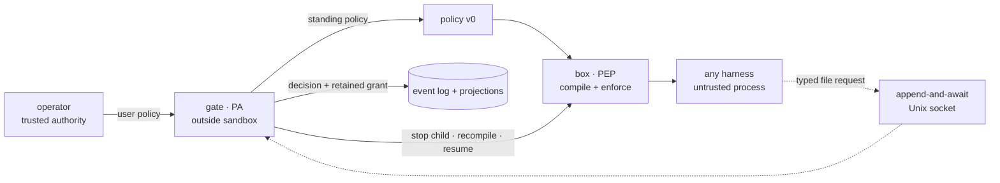

# pagu — context and design

pagu is a security wrapper for coding-agent harnesses. It separates policy
enforcement from policy administration:

- the **box** is the Policy Enforcement Point (PEP): compile and enforce a
  launch-time sandbox;
- the **gate** is the Policy Administrator (PA): adjudicate requests, persist
  scoped decisions, and retain evidence.

The architecture pivot is authoritative in
[ADR-0004](docs/decisions/0004-pivot-to-sandbox-plus-gate.md); the schema and
interface boundary are authoritative in
[ADR-0005](docs/decisions/0005-grant-schema-and-gate-boundary.md). This file
explains the durable model. Category profiles and the policy-growth telemetry
loop are authoritative in
[ADR-0006](docs/decisions/0006-profiles-growth-and-telemetry.md). Forward work
belongs in [ROADMAP.md](ROADMAP.md). The default product entrypoint is fixed by
[ADR-0008](docs/decisions/0008-default-launch-surface.md). The inhabitant
request interface is fixed by
[ADR-0009](docs/decisions/0009-request-only-agent-interface.md). Nested
authority and lineage are fixed by
[ADR-0010](docs/decisions/0010-nested-authority-and-lineage.md). Trusted child
launch attribution and literal namespace nesting are fixed by
[ADR-0011](docs/decisions/0011-credential-attested-child-broker.md). Pi's
assigned-session and native-tool adapter are fixed by
[ADR-0012](docs/decisions/0012-pi-native-adapter.md).

## Why the split exists

A useful harness changes quickly and holds rich application behavior. An OS
sandbox should be small, predictable, and indifferent to which harness it
contains. Approval is a third concern: it needs operator authority and durable
state, but it must not live inside the process asking for more access.

The split follows the NIST PE/PA/PEP model and capability-system precedents
summarized in
[the composition analysis](box/docs/notes/composition-split-analysis.md):

| Plane                 | pagu component                              | Responsibility                                    | Must not do                                 |
| --------------------- | ------------------------------------------- | ------------------------------------------------- | ------------------------------------------- |
| Policy decision       | operator or optional external control plane | author standing authority                         | enforce a process                           |
| Policy administration | gate                                        | adjudicate misses, derive grants, retain evidence | enter the sandbox                           |
| Policy enforcement    | box                                         | lower policy into OS controls and launch          | decide whether a request deserves authority |

This separation keeps routine launches local and fail-secure. The gate is an
exception path, not a per-action dependency.

## System boundary

The box and gate share a schema family, not a process:

- the box receives a complete standing policy at launch;
- the gate receives typed requests through an optional mounted socket;
- a decision never mutates the running mount namespace;
- the gate owns the boxed child, stops it after approval, and starts one new box
  from a complete derived policy;
- a resume adapter carries the same harness session across the new boundary.

## Trust model

| Input or component                      | Trust                    | Treatment                                                            |
| --------------------------------------- | ------------------------ | -------------------------------------------------------------------- |
| User policy selected by the operator    | trusted authority        | may grant within schema v0                                           |
| Project policy supplied by a repository | untrusted                | may only attenuate user authority; widening is ignored with warnings |
| Harness and everything it reads         | untrusted                | may request; cannot resolve or edit gate state                       |
| Agent hosting a child from inside a box | untrusted parent         | may derive an initial child; remains bounded by every ancestor       |
| Gate process and its state directory    | trusted core             | single writer and owner of the boxed child lifecycle                 |
| Box compiler and OS sandbox             | trusted enforcement core | exact lowering is the security boundary                              |
| Human-readable explanation              | evidence, not authority  | derived from the same compiled result used to launch                 |

Host processes running as the same user are outside the sandbox threat model.
The gate socket is mode `0600` to exclude other users; possession of the
bind-mounted path is the local request capability.

## Policy and grant model

Schema v0 is defined and strictly decoded in
[`src/policy/schema.ts`](src/policy/schema.ts). A non-empty policy is complete;
unknown fields are errors. `{}` denotes bottom authority.

The standing policy controls:

- home visibility (`rw` or a temporary filesystem);
- explicit read-write and read-only mounts;
- path denies;
- network namespace sharing;
- copied environment names;
- read-only auto-escalation and refusal scopes.

An external authority may emit one complete box-accepted profile-grant artifact
using the published strict `PolicyV0` shape at
[`schemas/profile-grant-v0.schema.json`](schemas/profile-grant-v0.schema.json).
This is the same artifact accepted by `pagu-box --policy`, not a second
authority language or a named-profile overlay. `parsePolicy` remains its
semantic validator. Named environment channels carry names only; their values
must already exist in the trusted launch environment and never enter the
artifact.

A gate grant is gate-derived policy data with `parent` and `expires` derivation
fields. Its distinct strict structural contract is published at
[`schemas/grant-v0.schema.json`](schemas/grant-v0.schema.json), while
`parseGrant` remains the semantic validator. It is not accepted by the box
policy decoder or a hand-authored second policy language. Stored grants also
carry the session, authoritative policy hash, decision-policy hash, original
path, canonical target, and application state.

### Narrow-only composition

[`src/policy/load.ts`](src/policy/load.ts) folds an authoritative user policy
with an optional project policy. The project layer can:

- change `home` from read-write to temporary, never the reverse;
- choose read-write children of user read-write roots;
- choose read-only children of user read-write or read-only roots;
- turn network off, never on;
- retain only environment names and auto rules already authorized by the user;
- add denies and refusals.

Nested paths require canonical containment. Invalid, widening, or symlink-
escaping candidates are dropped and surfaced as warnings. This is attenuation,
not a merge of peers.

### Nested child authority

[`src/policy/child.ts`](src/policy/child.ts) derives one complete child policy
from the effective parent policy. This is stricter than project composition: the
child subject is retained, but any attempted authority regain rejects the whole
derivation. Ancestor denies and refusals are inherited; filesystem, network,
environment, home, and automatic-escalation authority can only narrow.
[`src/policy/path.ts`](src/policy/path.ts) is the one canonical containment
primitive shared by both folds. Mount fields use exact path semantics—`/**` is
literal there—while auto/refuse scopes use pattern semantics. An `rw` parent
home also acts as the parent read-write root, so a child may mask home with
`tmpfs` and rebind only a canonical subdirectory.

[`src/policy/lineage.ts`](src/policy/lineage.ts) models host identity as a
relative position. An agent can be a child host while remaining an inhabitant of
the parent. Actor kind is metadata, not authority. Canonical lineage becomes
evidence only when retained by a lifecycle owner outside every governed
descendant; an environment depth marker, PID ancestry, or an inhabitant-writable
file is not trusted provenance.

The outer bubblewrap namespace is the final ceiling even when an inhabitant
bypasses the SDK and invokes another `pagu-box` directly. The reproducible
two-level tracer in
[`scripts/nested-box-tracer.ts`](scripts/nested-box-tracer.ts) proves that a
child cannot recover filesystem, network, environment, gate state, or control
capabilities removed by its outer worker.

[`src/child/`](src/child/) now supplies the first trusted lifecycle phase. Its
strict launch frame contains a complete proposed policy, host display metadata,
and command only. The broker selects authority from trusted per-message
sender/namespace facts, derives from that exact active parent, mints lineage and
route identity, and rolls a provisional child back unless namespace checks and
outside-owned `child-launch` evidence commit. A child cannot name a parent,
resolution, operator state, signal, or persistence operation.

[`scripts/child-broker-tracer.ts`](scripts/child-broker-tracer.ts) proves the
host can own the process while launching it by controlled construction through
a live parent process's user, mount, PID, network, IPC, and UTS namespaces.
Policy crosses that boundary as a strict immutable argv value; exact compiled evidence
returns through a machine-prefixed adapter line that the trusted adapter emits
before forwarding child stderr. The adapter itself remains wholly in host
namespaces; only its `nsenter` enforcement child enters the parent namespaces,
so the parent PID namespace cannot discover the adapter and write its evidence
FD. The retained event binds lineage, both policy identities, request-route
identity, compiled argv/environment names, command, cwd, PID, and observed
namespaces. The log remains outside every governed write root. The separate
adversarial nested tracer, not unequal namespace IDs alone, proves the
ancestor-final claim.

The stable Deno Unix socket API does not expose the ancillary-message facts
required for sender attribution, so the native credential frontend and
inhabitant adapter remain phase B. That frontend must receive per-message
`SCM_CREDENTIALS` and a kernel-bound `SCM_PIDFD`, pin the sender namespace
handles, and launch through those exact handles; it must never substitute
connection-time `SO_PEERCRED` or the phase-A tracer's numeric PID targeting.
Child request adjudication/replacement remain phase C. Until those land, pagu
does not claim an inhabitant-accessible child command, lineage-attributed child
requests, or host-owned child resume.

### Deny wins

The schema always adds the built-in SSH and GPG denies. A refusal must be
covered by a filesystem deny. During Linux lowering, allows are emitted before
denies so later deny mounts overlay earlier access.

### Category profiles and overlays

The six policy-v0 artifacts in [`profiles/`](profiles/) are curated categories,
not inferred per-task policies: advisor, worker, proof, web, infra, and
orchestrator. Their axes are explicit policy data and checked together in CI.
Every category carries the full secret refusal floor and at least one narrow
read-only session-auto seed.

Named launch is sugar for selecting one immutable artifact. Persist-scoped
growth is stored as a sparse read-only grant overlay in private gate state and
re-composed with a freshly materialized copy of the latest base at each start;
it is not a forked profile snapshot. The private materialization also prevents a
source-checkout profile under writable `$PWD` from entering the sandbox. Fast
operational growth therefore cannot silently rewrite or freeze the curated
category. Promotion into a profile requires review and profile assertions. The
proof category keeps direct network isolated while the explicit Nix-daemon mount
mediates cache and substitution work. Infra alone exposes journal paths.
Orchestrator strips the Herdr control environment/socket surface; schema v0 does
not claim to enforce a general per-executable allowlist.

## Enforcement model

[`src/policy/compile.ts`](src/policy/compile.ts) is a pure lowering from a
validated policy plus explicit host facts to bubblewrap arguments and a scrubbed
environment.

Security-relevant properties:

- the environment starts empty and only named values are copied;
- schema-policy launches do not inherit the legacy Nix-daemon bind;
- missing allow paths grant nothing;
- missing deny paths become empty mounts, preserving the deny if a writable
  parent later creates the path;
- a missing deny below an overlapping read-only mount fails before launch,
  because the host could create it after the check and bubblewrap cannot safely
  install the destination mask below RO;
- network remains isolated unless `net` is true;
- the optional request socket and its environment name exist only when `--gate`
  is supplied;
- a linked worktree's Git metadata is derived, validated, and frozen before
  launch, and an unsafe or unsupported repository shape aborts compilation
  instead of producing a box where Git silently fails;
- binding `/nix/var/nix/daemon-socket` adds `NIX_REMOTE=daemon` to the compiled
  environment and explanation; without the bind it is absent;
- `--explain` is a projection of the exact compiled result and omits secret
  values;
- gate-owned launches use `--evidence` to persist that spawned result's argv,
  environment names, command, and PID.

### Linked-worktree metadata is derived, not configured

A Git linked worktree keeps no repository inside the working directory: `.git` is
a pointer file naming an administrative directory under the main repository's
common directory, outside every mount a `$PWD`-scoped profile grants. So the box
needs a mount the policy does not name, derived from material the project
controls. [`src/policy/worktree.ts`](src/policy/worktree.ts) derives it, and
[`src/policy/repository-fs.ts`](src/policy/repository-fs.ts) probes and freezes
the facts once per launch, before bubblewrap starts.

The derivation grants nothing on the repository's word. It takes authority only
from what the repository can prove, and every check is a refusal, never a
downgrade:

- the pointer must name a directory whose own `gitdir` back pointer canonically
  names this launch worktree — a foreign or invented target cannot satisfy that
  without already holding write access to it;
- `commondir` must resolve to the exact parent of `worktrees/<name>`, which is
  Git's own linked-worktree layout, so rewriting it cannot select an unrelated
  directory;
- every resulting path must sit inside a trusted ceiling — the standing
  filesystem authority plus the pre-authorized session-auto read scopes of the
  *trusted* layer, which a project can only narrow — and inside no denied root;
- the access mode mirrors the profile's authority on the launch directory, so an
  advisor derives read-only metadata and a writer derives no more than it already
  holds on `$PWD`;
- canonical paths carry no symlinks, so a pointer or alias swapped after the
  probe cannot redirect a mount.

The supported Git-operation contract is deliberately narrower than "the
repository is writable". The common directory root stays read-only; only the
object store, the ref store, the common reflog directory, and this worktree's own
administrative directory become writable, in specificity order so each overlays
the read-only parent instead of being erased by it. That covers the ordinary
journey — status, diff, log, stage, commit, branch and reflog updates, including
branches that exist only in `packed-refs`. It excludes operations that rewrite
the common root itself: `git config --local`, `pack-refs`, `gc`, `repack`,
`worktree add/prune`, and anything writing `FETCH_HEAD`. Those fail loudly inside
the box on a read-only filesystem rather than being granted for convenience. An
absent common reflog directory is reported on stderr, not silently dropped.

Submodules and `--separate-git-dir` layouts have no per-worktree back pointer, so
they are refused before launch with a stable diagnostic rather than trusted on a
weaker check. Ordinary checkouts and bare repositories derive nothing at all:
whatever Git needs is already inside `$PWD`.

An advisor or writer launched in a linked worktree can therefore read the main
repository's object and ref store — the history is exactly what Git inspection
needs — but reaches no working tree other than its own.

On Linux, `--observe-denials FILE` opts a schema-policy launch into the seccomp
user-notif supervisor in [`box/src/denial-spike.c`](box/src/denial-spike.c). The
same `CompiledPolicy` value drives bubblewrap argv and the expanded
exact-file/directory-subtree deny rules; the adapter rejects a log below any
compiled sandbox-writable root. The supervisor appends denial-evidence v1 JSONL
outside bubblewrap and is absent from the default launch path. User-notif runs
before the syscall, so this bounded observer classifies only lexically canonical
UTF-8 absolute `open`/`openat` paths covered by `fs.deny`; relative/non-UTF-8
paths, path races, other bubblewrap denials, and automatic requests remain out
of scope. See the
[design and verification note](box/docs/notes/seccomp-user-notif-spike.md).

[`src/policy/cli.ts`](src/policy/cli.ts) is the thin process adapter used by the
Nix-built `pagu-box` launcher. Linux schema-policy compilation is implemented.
The macOS schema compiler fails with a typed unsupported-platform error; the
legacy seatbelt profiles remain separate compatibility behavior.

## Product launch surface

`pagu HARNESS` is a user-journey adapter over the existing gate-owned fresh
launch, not a third security component. The typed resolver in
[`src/launch/launch.ts`](src/launch/launch.ts) selects the built-in worker
category, a trusted user override from strict launch-config v0, or an explicit
CLI choice. It may infer Codex, Claude, or Pi from one named executable's
basename. The result still enters the same gate, verified harness resume port,
policy compiler, and box.

A launch states its intent: the harness is a bare positional (`pagu claude`),
and `--` is needed only when the executable would otherwise parse as an option.
Bare `pagu` — the empty command line — prints usage and launches nothing,
because the thing inferred from silence would be which policy gets enforced.
Configured `launch.json` defaults still complete any launch the caller has
otherwise stated, so `pagu --profile proof` remains valid. This grammar is fixed
by [ADR-0013](docs/decisions/0013-named-harness-launch-grammar.md), which
supersedes the bare-launch and `--`-separated forms in ADR-0008.

A gated launch wraps exactly one executable and takes no trailing arguments,
because the adapter must reproduce that argv when an approved grant stops the
box and resumes the session. Arbitrary commands — including a harness run
headlessly, which never resumes — belong to `pagu box`, and the refusal names it
with the caller's own argv shell-quoted.

Argv tokenisation is delegated to `@std/cli`; every decision downstream of it
stays hand-owned, because those decisions select which policy is enforced. The
packaged CLI runs `--cached-only` against a store-resident `vendor/`, so a
missing module fails loudly at launch rather than fetching over the network
inside a process holding `--allow-net --allow-write --allow-run`.

The trusted launch file lives outside repository control at the XDG pagu config
path and names only a checked-in category plus a verified harness adapter. It
does not define policy fields, grant authority to a project, or enter the
sandbox. A missing file selects built-in defaults; a malformed, unknown-field,
or unsupported version fails before launch. The historical integrated-harness
`config.json` remains a distinct pre-pivot SDK seam, so the new file is named
`launch.json`.

Direct `pagu gate` operation remains for explicit policies and existing
sessions. `pagu-box` remains the direct PEP compatibility surface. The root Nix
package launches `pagu`, making the product journey the default without removing
either expert surface.

## Escalation loop

The request schema in [`src/request/schema.ts`](src/request/schema.ts) permits
one exact `fs.ro` suggestion with a human-readable need and justification.
Unknown fields, wildcards, traversal, quotes, and control characters fail.

The Unix channel in [`src/request/channel.ts`](src/request/channel.ts) is
deliberately not general RPC:

1. one connection carries one request frame;
2. the gate returns that connection's decision;
3. the connection closes;
4. no resolution frame exists.

Frames and concurrent clients are bounded, incomplete frames time out, active
listeners cannot be replaced, and the socket is private to the user.

[`src/mcp/server.ts`](src/mcp/server.ts) is the discoverable inhabitant adapter
over that same channel. It exposes exactly one strict `request_read_access` tool
and receives only `PAGU_REQUEST_SOCKET`; it cannot resolve, persist, read gate
state, or launch a child. Fresh and resumed Codex/Claude commands receive the
server through session-local harness arguments. Pi, which has no MCP client,
receives [`integrations/pi/pagu.ts`](integrations/pi/pagu.ts) as an immutable
session-local native extension; its one tool invokes the same packaged MCP
process rather than reimplementing the request protocol. No adapter edits
persistent harness configuration. Packaged `pagu mcp` dispatches to the narrow
helper rather than the broader host CLI runtime. The bundled skill teaches the
same boundary.

An approved request intentionally stops the old box, including its MCP child,
before launching the wider replacement. The call may disconnect rather than
return its approval. The resumed harness retries the denied read and treats the
new enforcement result as evidence. The stdio server remains responsive to ping
while a request awaits the host. MCP cancellation suppresses a stale tool
response but does not retract the retained gate request.

[`src/request/adjudicate.ts`](src/request/adjudicate.ts) applies tiers in this
order:

1. refusal match → deny without prompting;
2. lexical and canonical containment within an auto rule → exact session grant;
3. otherwise → the gate's Approver port.

Canonicalization before auto-approval closes symlink aliases at decision time.
[`src/request/gate.ts`](src/request/gate.ts) captures that canonical target and
resolves the original path again immediately before application. A changed
target fails before the old box is stopped. The applied policy contains the
canonical path, not the mutable alias.

[`src/gate/relaunch.ts`](src/gate/relaunch.ts) owns the active child. It
verifies the request gate is reachable, stops the narrower box, and starts
`pagu-box` with the complete derived policy. Immediately before each initial or
approved launch it adds only that harness's RW state: `~/.codex`; `~/.claude`
plus `~/.claude.json`; or `~/.pi`. Pi's common user-local installed package
roots are added read-only when present so a temporary home can execute the
selected runtime without exposing the rest of home. This trusted launch overlay
leaves the standing/profile policy immutable, passes through the same boundary
validation and exact compiler/evidence path, and retains final secret denies.
Session-store inference selects exactly one of Codex, Claude, or Pi; ambiguous
and missing matches fail loud, while an explicit harness skips inference.
Gate-session v1 retains that
selection for existing-session launches. A fresh launch requires an explicit
harness and establishes ownership rather than inferring it from file timing.
Codex receives a generated nonce marker in its inert initial prompt; the gate
snapshots existing IDs before spawn and polls new rollout contents until that
exact marker attributes one UUID, ignoring unrelated concurrent sessions and
waiting through file-before-content flushes. Claude and Pi receive a
caller-generated UUID through `--session-id` and need no discovery poll.
Gate-session v2 retains the attributed or assigned UUID and fresh initial mode.
Requests arriving during
Codex attribution wait behind the already-mounted socket and cannot enter the
session-bound gate until attribution completes. Codex uses UUID resume with its
inner approval/sandbox posture disabled because bubblewrap is the outer
boundary; Claude uses `claude --resume SESSION_ID`; Pi uses
`pi --session SESSION_ID`. Versioned box launch
evidence v1 and the `policy-launch` event bind compiled argv, cwd, and the fresh
or resume command together. [`src/gate/resume.ts`](src/gate/resume.ts) is the
harness command/state port; [`src/gate/harness.ts`](src/gate/harness.ts) owns
fresh identity attribution and existing-session inference.

Nonce attribution handles cooperative fleet concurrency, not adversarial writers
to the shared harness store. Every gate-owned Codex box intentionally receives
the same `~/.codex` tree read-write for authentication and resume; a hostile
concurrent box could copy or delete another launch's marker/session material.
Per-launch write isolation or a harness-assigned Codex UUID is needed before
treating mutually hostile fleet peers as an attribution boundary. The operator
accepts cooperative peers for the current Slice 13 boundary; hostile- peer
isolation is explicitly deferred.

The existing `pagu-box --evidence` adapter remains the supported launch-evidence
path for harness integrations. A general arbitrary-harness gate/resume port is
deferred because it requires a separate boundary design; the current gate's
Codex, Claude, and Pi resume adapters are not generalized implicitly.

## Gate state and evidence

[`src/request/gate.ts`](src/request/gate.ts) serializes all mutations. Its
append-only log is the retained source of request, decision, and grant events.
The queue and session-grants JSON files are gate-owned projections:

| Artifact                      | Meaning                                                                                     |
| ----------------------------- | ------------------------------------------------------------------------------------------- |
| `events.md`                   | request, decision, grant, launch/failure, and once-spent evidence                           |
| `queue.json`                  | the operator request currently awaiting the Approver                                        |
| `resolution.json`             | host-only operator response; never mounted into the box                                     |
| `session-grants.json`         | bound pending/applied/spent once/session/persist projections                                |
| `launches/`                   | complete launch policies plus exact box-emitted evidence                                    |
| user policy / profile overlay | custom standing authority, or sparse named-profile `fs.ro` growth changed only by `persist` |

[`src/gate/operator.ts`](src/gate/operator.ts) supplies queue reads and a
resolve-only host file adapter. The CLI races that adapter with asynchronous TTY
input behind the same Approver port. A herdr pane renders the queue and invokes
`pagu resolve`; it receives no sandbox mount or alternative adjudicator.
[`src/gate/boundary.ts`](src/gate/boundary.ts) fails launch if the effective
policy can see gate state/the host socket pathname or write the user policy. The
default state lives below `XDG_RUNTIME_DIR`, never below the project mount.
Without that directory the operator supplies a private absolute directory;
ownership, final mode, symlinks, and replaceable ancestry are checked.

Every CLI-owned gate run appends versioned gate-session evidence with its
harness, profile, subject, session, and timestamp: v1 records an existing-
session launch and v2 records a fresh attributed/assigned launch; v0 logs remain
readable. Request, decision, grant, and launch evidence also carries timestamps.
[`src/telemetry/`](src/telemetry/) folds those retained events into a versioned
in-memory view; the CLI's table and JSON are two renderings of that same value.
No telemetry database or flow dependency exists.

The current prune query can prove only that an old approved grant lacks launch
evidence. It cannot prove whether an enforced filesystem capability was used.
That stronger claim waits for the syscall-interception observation substrate
specified—but deliberately not implemented—by ADR-0006.

## Fail-secure behavior

- No gate mount means no request capability and no new escalation path.
- An absent or malformed policy fails before launch; `{}` compiles to bottom.
- Gate unavailability cannot widen an already-running box.
- The relaunch adapter checks gate reachability before stopping the narrower
  child and has no wider fallback.
- A symlink target or any existing policy root changed after decision, while the
  gate was down, or before enforcement after the prior sandbox stops cannot
  expose operator authority to the launcher.
- A provisional widened child is stopped if durable grant state or launch
  evidence cannot commit; there is no wider unrecorded fallback.
- A persist decision and grant are retained in one append before projection, so
  restart rebuilds missing state and completes an interrupted exact policy edit.
- A grant for another session or authoritative policy hash cannot apply.
- A once grant is durably spent before the irreversible spawn; crash recovery
  prefers lost utility over possible replay.
- Refuse and auto tiers do not depend on an operator prompt.
- A malformed request creates no request, decision, or grant event.
- Project policy widening fails closed to the user policy ceiling.
- Unsupported schema enforcement fails loud rather than falling back to a weaker
  mode.

Fail-secure does not mean highly available. Gate absence at the preflight keeps
the standing box; an error after it stops is fail-stop rather than an unsafe
wider fallback. On Linux the policy adapter also probes the gate PID from its
trusted outer process, stopping the sandbox after an owning-gate crash.

## Evidence standard

Claims about enforcement bind to executable evidence:

- policy schema, attenuation, canonical paths, and explain equivalence:
  [`src/policy/policy.test.ts`](src/policy/policy.test.ts);
- child derivation, transitive attenuation, lineage position, and symlink
  falsifiers: [`src/policy/child.test.ts`](src/policy/child.test.ts), plus the
  packaged two-level
  [`scripts/nested-box-tracer.ts`](scripts/nested-box-tracer.ts);
- request protocol, tiers, persistence, socket boundary, and real bubblewrap
  falsifier: [`src/request/request.test.ts`](src/request/request.test.ts);
- relaunch, resume, TOCTOU, once, binding, operator, and fail-secure falsifiers:
  [`src/gate/gate.test.ts`](src/gate/gate.test.ts);
- event wire compatibility: [`src/events.test.ts`](src/events.test.ts);
- category profile and telemetry projections:
  [`src/policy/profiles.test.ts`](src/policy/profiles.test.ts) and
  [`src/telemetry/telemetry.test.ts`](src/telemetry/telemetry.test.ts);
- public SDK floor: [`src/mod.test.ts`](src/mod.test.ts).

The complete invariant catalog and enforcement tiers live in
[docs/INVARIANTS.md](docs/INVARIANTS.md).
