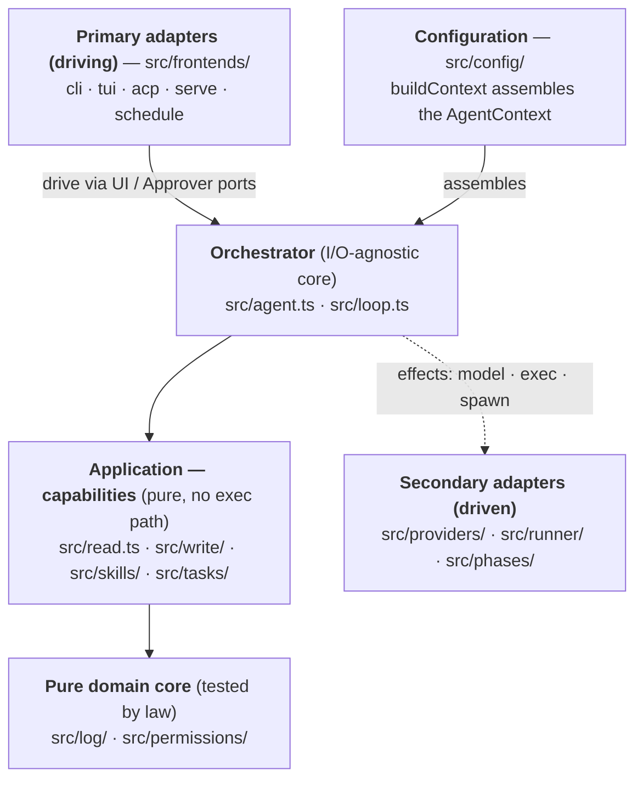

# pagu — architecture map (where things live)

Where each module lives, organized by **hexagonal layer**. Design _rationale_ is
in `CONTEXT.md`; _how we work_ in `AGENTS.md` + `docs/WORKFLOW.md`. Extracted
from `AGENTS.md` (2026-05-30) to keep that injected-every-turn file lean.

Each multi-file module exposes its public surface via an `index.ts` barrel;
callers import the module root, not internal files. **Dependencies point
inward** — adapters depend on the core, the core on the application layer, that
on the pure domain core; the pure core imports nothing.

## Pure domain core

Unit-tested — change with care, tests first. Imports nothing outward.

| module             | what's in it                                                                                                                                                                                                                                                                                                                                                                                                                         |
| ------------------ | ------------------------------------------------------------------------------------------------------------------------------------------------------------------------------------------------------------------------------------------------------------------------------------------------------------------------------------------------------------------------------------------------------------------------------------ |
| `src/log/`         | `pagu:*` block parse/serialize — the event-store format.                                                                                                                                                                                                                                                                                                                                                                             |
| `src/permissions/` | `envelope.ts`: `covers`/`within`/`withinEnvelope` (pure containment). `gitignore.ts`: VCS source (`git ls-files`). `concealment.ts`: pure multi-source hide policy (`buildConcealment` → `conceals` + `maskPaths`, `reveal` subtraction); `concealment-fs.ts`: its **effectful** glob source (`enumerateConcealed`). `policy.ts`: `buildEnvelope` (grants + concealment write-denies) + `shouldAutoApprove` (the auto-approve gate). |

## Application — capabilities

Also pure/tested; **none holds an exec path**.

| module        | what's in it                                                                                                                                                                                                                                                                                                                                                                                                                       |
| ------------- | ---------------------------------------------------------------------------------------------------------------------------------------------------------------------------------------------------------------------------------------------------------------------------------------------------------------------------------------------------------------------------------------------------------------------------------- |
| `src/read.ts` | `read` tool — inspect files/dirs, no side effects. Always allowed.                                                                                                                                                                                                                                                                                                                                                                 |
| `src/write/`  | `write.ts`: author scripts (**human gate** every proposal). `review.ts`: pure gate utilities (risk tier, envelope diff, LCS iteration diff, `--allow-run` check). `advisor.ts`: optional pre-approval reviewer (structured `[advisory]` flags, fails open). `pipeline.ts`: composable handlers (`cage`/`approve`/`run`) over `Step<Proposal>`; `execute.ts` = `pipeline([cage, approve, run])`. Handlers gate/narrow, never widen. |
| `src/skills/` | `skill.ts`: loader — discovers `.pagu/skills/<name>/`, reads `SKILL.md` (agentskills.io) + `scripts/*.ts`. `tool.ts`: `invoke_skill` — orchestrator resolves the verbatim body (agent never copies it); cage validates within the declared ceiling; auto-approved on match.                                                                                                                                                        |
| `src/tasks/`  | `policy.ts`: parse `allowed-tasks` → `CommandEntry` (deny by default). `discovery.ts`: scan `deno.json`/`package.json`/`Justfile` for available tasks. `tool.ts`: `run_task` — first run discovers perms via cage + writes `.pagu/inferred-perms.json` (gitignored lockfile), later runs cage against it.                                                                                                                          |

### The capability ladder

The agent's tools, ordered by how much pre-vetting the approval path requires.
**New tools must not hand the agent a path outside this ladder.**

| tool           | what it does                             | approval path                            |
| -------------- | ---------------------------------------- | ---------------------------------------- |
| `read`         | inspect files/dirs, no side effects      | always allowed (no approval needed)      |
| `write`        | author arbitrary scripts                 | **human gate** at every proposal         |
| `invoke_skill` | run a pre-authored skill script verbatim | auto-approved (verbatim match + ceiling) |
| `run_task`     | run a named project task from policy     | auto-approved (policy match + ceiling)   |

`invoke_skill`/`run_task` expand utility without widening blast radius: the cage
still validates permissions, and the orchestrator verifies the script body
matches verbatim pre-approved content before any execution.

## Orchestrator — the I/O-agnostic core

| module         | what's in it                                                                                                                                                                                                                                                                                                                                                             |
| -------------- | ------------------------------------------------------------------------------------------------------------------------------------------------------------------------------------------------------------------------------------------------------------------------------------------------------------------------------------------------------------------------ |
| `src/agent.ts` | `runTask(ctx, task)` + `AgentContext`/`Approver`/`UI` — the one seam between core and frontends. `runTask = loop(turn, MAX_TURNS)`. Siblings seed the log then run the same loop: `resumeTask`/`submitDecision` (#15) and `scheduledRun({instruction, payload})` (#16; `seedTrigger` authors the instruction, fences the payload as an untrusted `trigger` observation). |
| `src/loop.ts`  | **pure control core**: `Flow` (`continue｜done`), `Step<C>` (`C → Promise<Flow>`), `loop : Step → Step` (bounded fixpoint). Generic over the carrier (imports nothing; tested by law). `andThen` + `pipeline` implemented (`write/pipeline.ts` is the first caller at `C = Proposal`); `fanOut` deferred.                                                                |

## Primary adapters — frontends

Driving adapters; all differ **only** in their `UI` + `Approver`.

| module                      | what's in it                                                                                                                                                                                                                                                             |
| --------------------------- | ------------------------------------------------------------------------------------------------------------------------------------------------------------------------------------------------------------------------------------------------------------------------ |
| `src/frontends/cli.ts`      | one-shot frontend (stdin approver).                                                                                                                                                                                                                                      |
| `src/frontends/tui.ts`      | REPL frontend (colored, multi-turn; slash commands + arrow-key pickers via `src/frontends/select.ts`).                                                                                                                                                                   |
| `src/frontends/acp.ts`      | **ACP agent** (`pagu --acp`): editor-driven over JSON-RPC/stdio; maps the UI/Approver seam onto ACP `session/update` + `request_permission`. Declines the client's terminal/fs (invariant #1 across frontends).                                                          |
| `src/frontends/serve.ts`    | **HTTP write-back** (`pagu serve`): deferring approver, exposes the pending proposal over Bearer-token `GET /pending` / `POST /decision`. The only socket-opening frontend — re-execs with `--allow-net` scoped to the bind address, so the orchestrator stays net-less. |
| `src/frontends/schedule.ts` | **scheduled firing** (`pagu schedule`, #16): the cron target. Drives `scheduledRun` (authored instruction + untrusted stdin payload) with a deferring approver — in-envelope auto-runs, the rest queues as pending.                                                      |

## Secondary adapters — driven (the effect edges)

| module           | what's in it                                                                                                                                                                                                                                                                                                                                                                                                                                                                      |
| ---------------- | --------------------------------------------------------------------------------------------------------------------------------------------------------------------------------------------------------------------------------------------------------------------------------------------------------------------------------------------------------------------------------------------------------------------------------------------------------------------------------- |
| `src/providers/` | `chat.ts`: `chat()` **dispatcher** (OpenAI Chat Completions default) → `anthropic.ts` (native Messages API) by `format`. Add providers here, behind `chat()`.                                                                                                                                                                                                                                                                                                                     |
| `src/runner/`    | `run.ts`: scoped `deno run` (+ per-run timeout). `classify.ts`: cage result → ok / needs-perms / bug. `sandbox.ts`: **OS sandbox tier** (bubblewrap/`sandbox-exec`) beneath the Deno floor — denies net, confines writes (bounds an `--allow-run` subprocess Deno doesn't); `wrapForSandbox` (pure) + `detectSandbox` (degrades to `none`, no regression).                                                                                                                        |
| `src/phases/`    | `respond.ts`: the single phase entrypoint — converses, `read`s, proposes a script via `write` only when an effect is needed; `spawn.ts`/`messages.ts`/`ipc.ts` support it. **Streaming:** writes typed `StreamChunk` frames (`stream.ts`) to **stderr** as a display side-channel (`spawn.ts` demuxes → `onStream` → `UI.stream`); stdout stays the structured `{entries}` JSON. `<think>` reasoning (`providers/think.ts`) is ephemeral. The side-channel carries no capability. |

## Configuration (`buildContext` is the public interface)

| module                      | what's in it                                                                                                                                                                                                                                                                                                                                       |
| --------------------------- | -------------------------------------------------------------------------------------------------------------------------------------------------------------------------------------------------------------------------------------------------------------------------------------------------------------------------------------------------- |
| `src/config/config.ts`      | provider presets, instruction load (AGENTS.md/CLAUDE.md fallback, prose only), and the **`ConfigLayer` monoid** (`mergeLayer`/`composeLayers`/`toLayer`) roles + flags fold through.                                                                                                                                                               |
| `src/config/repo.ts`        | git-repo detect + per-repo memory (the run's permission policy lives in `src/permissions/policy.ts`).                                                                                                                                                                                                                                              |
| `src/config/roles.ts`       | composable config+instruction bundles (markdown + frontmatter): discovery (project shadows global), load, `listRoles`. Fail-loud on a missing `--role`. (Profiles/skills/personalities are siblings.)                                                                                                                                              |
| `src/config/setup.ts`       | `parseArgs` (cliffy: typed flags, `--help`, completions) + `buildContext` — the thin **assembly**: resolve repo/session/sandbox, compose `makeRunState` + `makeSessionStore` + static fields into the `AgentContext`.                                                                                                                              |
| `src/config/run-state.ts`   | `makeRunState`: the live, role-dependent slice of a run as a constructible **value** — folds `defaults ⋄ config.json ⋄ profile ⋄ roles ⋄ skills ⋄ flags`, derives provider/envelope/concealment/prose/capabilities, and owns the runtime mutators (`setProvider`/`setRoles`/`setSkills`/`setPersonality`/`setProfile`/`setAdvisor`/`fetchModels`). |
| `src/config/sessions.ts`    | the **session store** (a session = one saved conversation): per-project `.pagu/sessions/<id>.log.md`. Log entries are the source of truth; a YAML frontmatter header holds metadata. `session-store.ts` owns persistence + the event stream.                                                                                                       |
| `src/config/envfile.ts`     | opt-in, per-folder-consented `.env` loading (`@std/dotenv`) so keys like `ANTHROPIC_API_KEY` need no manual export.                                                                                                                                                                                                                                |
| `src/config/frontmatter.ts` | shared YAML frontmatter parse/serialize used by roles, skills, profiles, personalities, and sessions.                                                                                                                                                                                                                                              |
