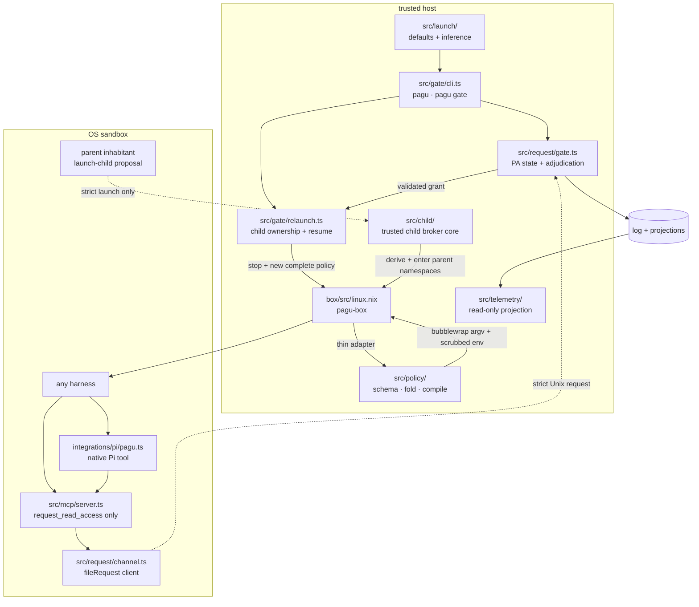

# pagu — architecture

The runtime has two security components, request-only inhabitant transports,
and one shared typed core:



## Entrypoints and packages

| Surface              | Source                                     | Current role                                                                                                         |
| -------------------- | ------------------------------------------ | -------------------------------------------------------------------------------------------------------------------- |
| `pagu`               | `src/launch/` + `src/gate/cli.ts`          | Default fresh gated journey; resolves user defaults and a wrapped verified harness into the existing gate lifecycle. |
| `pagu box`           | `flake.nix` → `pagu-box`                   | Human direct-enforcement surface; preserves argv and caller environment before exact delegation.                    |
| `pagu-box`           | `box/src/linux.nix` / `box/src/darwin.nix` | Compatibility process wrapper. Legacy profiles on Linux/macOS; schema-v0 enforcement on Linux.                       |
| `pagu gate`          | `src/gate/cli.ts`                          | Advanced explicit-policy/session surface over the same request listener, operator adapters, and relaunch lifecycle.  |
| `pagu resolve`       | `src/gate/cli.ts`                          | Thin host-only adapter that resolves one currently pending request ID.                                               |
| `pagu mcp`           | `src/mcp/cli.ts` + `src/mcp/server.ts`     | Request-only stdio MCP adapter injected into gate-owned harness sessions; no operator methods.                       |
| `pagu telemetry`     | `src/gate/cli.ts` + `src/telemetry/`       | Standalone human/JSON projection over one or many gate event logs.                                                   |
| SDK                  | `src/mod.ts`                               | Stable front door for launch, policy, request, event, and retained security primitives.                              |
| Root flake           | `flake.nix`                                | Builds default `pagu`, compatibility `pagu-box`, formatter, and the Linux development shell.                         |
| Standalone box flake | `box/flake.nix`                            | Preserved imported box package and module surface.                                                                   |

`pagu` is the default root package. Its `box` subcommand execs the packaged
`pagu-box` before the root wrapper changes `PATH`, so direct operation has one
implementation and the same trusted launch environment under both names.
`pagu-box` remains available for compatibility callers.

## Launch resolution

[`src/launch/launch.ts`](../src/launch/launch.ts) provides the typed core behind
the root command:

- strict launch-config v0 decoding and XDG path discovery;
- the built-in Codex + worker default;
- Codex/Claude/Pi inference from a single executable basename;
- pure config/flag/executable resolution.

The CLI lowers that result to `GateOptions`; it does not start a second
lifecycle. The selected category still resolves to a complete policy, and the
selected harness still passes through its verified fresh/resume adapter.

## Policy core

All policy core files are pure and exported through `src/policy/index.ts`.
The two effectful members are named as such: `src/policy/cli.ts` is the box
adapter, and `src/policy/repository-fs.ts` is the frozen repository probe it
hands to compilation.

| Module                                 | Responsibility                                                                                                    |
| -------------------------------------- | ----------------------------------------------------------------------------------------------------------------- |
| `src/policy/schema.ts`                 | Strict policy/grant v0 types and decoding; bottom policy; built-in denies; refusal containment.                   |
| `src/policy/path.ts`                   | Shared pure exact/pattern normalization and canonical path-containment primitive.                                 |
| `src/policy/child.ts`                  | Fail-loud complete child derivation from one effective parent policy.                                             |
| `src/policy/lineage.ts`                | Relative human/agent host and parent/child box-lineage values.                                                    |
| `schemas/profile-grant-v0.schema.json` | Published box-accepted `PolicyV0` contract for external authority lowering.                                       |
| `schemas/grant-v0.schema.json`         | Published strict structural contract for downstream gate GrantV0 consumers.                                       |
| `src/policy/load.ts`                   | Trusted-user plus narrow-only project fold; warnings for widening; canonical child validation.                    |
| `src/policy/compile.ts`                | Explicit-context policy lowering to Linux bubblewrap argv and scrubbed environment; exact explanation projection. |
| `src/policy/worktree.ts`               | Total linked-worktree Git authority derivation from frozen repository facts; refusal is a value, not a throw.     |
| `src/policy/repository-fs.ts`          | Effectful frozen probe over project-controlled repository metadata, bounded in size and memoized per launch.      |
| `src/policy/identity.ts`               | Canonical SHA-256 identity binding grants to complete policy authority.                                           |
| `src/policy/presets.ts`                | Schema representations of the four legacy profile baselines used for equivalence testing.                         |
| `src/policy/profiles.ts`               | Stable curated category names, filenames, and the shared secret-floor assertion data.                             |
| `src/policy/cli.ts`                    | Effectful adapter: read JSON, assemble host context, explain or spawn bubblewrap.                                 |
| `src/policy/policy.test.ts`            | Schema, project attenuation, canonicalization, legacy equivalence, explain, and adapter falsifiers.               |
| `src/policy/child.test.ts`             | Child authority, transitive ancestor, symlink, deny/refusal, identity, and lineage laws.                          |
| `src/policy/profiles.test.ts`          | Cross-profile secret, write, journal, Herdr, and compiled-deny assertions.                                        |
| `src/policy/worktree.test.ts`          | Linked-worktree derivation laws, hostile-pointer falsifiers, lowering order, and the real-git probe seam.         |

Dependency direction:

```text
schema/path.ts <- load.ts
schema/path.ts <- child.ts
schema.ts <- compile.ts
path.ts <- worktree.ts <- compile.ts
worktree.ts <- repository-fs.ts
schema/load/child/compile/repository-fs <- cli.ts
```

The shell launcher calls the adapter; policy logic is not duplicated in Nix or
shell.

## Request and gate core

The request module exports through `src/request/index.ts`.

| Module                        | Layer    | Responsibility                                                                                                                      |
| ----------------------------- | -------- | ----------------------------------------------------------------------------------------------------------------------------------- |
| `src/request/schema.ts`       | pure     | Exact request/frame and decision types; fail-loud request decoding.                                                                 |
| `src/request/adjudicate.ts`   | pure     | Refuse → auto → operator tier selection with lexical and canonical containment.                                                     |
| `src/request/channel.ts`      | effects  | One-request-per-connection client/server; size, timeout, connection, socket-mode, and listener-ownership bounds.                    |
| `src/request/gate.ts`         | effects  | Session-bound single writer; TOCTOU recheck; grant application state; events, queue, and persistence.                               |
| `src/request/request.test.ts` | evidence | Real bubblewrap resolution attack, tier behavior, restart persistence, symlink escape, socket ownership, and user-only persistence. |

Gate-side adapters export through `src/gate/index.ts`:

| Module                      | Responsibility                                                                   |
| --------------------------- | -------------------------------------------------------------------------------- |
| `src/gate/harness.ts`       | Existing-session inference plus nonce/assigned-ID fresh identity attribution.    |
| `src/gate/resume.ts`        | Fresh attributed argv and verified UUID-bound Codex/Claude/Pi resume commands.   |
| `src/gate/relaunch.ts`      | Gate-owned child replacement, active-gate check, policy artifacts, box evidence. |
| `src/gate/operator.ts`      | Queue read, ID-bound resolution submission, TTY/file Approver composition.       |
| `src/gate/boundary.ts`      | Proves operator state/socket stay hidden and user policy stays non-writable.     |
| `src/gate/state.ts`         | Establishes private owned state with non-replaceable host ancestry.              |
| `src/gate/reload-schema.ts` | Strict runtime-reload checkpoint/evidence shapes and pure adoption laws.         |
| `src/gate/gate.test.ts`     | Widened explain, TOCTOU, once, binding, operator, and fail-secure falsifiers.    |

`src/gate/cli.ts` composes those adapters. The request core does not know about
terminals, herdr, Codex argv, or process spawning.

## Trusted child lifecycle

Child-lifecycle phase A exports through `src/child/index.ts`:

| Module                           | Responsibility                                                                                           |
| -------------------------------- | -------------------------------------------------------------------------------------------------------- |
| `src/child/schema.ts`            | Strict `launch-child` v0 frame; no parent selector, resolution, state, signal, or persistence operation. |
| `src/child/broker.ts`            | Namespace-selected parent authority, recursive policy derivation, launch verification, and rollback.    |
| `src/child/evidence.ts`          | Verified broker launch → canonical versioned `child-launch` event mapping.                               |
| `src/child/broker.test.ts`       | Smuggling, stale namespace, recursive ceiling, evidence, rollback, and network-namespace falsifiers.     |
| `scripts/child-broker-tracer.ts` | Real host-owned `nsenter` launch inside a packaged parent box with outside retained evidence.            |

The broker core consumes one trusted, race-stable sender observation captured
by its frontend; it does not rediscover a numeric PID or accept a caller-supplied
parent. Phase A's real tracer supplies that observation directly. A native
per-message `SCM_CREDENTIALS` + `SCM_PIDFD` frontend and inhabitant adapter are
phase B, and child request adjudication/replacement are phase C.

## Agent interface

`src/mcp/server.ts` owns a connection-local MCP lifecycle and one strict tool.
It lowers `{path, need, justification}` to the existing `fileRequest` core;
there is no parallel request schema or adjudicator. `src/gate/resume.ts` adds
the immutable packaged server to Codex/Claude fresh and resume argv through
harness-native session-local configuration. Pi receives
`integrations/pi/pagu.ts`, whose one native tool invokes that same exact
packaged MCP adapter. The request process runs inside the box and sees the
mounted request socket, while operator projections and resolution remain
outside.

`skills/pagu/SKILL.md` is the provider-neutral operating guide for host and
inhabitant agents. It teaches the default launch, profile selection, direct-box
inspection, exact read requests, host resolution, replacement/resume, and the
current nested-child limit. It is guidance, not authority; the strict
native-tool/MCP/request decoders and box lifecycle enforce the boundary.

## Event and evidence core

| Module                 | Responsibility                                                                        |
| ---------------------- | ------------------------------------------------------------------------------------- |
| `src/log/schema.ts`    | Entry union, including request, decision, grant, policy/child launch, failure, and spent evidence. |
| `src/log/serialize.ts` | Typed entry → tilde-fenced markdown block.                                            |
| `src/log/parse.ts`     | Markdown blocks → typed entries; unknown future kinds are skipped.                    |
| `src/events.ts`        | Offset-addressed reads and live wakeups over an append-only entry array.              |
| `src/events.test.ts`   | Wire-contract floor: every entry kind must round-trip.                                |
| `src/telemetry/`       | Pure telemetry-v0 fold, filesystem collector, and human formatter over those entries. |

The markdown log is retained history. Queue, resolution, and session-grant JSON
are mutable gate projections outside all sandbox mounts. `launches/` retains
complete applied policies and exact evidence emitted after the box adapter
spawns bubblewrap. A prepared-launch transaction rolls the child back unless
those durable updates complete; pending persist projections recover an
interrupted standing-policy write. Named categories additionally retain only a
sparse persistent `fs.ro` overlay; each gate start composes it with the current
checked-in profile rather than freezing a full profile snapshot.

## Box enforcement adapters

| Path                           | Responsibility                                                                                       |
| ------------------------------ | ---------------------------------------------------------------------------------------------------- |
| `box/src/linux.nix`            | Nix-built shell adapter, legacy profiles, schema-policy handoff, and host-supervised parent-namespace entry. |
| `box/src/denial-spike.nix`     | Linux-only build/check boundary for the opt-in denial observer.                                      |
| `box/src/denial-spike.c`       | Outside-bwrap seccomp supervisor; compiled deny rules → denial-evidence v1 JSONL.                    |
| `box/src/denial-spike-test.c`  | Packaged unit falsifier for event encoding, subtree/exact matching, and false positives.             |
| `box/src/darwin.nix`           | Legacy seatbelt profiles and typed rejection of schema lowering until the Darwin compiler exists.    |
| `box/src/profiles/`            | Static seatbelt profiles for default, strict, paranoid, and loose compatibility modes.               |
| `profiles/`                    | Six immutable schema-v0 category policies resolved by name on both CLI surfaces.                     |
| `box/modules/home-manager.nix` | Home Manager package/module integration.                                                             |

An explicit `--policy` and a category `--profile` are mutually exclusive;
category names resolve to the checked-in JSON while legacy names retain the
compatibility launcher. With `--gate`, the Linux compiler bind-mounts the host
socket at `/run/pagu/request.sock` and sets only the sandbox path in
`PAGU_REQUEST_SOCKET`. `--evidence` writes the actual compiled argv after spawn;
the gate never passes its operator resolution path. With `--observe-denials`,
`src/policy/cli.ts` validates the host-only log path and wraps that same argv in
the C supervisor using deny rules from the same `CompiledPolicy`; without the
flag it directly spawns bubblewrap as before.

The trusted nested-launch adapter can pass the already decoded child policy as
internal `--policy-json` argv and receive the same post-spawn evidence through
internal `--evidence-stdio`. Policy v0 contains environment names but no secret
values. These immutable/process-owned channels avoid an inhabitant-writable
policy or evidence file; Darwin rejects both because schema enforcement remains
unsupported there.

`scripts/nested-box-tracer.ts` is the adversarial two-level composition
adapter. It launches the packaged `pagu-box` inside an outer packaged
`pagu-box`, verifies ordinary child work, and then bypasses
`deriveChildPolicy` deliberately. The outer namespace still prevents recovery
of removed filesystem, network, environment, state, and control capabilities.

`scripts/child-broker-tracer.ts` is the phase-A lifecycle adapter. The outside
host uses a pinned absolute `nsenter` to enter the exact parent namespaces,
launches the packaged child from immutable policy and a scrubbed launcher
environment, observes the real sandbox PID and distinct namespaces, and commits
strict lineage-linked `child-launch` evidence before broker success. Namespace
ancestry here is a claim about controlled construction, not an inference from
unequal inode strings alone. Credential attestation and request-linked
replacement remain the explicit next phases.

`scripts/mock-gate-journey.ts` is the provider-free top-level lifecycle tracer.
Its fake Codex-compatible inhabitant uses the session-local packaged MCP command
and deterministic files, while the real `pagu`, gate, box, operator resolver,
policy compiler, and event store remain in the path. It proves fresh
attribution, request → operator decision → replacement, exact-session resume,
and enforced access without calling a model. Client-specific session and MCP
compatibility still require a real harness check.

`scripts/box-command-journey.ts` is the direct-operation compatibility tracer.
It compares `pagu box` with `pagu-box` for help, schema explanation, and a real
boxed launch. The child prints its effective `PATH`, making parent-wrapper
environment drift observable alongside stdout, stderr, and exit status.

## Retained SDK primitives

These modules survived the pivot and remain exported, but they are not the
active schema-v0 box/gate runtime path unless stated:

| Module                         | Status                                                                                                          |
| ------------------------------ | --------------------------------------------------------------------------------------------------------------- |
| `src/capability/index.ts`      | Fail-closed capability-ceiling validation primitive.                                                            |
| `src/permissions/`             | Permission/envelope and concealment primitives; useful reference laws, distinct from policy-v0 JSON.            |
| `src/config/config.ts`         | Generic configuration-layer monoid retained for SDK compatibility.                                              |
| `src/config/project-config.ts` | Retained untrusted-project sanitization primitive; policy-v0 attenuation lives in `src/policy/load.ts`.         |
| `src/approval.ts`              | Earlier proposal/grant lifecycle primitives; the gate MVP uses `GateApprover` from `src/request/adjudicate.ts`. |
| `src/runner/sandbox.ts`        | Earlier command-wrapper sandbox primitive; schema-v0 enforcement uses `src/policy/compile.ts`.                  |

This distinction prevents a retained helper from being mistaken for the live
authority path.

## Structural checks

| Check                     | Enforced claim                                                                     |
| ------------------------- | ---------------------------------------------------------------------------------- |
| `scripts/check-layers.ts` | Pure/effect markers and surviving dependency rules.                                |
| `scripts/check-docs.ts`   | Live doc references, invariant definitions, law bindings, and current path claims. |
| `src/mod.test.ts`         | Public SDK export floor.                                                           |
| `deno task ci`            | Format, lint, type, layers, docs, and tests.                                       |

## Where to change a behavior

| Change                      | Primary files                                            |
| --------------------------- | -------------------------------------------------------- |
| Policy JSON shape           | `src/policy/schema.ts` + `src/policy/policy.test.ts`     |
| User/project attenuation    | `src/policy/load.ts` + policy falsifiers                 |
| Parent/child attenuation    | `src/policy/child.ts` + child laws + nested tracer       |
| Linux enforcement lowering  | `src/policy/compile.ts` + explain/adapter tests          |
| Git worktree derivation     | `src/policy/worktree.ts` + worktree laws + `journey:worktree` |
| Box CLI flags               | `box/src/linux.nix` and `box/src/darwin.nix`             |
| Request wire shape          | `src/request/schema.ts` + real channel tests             |
| Adjudication tiers          | `src/request/adjudicate.ts`                              |
| Gate persistence/evidence   | `src/request/gate.ts` + log/event codecs                 |
| Telemetry queries/rendering | `src/telemetry/` + versioned gate event entries          |
| Human approval surface      | adapter over `GateApprover`; do not fork adjudication    |
| Inhabitant tool surface     | `src/mcp/server.ts`; request only, no operator methods   |
| Resume syntax               | `src/gate/resume.ts` + live adapter test                 |
| Grant application           | `src/request/gate.ts` + `src/gate/relaunch.ts`           |
| Operator resolution         | `src/gate/operator.ts`; keep it outside compiler context |
