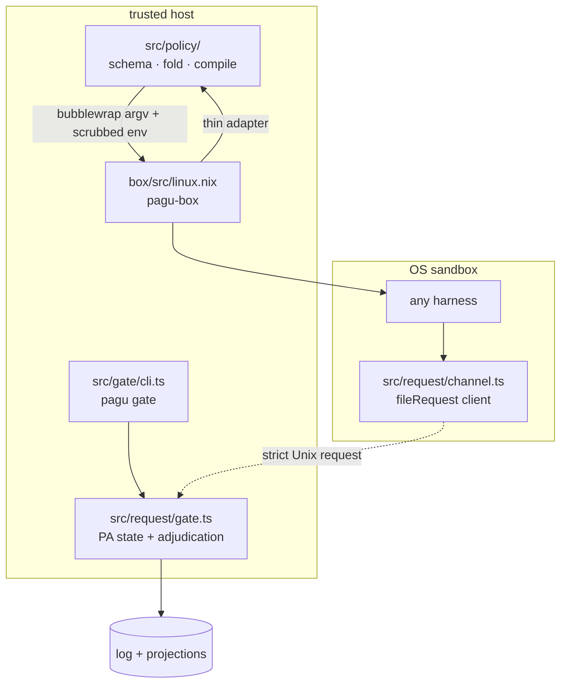

# pagu — architecture

The runtime has two independent executables and one shared typed core:



## Entrypoints and packages

| Surface              | Source                                     | Current role                                                                     |
| -------------------- | ------------------------------------------ | -------------------------------------------------------------------------------- |
| `pagu-box`           | `box/src/linux.nix` / `box/src/darwin.nix` | Process wrapper. Legacy profiles on Linux/macOS; schema-v0 enforcement on Linux. |
| `pagu gate`          | `src/gate/cli.ts`                          | Outside-sandbox daemon, TTY Approver adapter, Unix listener.                     |
| SDK                  | `src/mod.ts`                               | Stable front door for policy, request, event, and retained security primitives.  |
| Root flake           | `flake.nix`                                | Builds `pagu-box`, `pagu`, formatter, and the Linux development shell.           |
| Standalone box flake | `box/flake.nix`                            | Preserved imported box package and module surface.                               |

The default root package is `pagu-box`. A unified `pagu box` command is planned
but not implemented.

## Policy core

All policy core files are pure and exported through `src/policy/index.ts`.

| Module                      | Responsibility                                                                                                    |
| --------------------------- | ----------------------------------------------------------------------------------------------------------------- |
| `src/policy/schema.ts`      | Strict policy/grant v0 types and decoding; bottom policy; built-in denies; refusal containment.                   |
| `src/policy/load.ts`        | Trusted-user plus narrow-only project fold; warnings for widening; canonical child validation.                    |
| `src/policy/compile.ts`     | Explicit-context policy lowering to Linux bubblewrap argv and scrubbed environment; exact explanation projection. |
| `src/policy/presets.ts`     | Schema representations of the four legacy profile baselines used for equivalence testing.                         |
| `src/policy/cli.ts`         | Effectful adapter: read JSON, assemble host context, explain or spawn bubblewrap.                                 |
| `src/policy/policy.test.ts` | Schema, attenuation, canonicalization, legacy equivalence, explain, and real-adapter falsifiers.                  |

Dependency direction:

```text
schema.ts <- load.ts
schema.ts <- compile.ts
schema/load/compile <- cli.ts
```

The shell launcher calls the adapter; policy logic is not duplicated in Nix or
shell.

## Request and gate core

The request module exports through `src/request/index.ts`.

| Module                        | Layer    | Responsibility                                                                                                                      |
| ----------------------------- | -------- | ----------------------------------------------------------------------------------------------------------------------------------- |
| `src/request/schema.ts`       | pure     | Exact request/frame and decision types; fail-loud request decoding.                                                                 |
| `src/request/adjudicate.ts`   | pure     | Refuse → auto → operator tier selection with lexical and canonical containment.                                                     |
| `src/request/channel.ts`      | effects  | One-request-per-connection client/server; size, timeout, connection, socket-mode, and listener-ownership bounds.                    |
| `src/request/gate.ts`         | effects  | Single writer for events, queue, session grants, and user-policy persistence.                                                       |
| `src/request/request.test.ts` | evidence | Real bubblewrap resolution attack, tier behavior, restart persistence, symlink escape, socket ownership, and user-only persistence. |

`src/gate/cli.ts` supplies a TTY `GateApprover` and fixed state paths. The core
does not know about terminals or herdr.

## Event and evidence core

| Module                 | Responsibility                                                               |
| ---------------------- | ---------------------------------------------------------------------------- |
| `src/log/schema.ts`    | Entry union, including request, request-decision, and policy-grant evidence. |
| `src/log/serialize.ts` | Typed entry → tilde-fenced markdown block.                                   |
| `src/log/parse.ts`     | Markdown blocks → typed entries; unknown future kinds are skipped.           |
| `src/events.ts`        | Offset-addressed reads and live wakeups over an append-only entry array.     |
| `src/events.test.ts`   | Wire-contract floor: every entry kind must round-trip.                       |

The markdown log is retained history. Queue and session-grant JSON are mutable
gate projections.

## Box enforcement adapters

| Path                           | Responsibility                                                                                       |
| ------------------------------ | ---------------------------------------------------------------------------------------------------- |
| `box/src/linux.nix`            | Nix-built shell adapter, legacy bubblewrap profiles, and schema-policy handoff to the Deno compiler. |
| `box/src/darwin.nix`           | Legacy seatbelt profiles and typed rejection of schema lowering until the Darwin compiler exists.    |
| `box/src/profiles/`            | Static seatbelt profiles for default, strict, paranoid, and loose compatibility modes.               |
| `box/modules/home-manager.nix` | Home Manager package/module integration.                                                             |

With `--policy`, legacy policy flags are rejected. With `--gate`, the Linux
compiler bind-mounts the host socket at `/run/pagu/request.sock` and sets only
the sandbox path in `PAGU_REQUEST_SOCKET`.

## Retained SDK primitives

These modules survived the pivot and remain exported, but they are not the
active schema-v0 box/gate runtime path unless stated:

| Module                         | Status                                                                                                          |
| ------------------------------ | --------------------------------------------------------------------------------------------------------------- |
| `src/capability/index.ts`      | Fail-closed capability-ceiling validation primitive.                                                            |
| `src/permissions/`             | Permission/envelope and concealment primitives; useful reference laws, distinct from policy-v0 JSON.            |
| `src/config/config.ts`         | Generic configuration-layer monoid retained for SDK compatibility.                                              |
| `src/config/project-config.ts` | Retained untrusted-project sanitization primitive; policy-v0 attenuation lives in `src/policy/load.ts`.         |
| `src/approval.ts`              | Earlier proposal/grant lifecycle primitives; the gate MVP uses `GateApprover` from `src/request/adjudicate.ts`. |
| `src/runner/sandbox.ts`        | Earlier command-wrapper sandbox primitive; schema-v0 enforcement uses `src/policy/compile.ts`.                  |

This distinction prevents a retained helper from being mistaken for the live
authority path.

## Structural checks

| Check                     | Enforced claim                                                                     |
| ------------------------- | ---------------------------------------------------------------------------------- |
| `scripts/check-layers.ts` | Pure/effect markers and surviving dependency rules.                                |
| `scripts/check-docs.ts`   | Live doc references, invariant definitions, law bindings, and current path claims. |
| `src/mod.test.ts`         | Public SDK export floor.                                                           |
| `deno task ci`            | Format, lint, type, layers, docs, and tests.                                       |

## Where to change a behavior

| Change                     | Primary files                                            |
| -------------------------- | -------------------------------------------------------- |
| Policy JSON shape          | `src/policy/schema.ts` + `src/policy/policy.test.ts`     |
| User/project attenuation   | `src/policy/load.ts` + policy falsifiers                 |
| Linux enforcement lowering | `src/policy/compile.ts` + explain/adapter tests          |
| Box CLI flags              | `box/src/linux.nix` and `box/src/darwin.nix`             |
| Request wire shape         | `src/request/schema.ts` + real channel tests             |
| Adjudication tiers         | `src/request/adjudicate.ts`                              |
| Gate persistence/evidence  | `src/request/gate.ts` + log/event codecs                 |
| Human approval surface     | adapter over `GateApprover`; do not fork adjudication    |
| Grant application          | Slice 5; new launch/resume path, not live mount mutation |
