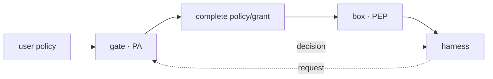
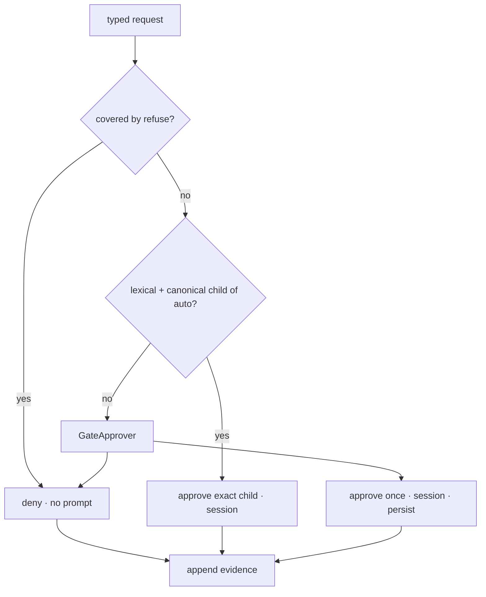

# pagu — concepts

## Vocabulary

| Term               | Meaning in pagu                                                                            |
| ------------------ | ------------------------------------------------------------------------------------------ |
| **harness**        | Any coding-agent process placed inside the box. It is not part of pagu's trusted core.     |
| **box**            | The OS sandbox around the harness; pagu's Policy Enforcement Point (PEP).                  |
| **gate**           | The outside-sandbox authority that adjudicates requests; pagu's Policy Administrator (PA). |
| **policy**         | Operator-authored standing authority, expressed as strict schema-v0 JSON.                  |
| **project policy** | Repository-authored attenuation of user policy; never an independent grant source.         |
| **grant**          | Gate-derived policy data tied to a request and decision scope.                             |
| **request**        | Exact read-only scope plus need and justification, sent out of the box.                    |
| **decision**       | Deny or approve with once/session/persist scope.                                           |
| **event**          | Append-only evidence of a request, decision, or grant.                                     |
| **projection**     | Mutable gate-owned view such as the queue or session-grants JSON.                          |
| **explain**        | Redacted view of the same compiled result used to launch the box.                          |
| **attenuation**    | Producing authority less than or equal to a trusted parent.                                |

## PEP and PA are different jobs

The box enforces but does not decide. The gate decides but does not enforce.



Why the separation is load-bearing:

- putting approval inside the box gives the requester a route to its own
  authority;
- putting policy judgment in the shell compiler duplicates the source of truth
  and makes prompt UX an enforcement concern;
- requiring the gate for every ordinary action harms availability and creates a
  centralized action path.

The standing policy handles the fast path. The gate handles misses.

## Authority is a partial order

Write `A ≤ B` when policy or grant `A` grants no more authority than `B`.
Project policy and derived grants must respect this order.

For schema v0, narrowing means:

| Field               | `A ≤ B` intuition                                                   |
| ------------------- | ------------------------------------------------------------------- |
| `fs.home`           | temporary home ≤ read-write host home                               |
| `fs.rw`             | every A path is canonically within a B read-write path              |
| `fs.ro`             | every A path is canonically within a B read-only or read-write path |
| `fs.deny`           | A may contain more denies                                           |
| `net`               | false ≤ true                                                        |
| `env.pass`          | A names are a subset of B names                                     |
| `escalation.auto`   | A rules are already authorized by B                                 |
| `escalation.refuse` | A may contain more refusals covered by deny                         |

This is not a symmetric configuration merge. The user layer is authority; the
project layer is a filter.

## Bottom, complete policies, and fail-loud decoding

`{}` is the bottom policy: temporary home, no added filesystem access, no
network, no copied environment, and no escalation rules. Built-in secret denies
remain.

A non-empty policy must state every schema-v0 field. Unknown keys are rejected.
These rules prevent two ambiguous states:

- a misspelled authority field that silently does nothing;
- an omitted field whose default might widen after a version change.

Policy and grant are distinct artifacts. A grant must carry its `parent` and
`expires` fields even when null.

## Deny and refuse

`fs.deny` is enforcement policy. `escalation.refuse` is adjudication policy.

- A denied path is concealed by the box.
- A refused request is denied by the gate without asking the operator.
- Every refusal must be covered by a filesystem deny.
- Deny mounts are compiled after allows, so a broader allow cannot expose a
  denied child.

Refuse reduces operator noise; deny supplies the actual boundary.

## Request channel as a capability

The gate socket is not a general command channel. Its protocol has one
operation:

```text
append request -> await tied decision -> close
```

The request body is strict:

```ts
{
  need: string;
  justification: string;
  suggested_rule: { "fs.ro": string };
}
```

The prose explains intent to a human but carries no authority. Only the typed
rule participates in tier matching. The sandbox API has no queue-resolution or
policy-write function.

Mounting the socket is itself a capability. Without `--gate`, the path and
`PAGU_REQUEST_SOCKET` are absent.

## Tiered adjudication



Refuse precedes auto. Auto returns the exact child request, never the wildcard
ceiling. Canonical containment is required so an in-scope symlink cannot target
an out-of-scope path.

## Decision scopes

| Scope     | Current gate behavior                            | Application behavior                                    |
| --------- | ------------------------------------------------ | ------------------------------------------------------- |
| `once`    | Store a gate-owned grant projection.             | Slice 5 must consume it exactly once.                   |
| `session` | Store a projection that survives gate restart.   | Slice 5 must bind it to its originating session/policy. |
| `persist` | Add the exact read-only rule to the user policy. | Future launches compile the standing rule normally.     |

No scope widens the running mount namespace today. The caller receives a
decision so it can stop, explain, or await the future relaunch integration.

## Event store and projections

The gate's markdown event log is retained history. Current gate event kinds:

- `request` — identity, requested rule, need, justification;
- `request-decision` — verdict, tier, scope, rationale;
- `policy-grant` — derived grant identity, request, scope, exact rule.

The queue and session-grants files can be replaced atomically because they are
projections. They are useful for restart and UI, but they do not replace the
append-only evidence record.

`eventStream` gives entries stable offsets equal to their log-array index. A UI
can read backlog and then subscribe without becoming a writer.

## Explain is a projection, not a second compiler

The compiler returns:

```ts
interface CompiledPolicy {
  argv: readonly string[];
  environment: Readonly<Record<string, string>>;
}
```

The process adapter launches with that value. `explain` returns the same argv
and only the environment names. This prevents display logic and enforcement
logic from drifting.

## SDK first, adapters second

The public functions live behind `src/mod.ts`:

- decode, fold, compile, explain;
- file a request and serve the gate channel;
- adjudicate and persist through typed ports;
- read retained events.

Human surfaces are adapters:

- `pagu-box` maps argv and host facts into the policy compiler;
- `pagu gate` maps the Approver port onto a TTY;
- herdr can later render the same queue and resolution seam.

An adapter may choose presentation. It may not duplicate policy meaning or
invent authority.

## Platform and lifecycle limits

- Schema-v0 enforcement is Linux-only today.
- macOS retains legacy profiles but has no schema-to-seatbelt lowering yet.
- Gate decisions are retained but not applied to a live or relaunched box.
- Structured PEP denial and launch evidence is follow-on work.
- Multi-host cryptographic discharge is outside v0.

These are explicit scope limits, not fallback permissions.
