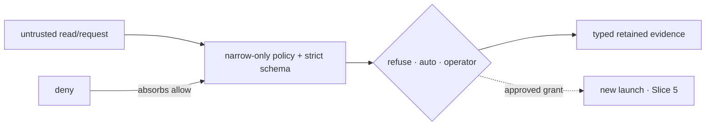

# pagu — invariants

These are the claims a refactor must preserve. Each live invariant names its
enforcement rung:

- **runtime** — the OS/process boundary enforces it;
- **type/schema** — invalid states are rejected before effects;
- **test** — a named falsifier or law fails in CI;
- **judgment** — review is still required where structure cannot decide intent.

## Live catalog

### #1 — The gate never widens authority by itself

**Claim:** an untrusted sandbox can request an exact read-only child scope, but
cannot resolve its own request, mutate gate state, or obtain a broader auto
grant. Operator approval records authority; applying that authority requires a
separate launch path.

Why it matters: an approval service inside the requester is self-approval. A
general bidirectional control channel would make protocol convention, rather
than capability structure, the boundary.

Enforcement:

| Rung        | Enforcer                                                                                                                |
| ----------- | ----------------------------------------------------------------------------------------------------------------------- |
| runtime     | `src/request/channel.ts` accepts one strict request frame per mounted Unix connection; the box mounts only that socket. |
| schema      | `src/request/schema.ts` permits only `need`, `justification`, and one exact `fs.ro` suggestion; unknown keys fail.      |
| pure core   | `src/request/adjudicate.ts` checks refusal first and returns the requested child rule, never the auto-rule parent.      |
| persistence | `src/request/gate.ts` owns queue, grant, user-policy, and event writes outside the box.                                 |
| packaging   | `src/policy/compile.ts` emits the socket mount and `PAGU_REQUEST_SOCKET` only when a gate socket is supplied.           |

Bound laws:

- [law: sandbox endpoint cannot submit resolution]
- [law: auto grants only requested child scope]
- [law: project policy cannot widen user authority]

Review questions:

- Did a new inside-sandbox API gain a decision or persistence method?
- Can an auto rule return its wildcard parent instead of the exact request?
- Can a project layer enable authority absent from the user layer?
- Did grant application move into the existing sandbox instead of a new launch?

### #2 — Deny wins at every layer

**Claim:** adding an allow never removes a deny. Refusal scopes are contained by
filesystem denies; project policy can add restrictions; compiled deny mounts
overlay all allows.

Why it matters: policy composition is only understandable if the restrictive
element is absorbing. Order-dependent allow overrides turn review into source
archaeology.

Enforcement:

| Rung               | Enforcer                                                                                           |
| ------------------ | -------------------------------------------------------------------------------------------------- |
| schema             | `src/policy/schema.ts` always adds built-in secret denies and rejects a refusal outside `fs.deny`. |
| fold               | `src/policy/load.ts` unions project denies/refusals while attenuating every authority field.       |
| compiler           | `src/policy/compile.ts` emits denies after read-write and read-only binds.                         |
| retained primitive | `src/permissions/envelope.ts` rejects a request matched by an envelope deny.                       |

Bound laws:

- [law: deny wins request equal deny never within]
- [law: built-in denies refuse containment enforced]
- [law: adding allows never revokes monotone]

Review questions:

- Is any deny evaluated before a later allow that can cover it?
- Does a new policy field have an explicit restrictive merge rule?
- Can a refusal exist without an enforcement-level deny?

### #3 — Reads are untrusted input

**Claim:** content visible to the harness—including repository policy and
request prose—may influence a request but cannot create standing authority. Only
the trusted user policy, a pre-authorized auto scope, or an operator decision
can authorize widening.

Why it matters: a repository can contain instructions crafted to make a harness
ask for secrets or external paths. Parsing the request correctly does not make
the request trustworthy.

Enforcement:

| Rung          | Enforcer                                                                                                                             |
| ------------- | ------------------------------------------------------------------------------------------------------------------------------------ |
| fold          | `src/policy/load.ts` treats the project policy as attenuation of user authority and returns warnings for widening attempts.          |
| path boundary | Project children and auto requests require canonical containment; failures route to warnings or operator review.                     |
| gate          | `src/request/adjudicate.ts` never uses `need` or `justification` as authority; only the typed rule and standing policy affect tiers. |
| operator seam | `GateApprover` receives the full request but returns only deny or an explicit decision scope.                                        |

Bound laws:

- [law: canonical paths reject symlink escapes accept symbolic aliases]
- [law: project dot segments cannot escape trusted path]
- [law: auto tier fails closed requested child symlink escape]

Review questions:

- Did prose, repository metadata, or a display field become a policy input?
- Is a nested path accepted without canonical containment?
- Can project data select a broader network, environment, home, or auto scope?

### #4 — Evidence outranks reports

**Claim:** security claims are derived from the artifact that drives behavior,
and every gate request, decision, and grant is retained as a typed event. Prose
status and adapter output are not independent sources of truth.

Why it matters: an explanation that is assembled separately from enforcement can
be accurate in tests and wrong in production. Mutable queue files can be useful
views but cannot replace retained events.

Enforcement:

| Rung        | Enforcer                                                                                              |
| ----------- | ----------------------------------------------------------------------------------------------------- |
| compiler    | `src/policy/compile.ts` returns one `CompiledPolicy`; `explain` projects from it.                     |
| event codec | `src/log/schema.ts`, `src/log/serialize.ts`, and `src/log/parse.ts` define the retained wire entries. |
| stream      | `src/events.ts` addresses the append-only entry array by stable offset.                               |
| writer      | `src/request/gate.ts` serializes request, decision, projection, and grant evidence writes.            |
| API floor   | `src/mod.test.ts` fails if a frozen surviving export disappears accidentally.                         |

Bound laws:

- [law: explain argv exactly compiled argv]
- [law: event wire schema every entry kind round trips]
- [law: log round trips any entry sequence]
- [law: session grants survive gate restart]

Review questions:

- Is human-facing output projected from the same value passed to enforcement?
- Can a decision or grant exist without a retained event?
- Is a mutable JSON projection being treated as canonical history?
- Did an event shape change without codec, wire-floor, and API review?

## Cross-invariant boundary

The four claims compose:

1. untrusted reads may create requests, never decisions;
2. narrowing and deny-wins bound what can be decided automatically;
3. the gate is the only writer of decision authority;
4. retained evidence makes the path auditable before a later launch applies it.

## Historical numeric anchor

### #5 — Retired harness-era invariant identifier

Immutable ADRs cite invariant number 5 as it existed at decision time. The
identifier remains defined so those historical references resolve, but it is not
a live box + gate invariant. The live catalog is #1–#4 above.

## Change protocol

For a change touching policy, requests, grants, compilation, or gate state:

1. identify the affected invariant;
2. write the falsifier first;
3. prefer a schema/type/runtime enforcer over a prose rule;
4. run the focused test, then `deno task ci`;
5. run the real boxed journey when the capability path changed;
6. update this catalog only when the load-bearing claim itself changes.
