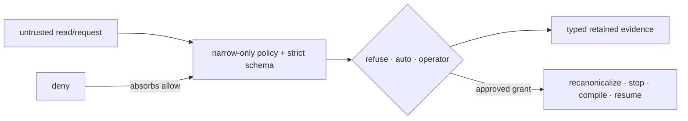

# pagu — invariants

These are the claims a refactor must preserve. Each live invariant names its
enforcement rung:

- **runtime** — the OS/process boundary enforces it;
- **type/schema** — invalid states are rejected before effects;
- **test** — a named falsifier or law fails in CI;
- **judgment** — review is still required where structure cannot decide intent.

## Live catalog

### #1 — The gate never widens authority by itself

**Claim:** an untrusted sandbox can request an exact read-only child scope, but
cannot resolve its own request, mutate gate state, or obtain a broader auto
grant. Operator approval records authority; applying that authority requires a
separate launch path.

Why it matters: an approval service inside the requester is self-approval. A
general bidirectional control channel would make protocol convention, rather
than capability structure, the boundary.

Enforcement:

| Rung         | Enforcer                                                                                                                                    |
| ------------ | ------------------------------------------------------------------------------------------------------------------------------------------- |
| runtime      | `src/request/channel.ts` accepts one strict request frame per mounted Unix connection; the box mounts only that socket.                     |
| agent API    | `src/mcp/server.ts` and `integrations/pi/pagu.ts` expose one strict `request_read_access` tool and no operator-resolution port.             |
| schema       | `src/request/schema.ts` permits only `need`, `justification`, and one exact `fs.ro` suggestion; unknown keys fail.                          |
| pure core    | `src/request/adjudicate.ts` checks refusal first and returns the requested child rule, never the auto-rule parent.                          |
| persistence  | `src/request/gate.ts` owns queue, grant, user-policy, launch, and event writes outside the box.                                             |
| packaging    | `src/policy/compile.ts` emits the socket mount and `PAGU_REQUEST_SOCKET` only when a gate socket is supplied.                               |
| application  | `src/gate/relaunch.ts` stops the gate-owned child and starts one newly compiled box; it never mutates a live namespace.                     |
| child core   | `src/policy/child.ts` rejects a complete child proposal if any authority field exceeds its effective parent.                                |
| nesting      | Each descendant bubblewrap remains inside its ancestor namespace; bypassing the SDK cannot recover absent authority.                        |
| child broker | `src/child/broker.ts` selects the active parent from one trusted sender observation, derives before launch, and rolls back failed evidence. |
| child frame  | `src/child/schema.ts` accepts launch metadata only; parent selection, resolution, state, signals, and persistence are absent.               |

Bound laws:

- [law: sandbox endpoint cannot submit resolution]
- [law: auto grants only requested child scope]
- [law: project policy cannot widen user authority]
- [law: fail secure unavailable gate leaves narrower box running]
- [law: Codex nonce attribution ignores staggered decoy session]
- [law: fresh widen resumes discovered session id]
- [law: MCP exposes one request-only inhabitant tool]
- [law: MCP cannot resolve or smuggle authority]
- [law: MCP services ping while retaining cancelled gate request]
- [law: Pi extension exposes one request-only native tool]
- [falsifier: Pi bridge fails loud on a parallel interface]
- [law: narrowest ancestor remains final across child derivation]
- [falsifier: child policy cannot regain ancestor filesystem network
  environment]
- [falsifier: child broker frame cannot smuggle parent resolution or control]
- [law: message sender namespace selects parent and recursive child ceiling]
- [falsifier: unknown or stale sender namespace cannot launch]
- [falsifier: child network namespace must implement derived net policy]
- [falsifier: concurrent child launches cannot reuse one lineage id]
- [falsifier: failed provisional rollback remains tracked for close retry]

Review questions:

- Did a new inside-sandbox API gain a decision or persistence method?
- Can an auto rule return its wildcard parent instead of the exact request?
- Can a project layer enable authority absent from the user layer?
- Did grant application move into the existing sandbox instead of a new launch?
- Did an inhabitant-facing child surface gain resolution, state, or control?

### #2 — Deny wins at every layer

**Claim:** adding an allow never removes a deny. Refusal scopes are contained by
filesystem denies; project policy can add restrictions; compiled deny mounts
overlay all allows.

Why it matters: policy composition is only understandable if the restrictive
element is absorbing. Order-dependent allow overrides turn review into source
archaeology.

Enforcement:

| Rung                | Enforcer                                                                                                                                                                                              |
| ------------------- | ----------------------------------------------------------------------------------------------------------------------------------------------------------------------------------------------------- |
| schema              | `src/policy/schema.ts` always adds built-in secret denies and rejects a refusal outside `fs.deny`.                                                                                                    |
| fold                | `src/policy/load.ts` unions project denies/refusals while attenuating every authority field.                                                                                                          |
| child derivation    | `src/policy/child.ts` unions ancestor/child denies and refusals after checking every positive capability.                                                                                             |
| compiler            | `src/policy/compile.ts` emits denies after read-write and read-only binds.                                                                                                                            |
| derived mounts      | `src/policy/compile.ts` refuses a derived Git path inside a denied root and emits derived binds parents-first, so a writable child overlays its read-only parent.                                     |
| derived composition | `src/policy/worktree.ts` emits only what the effective policy does not already supply, and restores every granted writable root inside a composed read-only parent, so derivation can never subtract. |
| observer            | The same `CompiledPolicy` derives enforcement mounts and exact/subtree denial-observer rules.                                                                                                         |
| category profiles   | `src/policy/profiles.test.ts` checks every curated profile's full secret refusal floor and final concealment mounts.                                                                                  |
| retained primitive  | `src/permissions/envelope.ts` rejects a request matched by an envelope deny.                                                                                                                          |

Bound laws:

- [law: deny wins request equal deny never within]
- [law: built-in denies refuse containment enforced]
- [law: adding allows never revokes monotone]
- [law: category profiles refuse complete secret floor]
- [law: category compiled denies final concealment mounts]
- [law: denial observer truth is the compiled fs.deny set]
- [law: HOME repository cannot re-expose denied secrets]
- [law: profile overlay re-composes persistent grants latest curated base]
- [law: harness state is scoped and deny remains final]
- [law: Claude relaunch keeps UUID argv and state]
- [law: harness inference selects unique session location]
- [law: harness inference fails typed for both or neither]
- [law: Pi fresh binds assigned session id without discovery]
- [law: child derivation preserves identity while attenuating every authority]
- [law: rw parent home may attenuate to explicit child home scopes]
- [law: derived writable git children overlay read only common parent]
- [falsifier: derived git path inside denied root aborts before launch]
- [falsifier: derived git mount cannot overlay the launch worktree]
- [falsifier: missing derived git path aborts instead of dropping the bind]
- [law: derivation emits nothing when policy already grants every git path]
- [law: derivation never narrows a policy root that already covers the
  repository]
- [falsifier: derived read only common parent cannot shadow a granted writable
  child]

Review questions:

- Is any deny evaluated before a later allow that can cover it?
- Does a new policy field have an explicit restrictive merge rule?
- Can a refusal exist without an enforcement-level deny?

### #3 — Reads are untrusted input

**Claim:** content visible to the harness—including repository policy and
request prose—may influence a request but cannot create standing authority. Only
the trusted user policy, a pre-authorized auto scope, or an operator decision
can authorize widening.

Why it matters: a repository can contain instructions crafted to make a harness
ask for secrets or external paths. Parsing the request correctly does not make
the request trustworthy.

Enforcement:

| Rung          | Enforcer                                                                                                                                                                                                                            |
| ------------- | ----------------------------------------------------------------------------------------------------------------------------------------------------------------------------------------------------------------------------------- |
| fold          | `src/policy/load.ts` treats the project policy as attenuation of user authority and returns warnings for widening attempts.                                                                                                         |
| child path    | `src/policy/path.ts` requires canonical containment for nested child scopes; null or escape rejects the complete derivation.                                                                                                        |
| path boundary | Project children and auto requests require canonical containment; grant application requires the same target at relaunch.                                                                                                           |
| derivation    | `src/policy/worktree.ts` takes Git metadata authority only from a back pointer the repository cannot forge, inside a trusted ceiling and never above the profile's authority on the launch directory.                               |
| placement     | `src/policy/compile.ts` grades the derivation ceiling by access: only `fs.derive` and roots the policy already mounts read-write may hold a derived writable mount. `escalation.auto` is a gate read scope and grants no placement. |
| frozen probe  | `src/policy/repository-fs.ts` answers each repository fact once per launch, so the material validated is the material mounted.                                                                                                      |
| gate          | `src/request/adjudicate.ts` never uses `need` or `justification` as authority; only the typed rule and standing policy affect tiers.                                                                                                |
| operator seam | `GateApprover` receives the full request but returns only deny or an explicit decision scope.                                                                                                                                       |

Bound laws:

- [law: canonical paths reject symlink escapes accept symbolic aliases]
- [law: project dot segments cannot escape trusted path]
- [law: auto tier fails closed requested child symlink escape]
- [law: symlink swapped after decision cannot widen relaunch]
- [law: grant binding session policy cannot apply]
- [falsifier: child canonical path cannot escape parent through symlink]
- [falsifier: literal filesystem wildcard cannot become its parent directory]
- [falsifier 3: project filesystem wildcard is a literal path]
- [law: linked worktree derives git metadata at profile authority]
- [law: advisor linked worktree git metadata stays read only]
- [law: ordinary checkout and bare repository derive no git metadata]
- [law: real git linked worktree probe freezes canonical metadata]
- [falsifier: hostile git pointer outside trusted ceiling aborts before launch]
- [falsifier: git pointer traversal or symlink alias cannot acquire authority]
- [falsifier: rewritten commondir pointer cannot acquire authority]
- [falsifier: git directory without worktree back pointer is refused]
- [falsifier: derived git root cannot expose the gate request socket]
- [law: a read-only placement root cannot host a writable derived mount]
- [law: real git fetch writes FETCH_HEAD inside the writable admin directory]
- [falsifier: forged pointer into a trusted root cannot acquire write access]
- [falsifier: an auto read scope alone cannot place a derived git mount]
- [falsifier: a derived git mount cannot re-expose a deny masked by a tmpfs
  home]

Review questions:

- Did prose, repository metadata, or a display field become a policy input?
- Is a nested path accepted without canonical containment?
- Can a repository-controlled pointer select a mount outside the trusted
  ceiling, or above the profile's authority on the launch directory?
- Can a read-only rule of any kind become the source of a writable mount?
- Can project data select a broader network, environment, home, or auto scope?

### #4 — Evidence outranks reports

**Claim:** security claims are derived from the artifact that drives behavior,
and every gate request, decision, and grant is retained as a typed event. Prose
status and adapter output are not independent sources of truth.

Why it matters: an explanation that is assembled separately from enforcement can
be accurate in tests and wrong in production. Mutable queue files can be useful
views but cannot replace retained events.

Enforcement:

| Rung             | Enforcer                                                                                                                                                   |
| ---------------- | ---------------------------------------------------------------------------------------------------------------------------------------------------------- |
| compiler         | `src/policy/compile.ts` returns one `CompiledPolicy`; `explain` projects from it.                                                                          |
| derived evidence | The same `CompiledPolicy` carries derived writable roots and derivation warnings, so `--explain` and the outside guards see the mounts that were compiled. |
| event codec      | `src/log/schema.ts`, `src/log/serialize.ts`, and `src/log/parse.ts` define versioned session metadata and retained wire entries.                           |
| stream           | `src/events.ts` addresses the append-only entry array by stable offset.                                                                                    |
| writer           | `src/request/gate.ts` serializes session, request, decision, projection, grant, launch, failure, and spend evidence.                                       |
| launch           | `src/policy/cli.ts` writes evidence from one `CompiledPolicy` while staying outside any entered parent namespace.                                          |
| child launch     | `src/child/broker.ts` verifies lineage/policy/route/process material before `src/child/evidence.ts` creates a strict event.                                |
| denial           | Opt-in `src/policy/cli.ts` rejects writable log roots and passes that `CompiledPolicy`'s deny rules to the outside supervisor.                             |
| telemetry        | `src/telemetry/projection.ts` folds retained entries; table and JSON adapters do not maintain another store.                                               |
| API floor        | `src/mod.test.ts` fails if a frozen surviving export disappears accidentally.                                                                              |
| profile wire     | `schemas/profile-grant-v0.schema.json` publishes the box-accepted `PolicyV0` shape; `parsePolicy` retains semantic checks.                                 |
| grant wire       | `schemas/grant-v0.schema.json` publishes the strict gate GrantV0 shape; `parseGrant` retains semantic checks.                                              |
| reload wire      | `src/gate/reload-schema.ts` strictly binds checkpoint adoption and prepare → handoff → active evidence.                                                    |

Bound laws:

- [law: explain argv exactly compiled argv]
- [law: explain proves no broad git parent became writable]
- [law: normal checkout compilation is unchanged by git derivation]
- [falsifier: unsupported repository shape stops compilation before launch]
- [law: event wire schema every entry kind round trips]
- [law: child launch evidence binds lineage policies route and material]
- [falsifier: namespace or durable evidence failure stops provisional child]
- [law: log round trips any entry sequence]
- [law: session grants survive gate restart]
- [law: widened launch evidence uses explained compiled argv]
- [law: daemon socket bind sets NIX_REMOTE compile explain]
- [law: once grant applies once durably spent]
- [law: operator file surface resolves same Approver port]
- [law: operator authority paths stay outside sandbox policy roots]
- [law: TOCTOU relaunch resolves again after old sandbox stops]
- [law: widened child rolls back if durable launch evidence fails]
- [law: fresh gate session retains discovered id]
- [law: operator boundary rechecked after old sandbox stops]
- [law: operator state directory rejects replaceable ancestry symlinks]
- [law: failed rollback keeps child tracked shutdown retry]
- [law: retained persist grant rebuilds missing projection without ID reuse]
- [law: telemetry projects denials approvals tiers stale unlaunched grants]
- [law: denial observation stays opt-in and host-owned]
- [law: published profile grant v0 contract matches box policy decoder]
- [law: published grant v0 contract matches strict decoder shape]
- [law: reload checkpoint strict decoder preserves pending work fd manifest]
- [law: reload adoption rejects mismatched session policy event digest]
- [law: reload checkpoint binds request seccomp state typed fd roles]
- [law: reload evidence cannot activate without exact prepare handoff]

Review questions:

- Is human-facing output projected from the same value passed to enforcement?
- Can a decision or grant exist without a retained event?
- Is a mutable JSON projection being treated as canonical history?
- Did an event shape change without codec, wire-floor, and API review?

## Cross-invariant boundary

The four claims compose:

1. untrusted reads may create requests, never decisions;
2. narrowing and deny-wins bound what can be decided automatically;
3. the gate is the only writer of decision authority;
4. retained evidence makes the path auditable before a later launch applies it.

## Historical numeric anchor

### #5 — Retired harness-era invariant identifier

Immutable ADRs cite invariant number 5 as it existed at decision time. The
identifier remains defined so those historical references resolve, but it is not
a live box + gate invariant. The live catalog is #1–#4 above.

## Change protocol

For a change touching policy, requests, grants, compilation, or gate state:

1. identify the affected invariant;
2. write the falsifier first;
3. prefer a schema/type/runtime enforcer over a prose rule;
4. run the focused test, then `deno task ci`;
5. run the real boxed journey when the capability path changed;
6. update this catalog only when the load-bearing claim itself changes.
