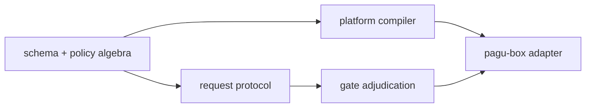

# Development workflow

pagu is developed by short-lived contributors who cannot rely on shared tacit
knowledge. A change is complete only when its design claims, implementation,
tests, and documentation agree.

## Start with the smallest useful reading set

1. Read `AGENTS.md`, `CONTEXT.md`, and `ROADMAP.md`.
2. Use `docs/ARCHITECTURE.md` to locate the relevant module.
3. Read `docs/CONCEPTS.md` and `docs/INVARIANTS.md` when the change touches a
   security boundary or a named law.
4. Consult `docs/decisions/` before reopening a settled trade-off. ADRs record
   the system at decision time; current behavior lives in the non-ADR docs.
5. Treat `docs/specs/` and `docs/diagrams/` as pre-pivot design history unless a
   current document links to a specific file.

Orient before editing:

```sh
git status --short
git log --oneline -5
deno task test
```

Preserve unrelated working-tree changes. Pick the next bounded slice from
`ROADMAP.md`, and state the behavior that will prove it is done.

## Deliver a user journey, not a component

Every feature slice starts with a short journey:

1. name the actor as a human host, agent host, or pagu inhabitant;
2. state the outcome in language that actor can observe;
3. trace one path through the typed SDK, human or agent adapter, gate, and box;
4. name the falsifier that would disprove either the outcome or its authority
   boundary;
5. explicitly defer variants that do not need to cross that tracer.

Write the pure SDK test first. Then add the thinnest CLI, MCP, skill, or other
adapter needed by the actor. A component-only unit may support the slice, but it
does not complete it. Completion requires the packaged journey, retained
evidence where applicable, and documentation written from the actor's point of
view.

This keeps the workflow compatible with the architecture: human and agent
surfaces share one typed core, while box enforcement and gate adjudication stay
separate. A journey may cross both planes without merging their authority.

## Build from the policy boundary outward

The dependency direction is deliberate:



For policy or capability work:

1. Write the falsifier first: the test that would expose widening, deny loss,
   path escape, protocol confusion, or false evidence.
2. Put pure rules in `src/policy/` or `src/request/`; keep OS, socket, terminal,
   and filesystem effects in their adapters.
3. Compile policy to the platform's native enforcement mechanism. Application
   checks may improve errors, but they are not the security boundary.
4. Keep a sandbox request informational. Only the outside gate may decide or
   grant it.
5. Record evidence at the point where the trusted side observes the event.

Use the public surface in `src/mod.ts` deliberately. Before launch, improve an
incorrect public shape and update its floor test; after launch, preserve frozen
exports.

## Verify claims at the right layer

Run the narrowest relevant test during development, then the full gate:

```sh
deno test --allow-all path/to/relevant_test.ts
deno task check:docs
deno task ci
```

For box behavior, also build and exercise the real Nix package:

```sh
nix build .#pagu .#pagu-box
nix run . -- --help
nix run .#pagu-box -- --help
```

For gate behavior, give `pagu gate` a real harness session ID so it owns the
boxed child. Exercise request → operator resolution → stop → recompile → resume,
then compare the retained launch evidence with the applied policy. A model stub
is not a substitute when the changed seam depends on live process behavior.

For an inhabitant MCP change, exercise the packaged `pagu mcp` protocol and
verify the generated session-local configuration with the actual supported
harness clients. If request behavior changed, file the request through that
MCP surface in a real box and confirm that resolution remains host-only.

Security-boundary work should receive an independent-context review. The
reviewer should try to falsify the claim, not merely restate the diff.

## Keep the documentation tiers honest

| Information                         | Canonical home         |
| ----------------------------------- | ---------------------- |
| Durable design and trust boundaries | `CONTEXT.md`           |
| Forward work and explicit deferrals | `ROADMAP.md`           |
| Shipped history                     | `CHANGELOG.md`         |
| Current module locations            | `docs/ARCHITECTURE.md` |
| Vocabulary and composition laws     | `docs/CONCEPTS.md`     |
| Load-bearing claims and evidence    | `docs/INVARIANTS.md`   |
| Hard-to-reverse decision            | `docs/decisions/`      |

Update the tier touched by the change. Do not leave a deferred requirement in a
commit message alone; put it in `ROADMAP.md`. `scripts/check-docs.ts` verifies
live path references and law/test bindings. ADR path references are exempt
because ADR bodies are immutable point-in-time records.

## Wrap the slice

Before committing:

- inspect `git diff` and `git status --short`;
- run `deno task ci` from a cleanly understood tree;
- record which real journey was exercised and what it proved;
- document any claim that could not be verified;
- leave user-owned or brief files uncommitted unless explicitly requested.

Commit with a Conventional Commit subject and the repository's required
co-author trailer. The handoff should name the commit, tests, live evidence,
open questions, and the next roadmap slice. Do not push unless asked.
