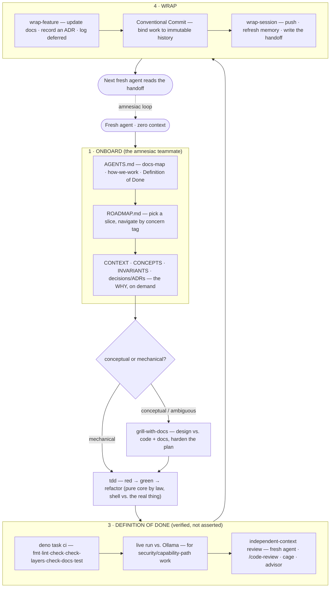

# pagu — agentic development lifecycle

How work gets done here. The governing model is **the amnesiac team**: every
session is a fresh teammate onboarded from zero, who does excellent work, then
leaves — taking all tacit context with it. The _why_ behind this (the
asymmetries, the practice filter) is
[`docs/decisions/0001`](decisions/0001-agentic-workflow-practices.md); this file
is the operational picture.

## The session loop — a teammate's shift



## Why it's shaped this way — three asymmetries

| Human team                        | Agent team                                             | Consequence for the lifecycle                                                    |
| --------------------------------- | ------------------------------------------------------ | -------------------------------------------------------------------------------- |
| Knowledge accrues in people       | **Extreme bus factor** — everyone quits at session end | Docs are the _primary transmission medium_, not insurance                        |
| Time is the scarce resource       | **Context** is scarce, not time                        | Cheap to _write_ ceremony, paid again at _read_ time → optimize for navigability |
| People hedge ("I think it works") | Agents **confabulate** "done" confidently              | Bind every claim to _verifiable evidence_                                        |

→ The filter: **adopt a practice iff it externalizes knowledge or verifies a
claim; skip it if its value was coordinating persistent humans.**

## Progressive disclosure — the doc tiers

| Tier              | Artifact                                                           | Holds                                                     | Read when                        |
| ----------------- | ------------------------------------------------------------------ | --------------------------------------------------------- | -------------------------------- |
| **0 entrypoint**  | `AGENTS.md` (injected)                                             | docs-map · how-we-work · Definition of Done               | always, first                    |
| **1 what / why**  | `CONTEXT.md` · `ROADMAP.md`                                        | durable design · forward plan (concern-tagged)            | starting any task                |
| **2 reference**   | `CONCEPTS.md` · `INVARIANTS.md` · `ARCHITECTURE.md` · `decisions/` | glossary · load-bearing claims · where-things-live · ADRs | on demand / before re-litigating |
| **3 drill-down**  | `docs/specs/`                                                      | deep per-feature designs                                  | implementing that feature        |
| **cross-session** | the agent's memory (Obsidian-shaped)                               | what's-next · feedback · pointers                         | session start (auto-recalled)    |

Each tier-1/2 doc opens with a `summary` + `tags` frontmatter, so its header is
scannable without loading the body.

## The enforcement ladder — claims bound to evidence

A convention that lives only in prose is one refactor from silent breakage. Push
each up the ladder to the strongest rung the toolchain supports:

```
prose  →  comment  →  test  →  type / lint / CI rule
(weakest, drifts)                  (strongest, can't drift)
```

| Convention                                      | Rung it reached                               |
| ----------------------------------------------- | --------------------------------------------- |
| hexagonal boundary (`// pure:` / `// effects:`) | CI — `scripts/check-layers.ts`                |
| no-exec invariant #1                            | test — `agent.test.ts` asserts `respondFlags` |
| gate-never-widen                                | type — `readonly PermissionSet`               |
| doc refs / invariants / laws resolve            | CI — `scripts/check-docs.ts` Edges 1–3        |
| "done" claims point at real files               | CI — `scripts/check-docs.ts` Edge 4           |
| public API surface                              | test — `mod.test.ts` floor                    |

## Team practice → agentic form

| Practice                              | Agentic form in pagu                                    | Transfers?                           |
| ------------------------------------- | ------------------------------------------------------- | ------------------------------------ |
| Onboarding doc                        | `AGENTS.md` docs-map + progressive disclosure           | ✅ strong                            |
| ADRs / decision log                   | `docs/decisions/` (check-docs-scanned)                  | ✅ strong                            |
| Glossary / ubiquitous language        | `docs/CONCEPTS.md`                                      | ✅                                   |
| Chesterton's Fence                    | `// invariant #1`, `// effects:` markers                | ✅ (guards against amnesiac cleanup) |
| Conventional Commits                  | work → immutable, dated history                         | ✅                                   |
| Definition of Done                    | CI + live-run + deferred-logged, _as a check_           | ✅ strong                            |
| Code review                           | a **different-context** reviewer agent / cage / advisor | ✅ (the key one)                     |
| Least privilege / staged access       | the capability ladder + scoped Deno perms               | ✅ (it _is_ the product)             |
| Standup                               | the `wrap-session` handoff (a standup to the future)    | ◐ only this                          |
| Sprints · estimation · tickets · RACI | —                                                       | ✗ coordinate persistent humans       |

## The throughline

**pagu's security model and its development-process model are the same idea** —
least privilege, bounded blast radius, claims bound to evidence, transparency by
construction. What makes a _compromised model_ safe is what makes an _amnesiac
teammate_ predictable. (Proven, not asserted: a fresh agent onboarded cold off
these docs and shipped the #16 token ceiling correctly — the loop above, walked
by a literal new teammate.)
