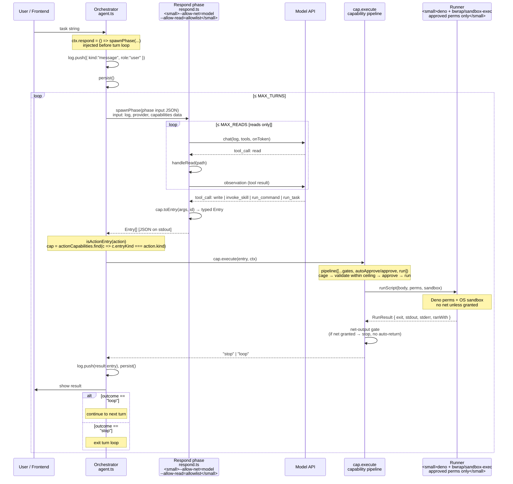

# Capability lifecycle

How a single capability invocation travels from user input through the registry,
subprocess boundary, and sandboxed runner back to the conversation log.

**Key boundaries**

- The **respond phase** runs as a separate `deno` process with minimal
  permissions (`--allow-net=<model>`, `--allow-read=<allowlist>` only). It can
  talk to the model and read context; it cannot write files or run programs.
- The **runner** runs as a separate `deno` process inside the OS sandbox
  (bubblewrap on Linux, sandbox-exec on macOS) with exactly the approved
  permissions. Only the orchestrator triggers it — never the agent.
- The **process boundary** (JSON over stdin/stdout) is where typed log entries
  cross from the respond phase back to the orchestrator.

**The net-output gate** (inside `performRun`, `src/capability/index.ts`) is
where output gating falls out of the runner's permissions: if the runner was
granted network access, the output might have exfiltrated data, so it does not
auto-return into the agent's context — the human sees a note and the loop stops.
Network-less runs auto-return safely.

**The respond phase permissions** are invariant #1: `respondFlags()` in
`agent.ts` is the sole place they are constructed, and `agent.test.ts` asserts
they never include write, run, env, or blanket allow.
