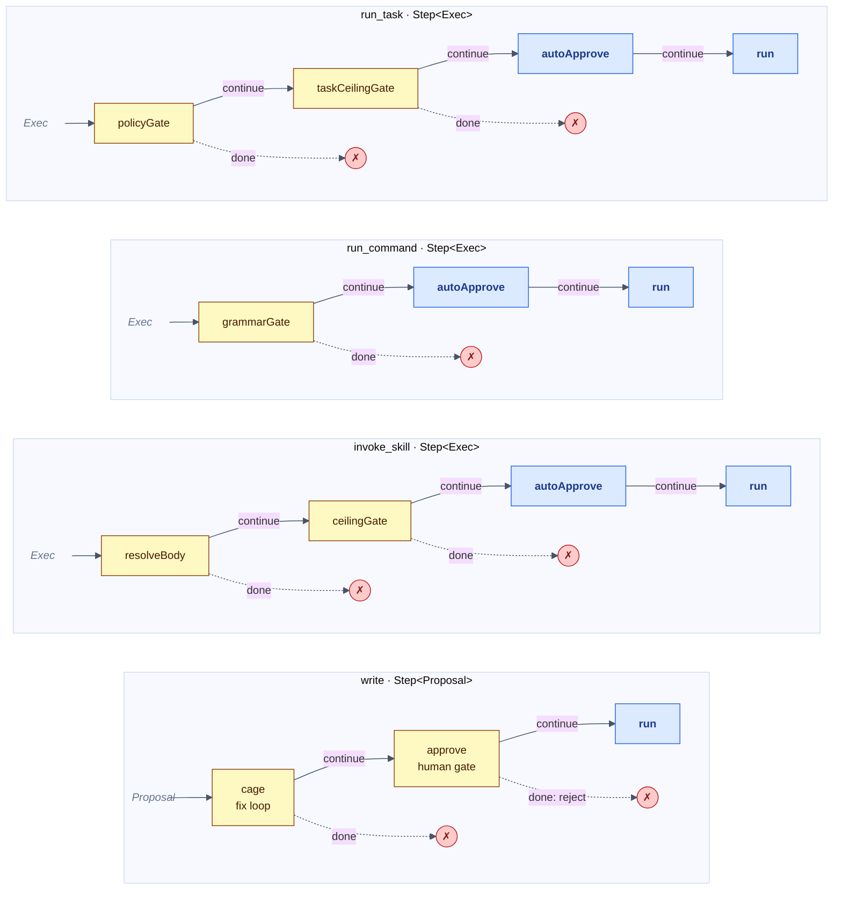

# Capability pipeline shapes

A string-diagram approximation of the four handler pipelines in pagu.

**Reading the diagram**

Each row is a `Step<C>` pipeline — Kleisli composition (`andThen`) of handlers
left-to-right. The carrier type (`Proposal` for write, `Exec` for the rest)
flows as a continuous wire through each box. A **gate** (yellow) may halt the
pipeline by returning `"done"` — dotted arrows show that exit path. The
**shared handlers** (blue) live in `src/capability/index.ts`; per-capability
gates live in their own modules.

```
Step<C> = C → Promise<"continue" | "done">
a → b   = andThen(a, b)   (Kleisli composition — short-circuit on "done")
[x]     = handler x       (box on the wire)
- - →   = "done" exit     (counit: wire is killed)
```



**The shared suffix** (`autoApprove → run`, in blue) is the deduplication the
`src/capability/` module captures. All three auto-approved capabilities
(`invoke_skill`, `run_command`, `run_task`) end identically: log the approve
decision, then execute in the sandboxed runner with the net-output gate.

`write` shares only `run` (via `performRun`) — its `approve` is richer: it
shows the review aid, optionally calls the advisor, and asks the human.

**Gate law (gate-never-widen):** every gate may narrow or halt (`"done"`) but
may never widen the carrier's permission set. This is the permission lattice law
(composition holds-or-tightens) expressed as a type invariant.
